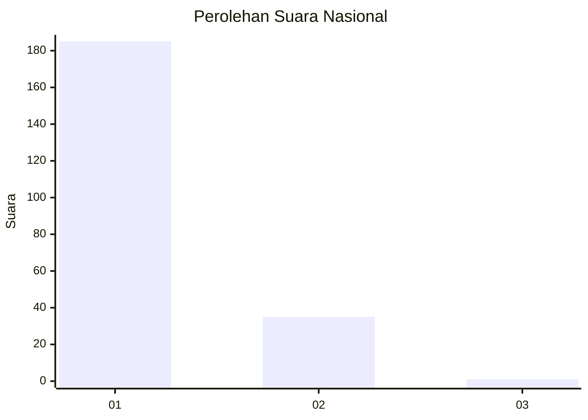
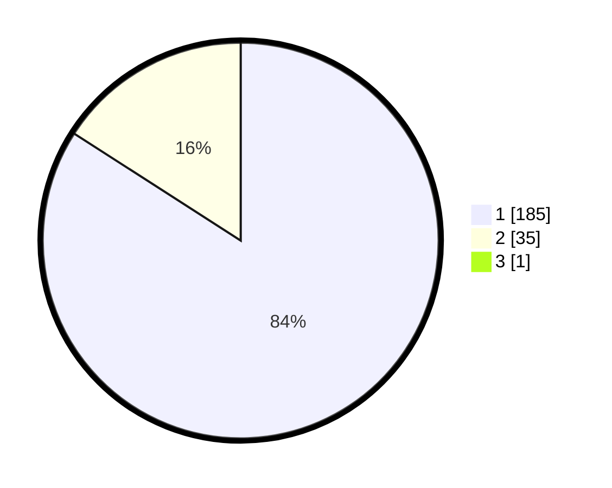

# Hasil

## Grafik

## Tabel

| No. | Nama Paslon    | Suara | Suara (raw) | Persentase |
|:--- |:-------------- | -----:| -----------:| ----------:|
| 1   | ANIES MUHAIMIN | 185   | [185][p-1]  | 83,71      |
| 2   | PRABOWO GIBRAN | 35    | [35][p-2]   | 15,84      |
| 3   | GANJAR MAHFUD  | 1     | [1][p-3]    | 0,45       |

[p-1]: https://github.com/gigit-pemilu/pemilu-2024/blob/main/pilpres/hitung-suara/sub/11-aceh/sub/12-aceh-barat-daya/sub/05-kuala-batee/sub/2013-krueng-batee/sub/002-tps/sub/paslon-1.txt
[p-2]: https://github.com/gigit-pemilu/pemilu-2024/blob/main/pilpres/hitung-suara/sub/11-aceh/sub/12-aceh-barat-daya/sub/05-kuala-batee/sub/2013-krueng-batee/sub/002-tps/sub/paslon-2.txt
[p-3]: https://github.com/gigit-pemilu/pemilu-2024/blob/main/pilpres/hitung-suara/sub/11-aceh/sub/12-aceh-barat-daya/sub/05-kuala-batee/sub/2013-krueng-batee/sub/002-tps/sub/paslon-3.txt

## Foto C Plano

https://sirekap-obj-formc.kpu.go.id/253d/pemilu/ppwp/11/12/05/20/13/1112052013002-20240215-125822--066acf99-4c4f-47e4-8163-d0b73c22159b.jpg

https://sirekap-obj-formc.kpu.go.id/253d/pemilu/ppwp/11/12/05/20/13/1112052013002-20240215-125939--d31e6cad-252d-4aba-a5bd-0eef855666fe.jpg

https://sirekap-obj-formc.kpu.go.id/253d/pemilu/ppwp/11/12/05/20/13/1112052013002-20240215-130116--903b59d4-5fe5-4505-a5b9-b7bc968f9c48.jpg

## Metadata

| Key        | Value               |
| ---------- | ------------------- |
| Time Stamp | 2024-02-16 22:30:00 |

