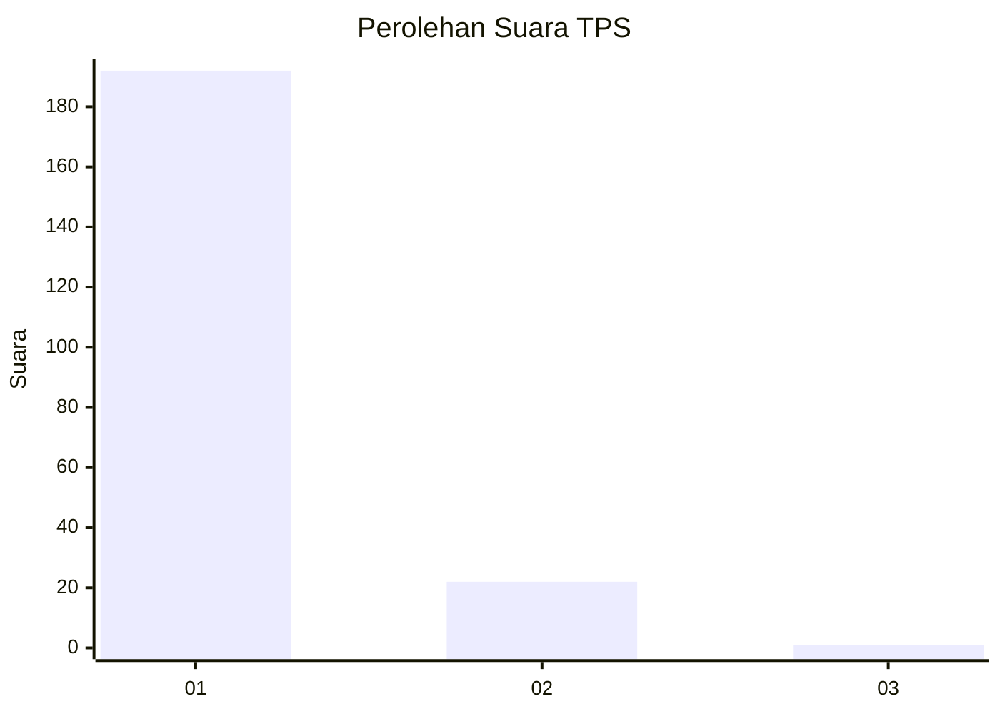
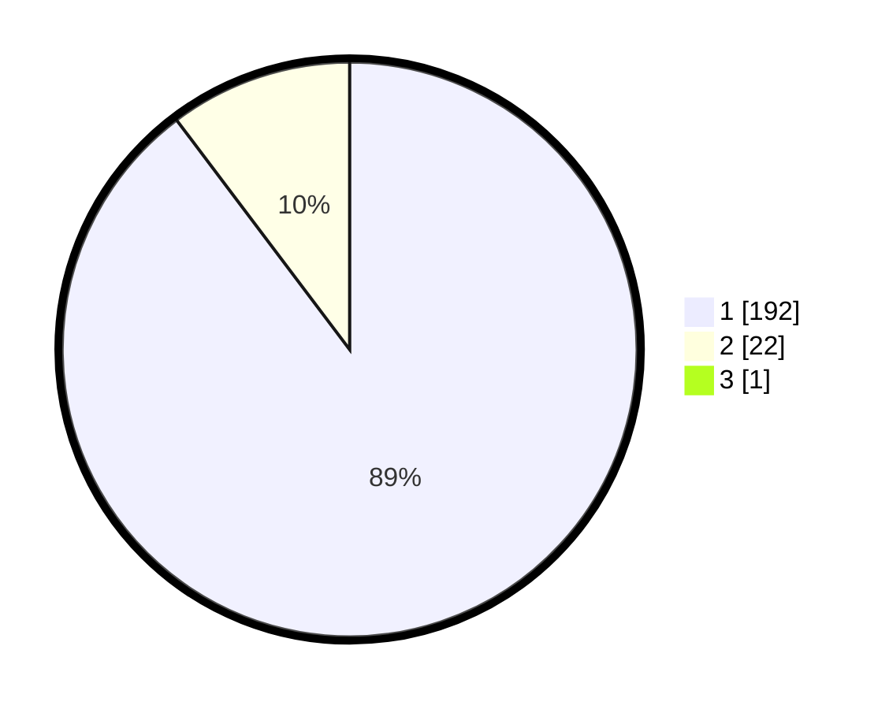

# Hasil

## Grafik

## Tabel

| No. | Nama Paslon    | Suara | Suara (raw) | Persentase |
|:--- |:-------------- | -----:| -----------:| ----------:|
| 1   | ANIES MUHAIMIN | 192   | [192][p-1]  | 89,30      |
| 2   | PRABOWO GIBRAN | 22    | [22][p-2]   | 10,23      |
| 3   | GANJAR MAHFUD  | 1     | [1][p-3]    | 0,47       |

[p-1]: https://github.com/gigit-pemilu/pemilu-2024-11-aceh/blob/main/pilpres/hitung-suara/sub/11-aceh/sub/12-aceh-barat-daya/sub/05-kuala-batee/sub/2013-krueng-batee/sub/003-tps/sub/paslon-1.txt
[p-2]: https://github.com/gigit-pemilu/pemilu-2024-11-aceh/blob/main/pilpres/hitung-suara/sub/11-aceh/sub/12-aceh-barat-daya/sub/05-kuala-batee/sub/2013-krueng-batee/sub/003-tps/sub/paslon-2.txt
[p-3]: https://github.com/gigit-pemilu/pemilu-2024-11-aceh/blob/main/pilpres/hitung-suara/sub/11-aceh/sub/12-aceh-barat-daya/sub/05-kuala-batee/sub/2013-krueng-batee/sub/003-tps/sub/paslon-3.txt

## Foto C Plano

https://sirekap-obj-formc.kpu.go.id/be77/pemilu/ppwp/11/12/05/20/13/1112052013003-20240215-123020--8c123dc8-255e-43cd-b89f-91b0da5894a2.jpg

https://sirekap-obj-formc.kpu.go.id/be77/pemilu/ppwp/11/12/05/20/13/1112052013003-20240215-111631--3dd0e9e9-1720-4bd6-bbef-4e5322903c26.jpg

https://sirekap-obj-formc.kpu.go.id/be77/pemilu/ppwp/11/12/05/20/13/1112052013003-20240215-111833--322bd077-84c6-40ff-bea6-a80ee3948a24.jpg

## Metadata

| Key        | Value               |
| ---------- | ------------------- |
| Time Stamp | 2024-02-24 22:31:28 |

