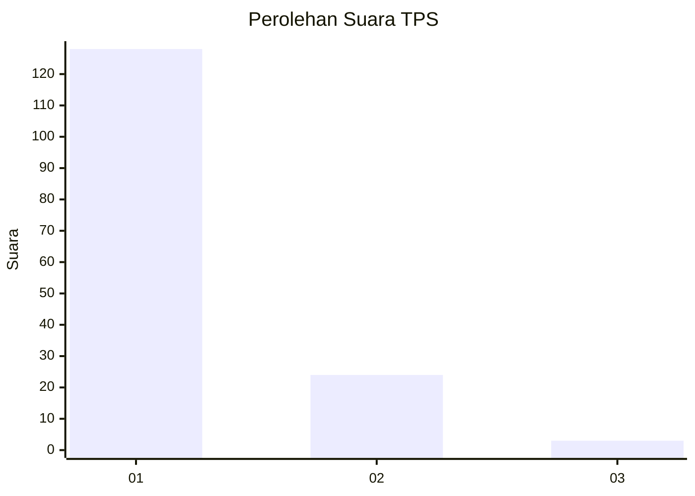
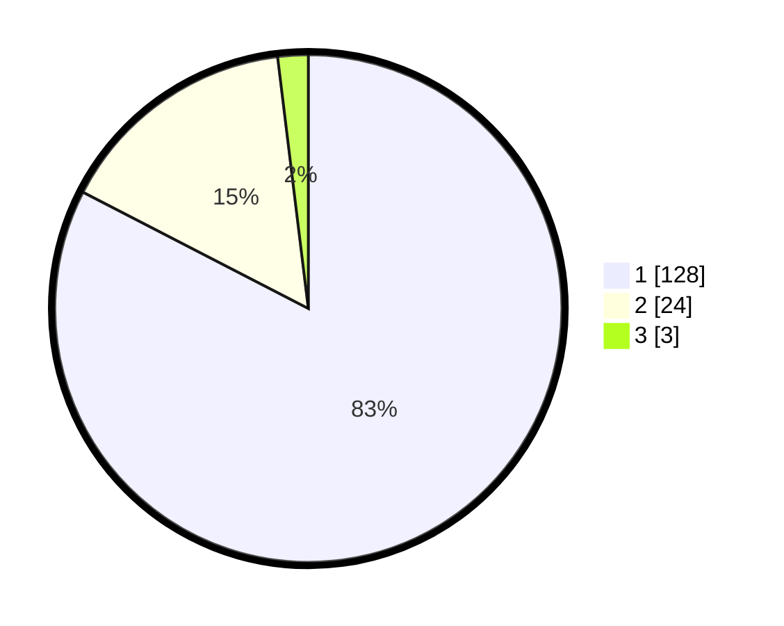

# Hasil

## Grafik

## Tabel

| No. | Nama Paslon    | Suara | Suara (raw) | Persentase |
|:--- |:-------------- | -----:| -----------:| ----------:|
| 1   | ANIES MUHAIMIN | 128   | [128][p-1]  | 82,58      |
| 2   | PRABOWO GIBRAN | 24    | [24][p-2]   | 15,48      |
| 3   | GANJAR MAHFUD  | 3     | [3][p-3]    | 1,94       |

[p-1]: https://github.com/gigit-pemilu/pemilu-2024-11-aceh/blob/main/pilpres/hitung-suara/sub/11-aceh/sub/12-aceh-barat-daya/sub/05-kuala-batee/sub/2013-krueng-batee/sub/004-tps/sub/paslon-1.txt
[p-2]: https://github.com/gigit-pemilu/pemilu-2024-11-aceh/blob/main/pilpres/hitung-suara/sub/11-aceh/sub/12-aceh-barat-daya/sub/05-kuala-batee/sub/2013-krueng-batee/sub/004-tps/sub/paslon-2.txt
[p-3]: https://github.com/gigit-pemilu/pemilu-2024-11-aceh/blob/main/pilpres/hitung-suara/sub/11-aceh/sub/12-aceh-barat-daya/sub/05-kuala-batee/sub/2013-krueng-batee/sub/004-tps/sub/paslon-3.txt

## Foto C Plano

https://sirekap-obj-formc.kpu.go.id/4b3c/pemilu/ppwp/11/12/05/20/13/1112052013004-20240215-164556--cc122a9a-9c2a-4dd0-bc1d-9422f79b0071.jpg

https://sirekap-obj-formc.kpu.go.id/4b3c/pemilu/ppwp/11/12/05/20/13/1112052013004-20240215-165337--2e192941-8766-420e-9d51-71e8fa3cbe6b.jpg

https://sirekap-obj-formc.kpu.go.id/4b3c/pemilu/ppwp/11/12/05/20/13/1112052013004-20240215-165517--c5a97468-0990-4c89-b2cc-c9e54ec664aa.jpg

## Metadata

| Key        | Value               |
| ---------- | ------------------- |
| Time Stamp | 2024-02-24 22:31:28 |

