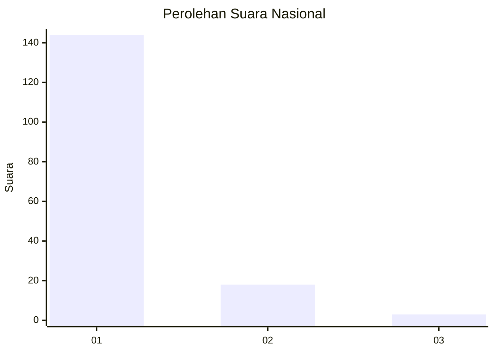
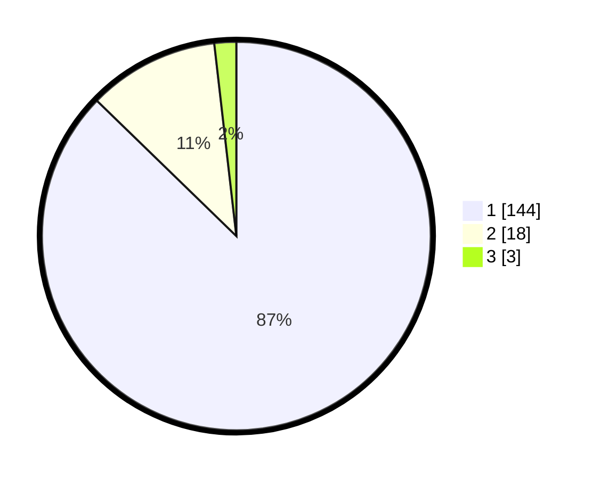

# Hasil

## Grafik

## Tabel

| No. | Nama Paslon    | Suara | Suara (raw) | Persentase |
|:--- |:-------------- | -----:| -----------:| ----------:|
| 1   | ANIES MUHAIMIN | 144   | [144][p-1]  | 87,27      |
| 2   | PRABOWO GIBRAN | 18    | [18][p-2]   | 10,91      |
| 3   | GANJAR MAHFUD  | 3     | [3][p-3]    | 1,82       |

[p-1]: https://github.com/gigit-pemilu/pemilu-2024/blob/main/pilpres/hitung-suara/sub/11-aceh/sub/12-aceh-barat-daya/sub/05-kuala-batee/sub/2016-ie-mameh/sub/003-tps/sub/paslon-1.txt
[p-2]: https://github.com/gigit-pemilu/pemilu-2024/blob/main/pilpres/hitung-suara/sub/11-aceh/sub/12-aceh-barat-daya/sub/05-kuala-batee/sub/2016-ie-mameh/sub/003-tps/sub/paslon-2.txt
[p-3]: https://github.com/gigit-pemilu/pemilu-2024/blob/main/pilpres/hitung-suara/sub/11-aceh/sub/12-aceh-barat-daya/sub/05-kuala-batee/sub/2016-ie-mameh/sub/003-tps/sub/paslon-3.txt

## Foto C Plano

https://sirekap-obj-formc.kpu.go.id/fc6f/pemilu/ppwp/11/12/05/20/16/1112052016003-20240215-003325--93976ac8-166c-4a62-a72b-6b84af54cee0.jpg

https://sirekap-obj-formc.kpu.go.id/fc6f/pemilu/ppwp/11/12/05/20/16/1112052016003-20240215-003615--dd586c03-76e5-4911-9012-4502c02b80f3.jpg

https://sirekap-obj-formc.kpu.go.id/fc6f/pemilu/ppwp/11/12/05/20/16/1112052016003-20240215-003101--c52854b2-a808-4a6a-86c3-16c03d5547d7.jpg

## Metadata

| Key        | Value               |
| ---------- | ------------------- |
| Time Stamp | 2024-02-24 22:31:28 |

