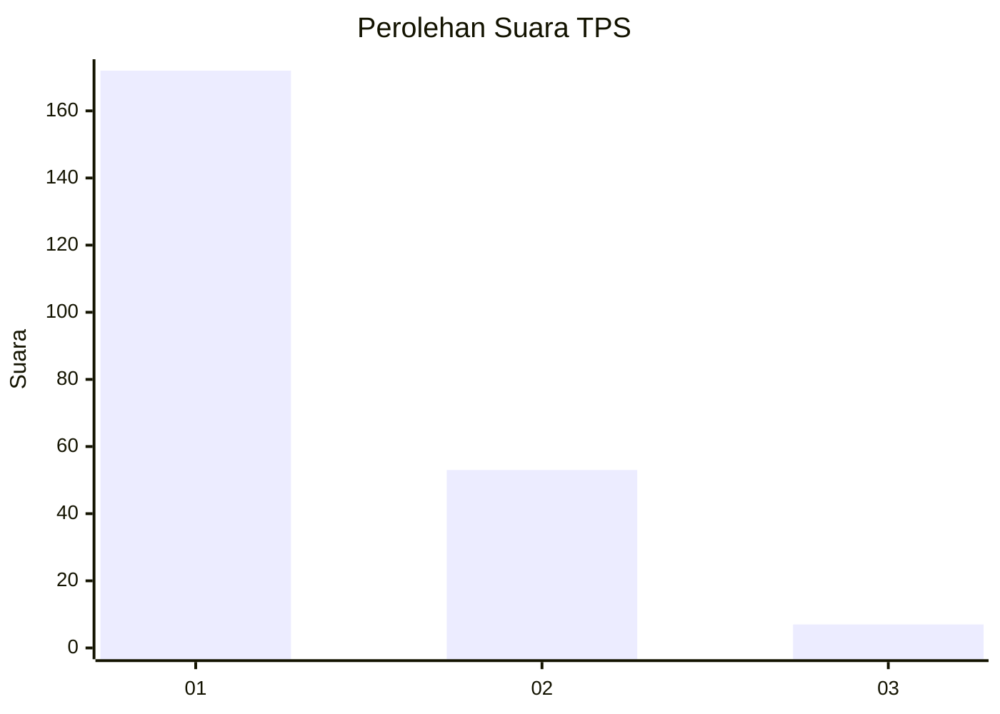
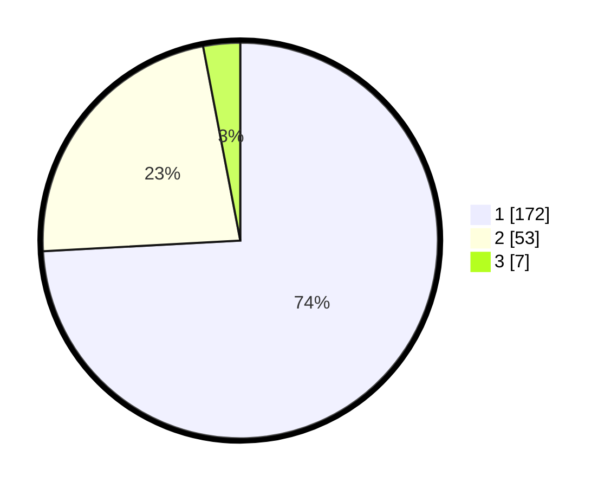

# Hasil

## Grafik

## Tabel

| No. | Nama Paslon    | Suara | Suara (raw) | Persentase |
|:--- |:-------------- | -----:| -----------:| ----------:|
| 1   | ANIES MUHAIMIN | 172   | [172][p-1]  | 74,14      |
| 2   | PRABOWO GIBRAN | 53    | [53][p-2]   | 22,84      |
| 3   | GANJAR MAHFUD  | 7     | [7][p-3]    | 3,02       |

[p-1]: https://github.com/gigit-pemilu/pemilu-2024-11-aceh/blob/main/pilpres/hitung-suara/sub/11-aceh/sub/12-aceh-barat-daya/sub/06-babah-rot/sub/2001-pante-rakyat/sub/003-tps/sub/paslon-1.txt
[p-2]: https://github.com/gigit-pemilu/pemilu-2024-11-aceh/blob/main/pilpres/hitung-suara/sub/11-aceh/sub/12-aceh-barat-daya/sub/06-babah-rot/sub/2001-pante-rakyat/sub/003-tps/sub/paslon-2.txt
[p-3]: https://github.com/gigit-pemilu/pemilu-2024-11-aceh/blob/main/pilpres/hitung-suara/sub/11-aceh/sub/12-aceh-barat-daya/sub/06-babah-rot/sub/2001-pante-rakyat/sub/003-tps/sub/paslon-3.txt

## Foto C Plano

https://sirekap-obj-formc.kpu.go.id/5607/pemilu/ppwp/11/12/06/20/01/1112062001003-20240215-100906--dd1a64e1-45da-4728-a543-0c79c06c70a6.jpg

https://sirekap-obj-formc.kpu.go.id/5607/pemilu/ppwp/11/12/06/20/01/1112062001003-20240215-101312--12e20224-5723-4a62-a3f2-46095762911b.jpg

https://sirekap-obj-formc.kpu.go.id/5607/pemilu/ppwp/11/12/06/20/01/1112062001003-20240215-101603--1c9644fd-0538-442f-a697-bf6cde069818.jpg

## Metadata

| Key        | Value               |
| ---------- | ------------------- |
| Time Stamp | 2024-02-15 20:00:44 |

