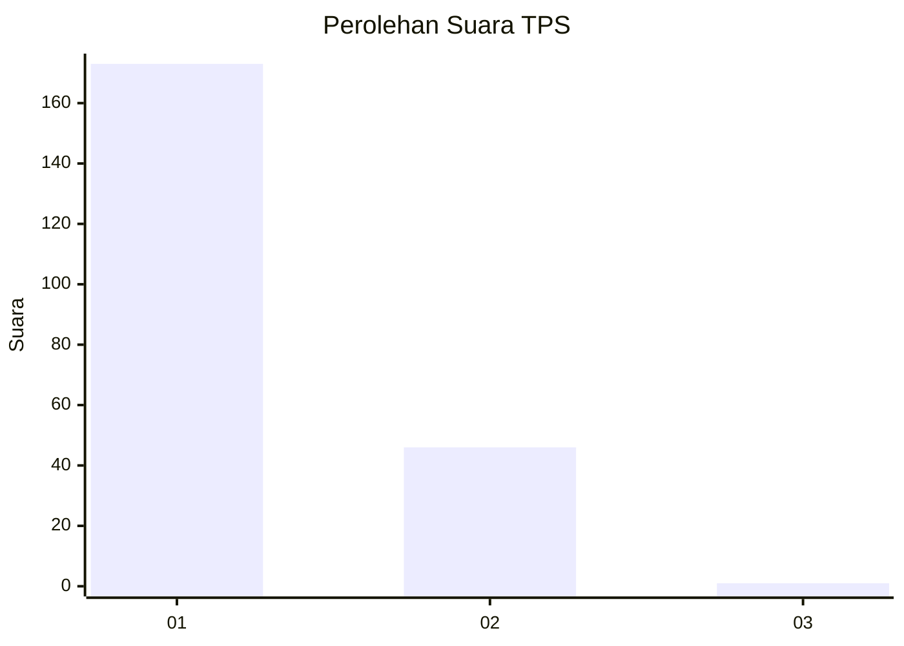
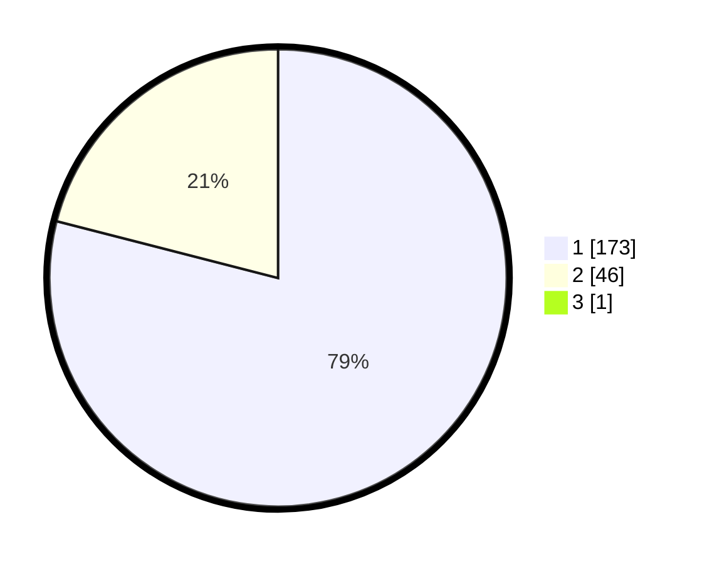

# Hasil

## Grafik

## Tabel

| No. | Nama Paslon    | Suara | Suara (raw) | Persentase |
|:--- |:-------------- | -----:| -----------:| ----------:|
| 1   | ANIES MUHAIMIN | 173   | [173][p-1]  | 78,64      |
| 2   | PRABOWO GIBRAN | 46    | [46][p-2]   | 20,91      |
| 3   | GANJAR MAHFUD  | 1     | [1][p-3]    | 0,45       |

[p-1]: https://github.com/gigit-pemilu/pemilu-2024-11-aceh/blob/main/pilpres/hitung-suara/sub/11-aceh/sub/12-aceh-barat-daya/sub/06-babah-rot/sub/2001-pante-rakyat/sub/004-tps/sub/paslon-1.txt
[p-2]: https://github.com/gigit-pemilu/pemilu-2024-11-aceh/blob/main/pilpres/hitung-suara/sub/11-aceh/sub/12-aceh-barat-daya/sub/06-babah-rot/sub/2001-pante-rakyat/sub/004-tps/sub/paslon-2.txt
[p-3]: https://github.com/gigit-pemilu/pemilu-2024-11-aceh/blob/main/pilpres/hitung-suara/sub/11-aceh/sub/12-aceh-barat-daya/sub/06-babah-rot/sub/2001-pante-rakyat/sub/004-tps/sub/paslon-3.txt

## Foto C Plano

https://sirekap-obj-formc.kpu.go.id/d0a1/pemilu/ppwp/11/12/06/20/01/1112062001004-20240215-095614--c2285132-3662-49d2-b58a-75b3571e27cf.jpg

https://sirekap-obj-formc.kpu.go.id/d0a1/pemilu/ppwp/11/12/06/20/01/1112062001004-20240215-095801--230ddb57-8da2-4236-8e53-f0cdd42879d9.jpg

https://sirekap-obj-formc.kpu.go.id/d0a1/pemilu/ppwp/11/12/06/20/01/1112062001004-20240215-095937--50a75a05-a60d-4475-90f6-0d686395c781.jpg

## Metadata

| Key        | Value               |
| ---------- | ------------------- |
| Time Stamp | 2024-02-15 20:00:44 |

