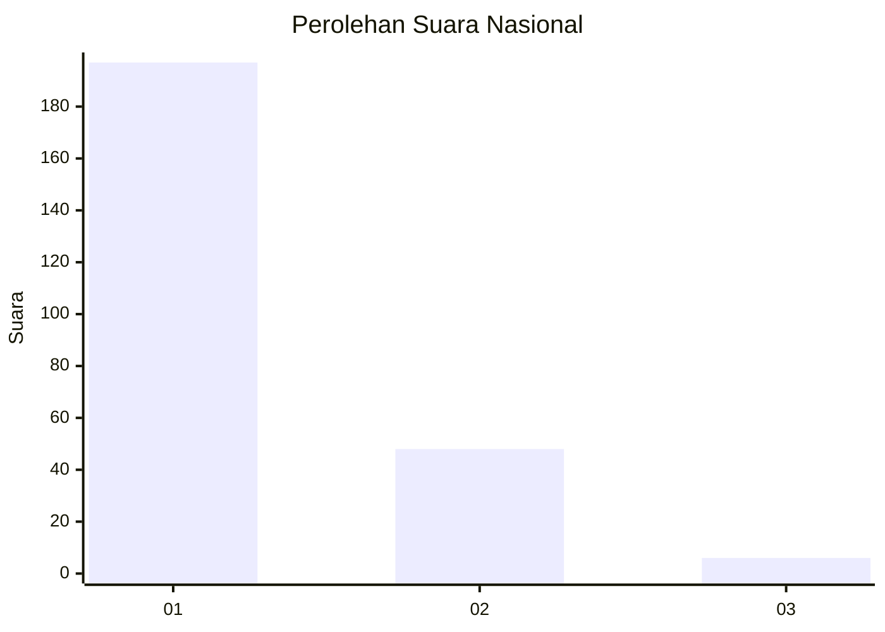
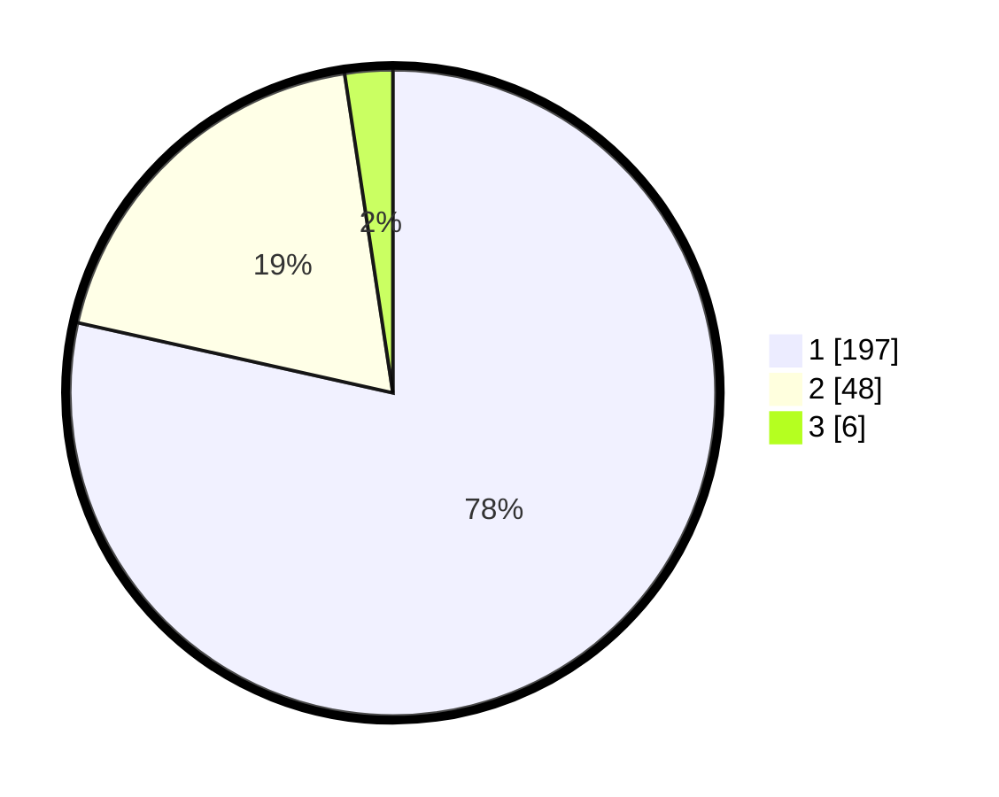

# Hasil

## Grafik

## Tabel

| No. | Nama Paslon    | Suara | Suara (raw) | Persentase |
|:--- |:-------------- | -----:| -----------:| ----------:|
| 1   | ANIES MUHAIMIN | 197   | [197][p-1]  | 78,49      |
| 2   | PRABOWO GIBRAN | 48    | [48][p-2]   | 19,12      |
| 3   | GANJAR MAHFUD  | 6     | [6][p-3]    | 2,39       |

[p-1]: https://github.com/gigit-pemilu/pemilu-2024/blob/main/pilpres/hitung-suara/sub/11-aceh/sub/12-aceh-barat-daya/sub/06-babah-rot/sub/2001-pante-rakyat/sub/005-tps/sub/paslon-1.txt
[p-2]: https://github.com/gigit-pemilu/pemilu-2024/blob/main/pilpres/hitung-suara/sub/11-aceh/sub/12-aceh-barat-daya/sub/06-babah-rot/sub/2001-pante-rakyat/sub/005-tps/sub/paslon-2.txt
[p-3]: https://github.com/gigit-pemilu/pemilu-2024/blob/main/pilpres/hitung-suara/sub/11-aceh/sub/12-aceh-barat-daya/sub/06-babah-rot/sub/2001-pante-rakyat/sub/005-tps/sub/paslon-3.txt

## Foto C Plano

https://sirekap-obj-formc.kpu.go.id/9a12/pemilu/ppwp/11/12/06/20/01/1112062001005-20240215-164648--17a56a69-afe9-4ded-ae57-4e6edc22026c.jpg

https://sirekap-obj-formc.kpu.go.id/9a12/pemilu/ppwp/11/12/06/20/01/1112062001005-20240215-164747--adba7d37-3a4b-433e-a90a-d6ed2ebaaab4.jpg

https://sirekap-obj-formc.kpu.go.id/9a12/pemilu/ppwp/11/12/06/20/01/1112062001005-20240215-164852--b8c6f79a-3832-453d-80a9-b498b6726333.jpg

## Metadata

| Key        | Value               |
| ---------- | ------------------- |
| Time Stamp | 2024-02-15 20:30:46 |

