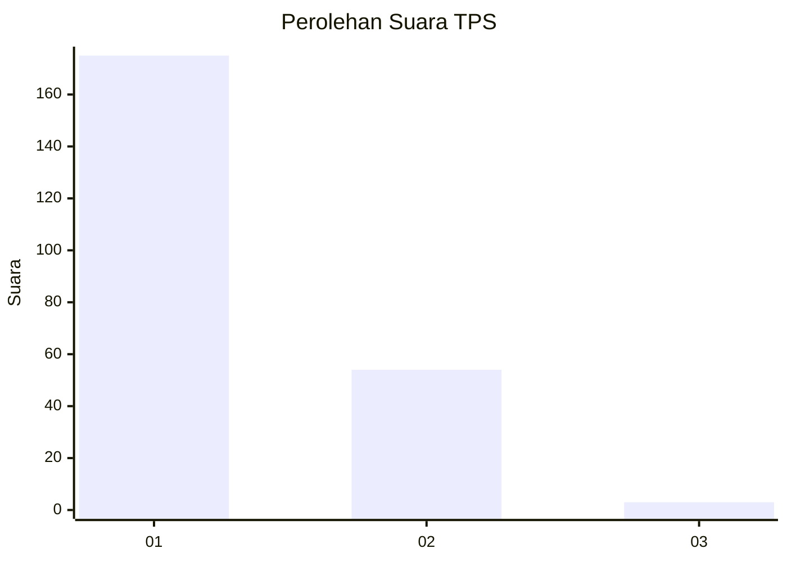
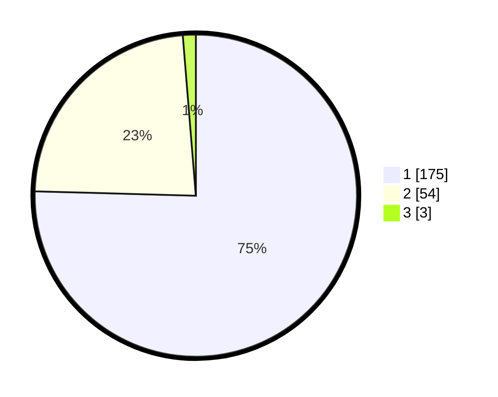

# Hasil

## Grafik

## Tabel

| No. | Nama Paslon    | Suara | Suara (raw) | Persentase |
|:--- |:-------------- | -----:| -----------:| ----------:|
| 1   | ANIES MUHAIMIN | 175   | [175][p-1]  | 75,43      |
| 2   | PRABOWO GIBRAN | 54    | [54][p-2]   | 23,28      |
| 3   | GANJAR MAHFUD  | 3     | [3][p-3]    | 1,29       |

[p-1]: https://github.com/gigit-pemilu/pemilu-2024-11-aceh/blob/main/pilpres/hitung-suara/sub/11-aceh/sub/12-aceh-barat-daya/sub/06-babah-rot/sub/2001-pante-rakyat/sub/006-tps/sub/paslon-1.txt
[p-2]: https://github.com/gigit-pemilu/pemilu-2024-11-aceh/blob/main/pilpres/hitung-suara/sub/11-aceh/sub/12-aceh-barat-daya/sub/06-babah-rot/sub/2001-pante-rakyat/sub/006-tps/sub/paslon-2.txt
[p-3]: https://github.com/gigit-pemilu/pemilu-2024-11-aceh/blob/main/pilpres/hitung-suara/sub/11-aceh/sub/12-aceh-barat-daya/sub/06-babah-rot/sub/2001-pante-rakyat/sub/006-tps/sub/paslon-3.txt

## Foto C Plano

https://sirekap-obj-formc.kpu.go.id/4dd6/pemilu/ppwp/11/12/06/20/01/1112062001006-20240215-095914--ad4ca9cf-7757-4de9-a53f-9a8558b6af96.jpg

https://sirekap-obj-formc.kpu.go.id/4dd6/pemilu/ppwp/11/12/06/20/01/1112062001006-20240214-224529--1977834c-75d2-4915-9e4f-1bdc4352a248.jpg

## Metadata

| Key        | Value               |
| ---------- | ------------------- |
| Time Stamp | 2024-02-15 20:00:44 |

