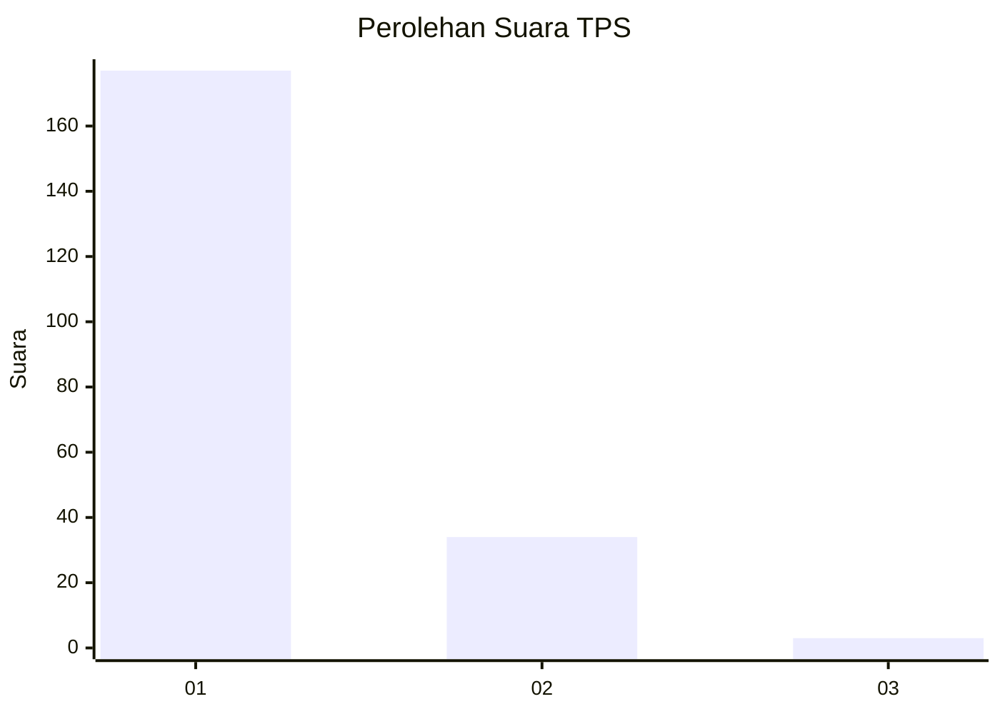
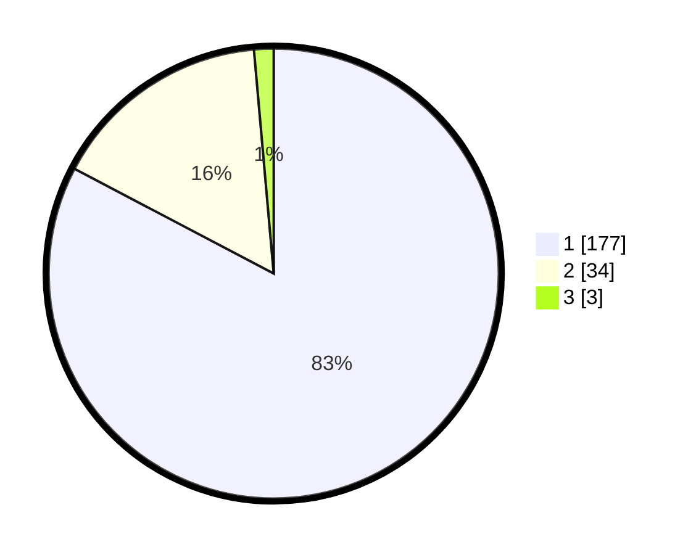

# Hasil

## Grafik

## Tabel

| No. | Nama Paslon    | Suara | Suara (raw) | Persentase |
|:--- |:-------------- | -----:| -----------:| ----------:|
| 1   | ANIES MUHAIMIN | 177   | [177][p-1]  | 82,71      |
| 2   | PRABOWO GIBRAN | 34    | [34][p-2]   | 15,89      |
| 3   | GANJAR MAHFUD  | 3     | [3][p-3]    | 1,40       |

[p-1]: https://github.com/gigit-pemilu/pemilu-2024-11-aceh/blob/main/pilpres/hitung-suara/sub/11-aceh/sub/12-aceh-barat-daya/sub/06-babah-rot/sub/2003-gunung-samarinda/sub/002-tps/sub/paslon-1.txt
[p-2]: https://github.com/gigit-pemilu/pemilu-2024-11-aceh/blob/main/pilpres/hitung-suara/sub/11-aceh/sub/12-aceh-barat-daya/sub/06-babah-rot/sub/2003-gunung-samarinda/sub/002-tps/sub/paslon-2.txt
[p-3]: https://github.com/gigit-pemilu/pemilu-2024-11-aceh/blob/main/pilpres/hitung-suara/sub/11-aceh/sub/12-aceh-barat-daya/sub/06-babah-rot/sub/2003-gunung-samarinda/sub/002-tps/sub/paslon-3.txt

## Foto C Plano

https://sirekap-obj-formc.kpu.go.id/83a0/pemilu/ppwp/11/12/06/20/03/1112062003002-20240214-190009--7f6ed348-ea72-4121-bc21-178aa774bdc1.jpg

https://sirekap-obj-formc.kpu.go.id/83a0/pemilu/ppwp/11/12/06/20/03/1112062003002-20240214-190228--b53a00a0-0b28-4966-ab30-6861ea5f6e0d.jpg

https://sirekap-obj-formc.kpu.go.id/83a0/pemilu/ppwp/11/12/06/20/03/1112062003002-20240214-190358--f1ebaaf7-b997-4dd8-bbf1-7678199b2248.jpg

## Metadata

| Key        | Value               |
| ---------- | ------------------- |
| Time Stamp | 2024-02-15 19:30:26 |

