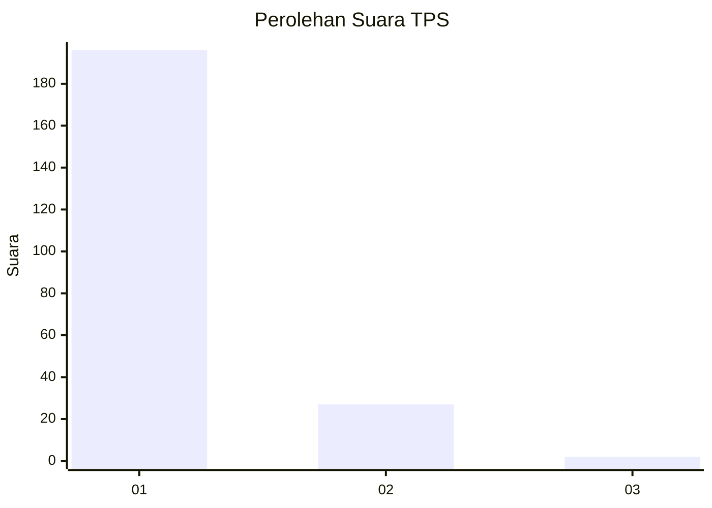
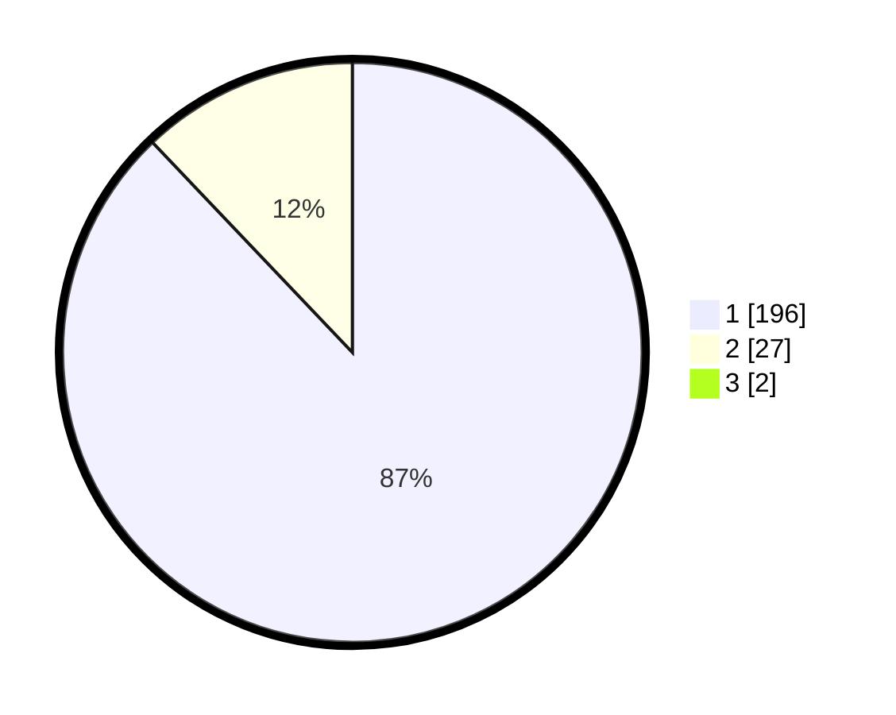

# Hasil

## Grafik

## Tabel

| No. | Nama Paslon    | Suara | Suara (raw) | Persentase |
|:--- |:-------------- | -----:| -----------:| ----------:|
| 1   | ANIES MUHAIMIN | 196   | [196][p-1]  | 87,11      |
| 2   | PRABOWO GIBRAN | 27    | [27][p-2]   | 12,00      |
| 3   | GANJAR MAHFUD  | 2     | [2][p-3]    | 0,89       |

[p-1]: https://github.com/gigit-pemilu/pemilu-2024-11-aceh/blob/main/pilpres/hitung-suara/sub/11-aceh/sub/12-aceh-barat-daya/sub/06-babah-rot/sub/2004-alue-jeurejak/sub/004-tps/sub/paslon-1.txt
[p-2]: https://github.com/gigit-pemilu/pemilu-2024-11-aceh/blob/main/pilpres/hitung-suara/sub/11-aceh/sub/12-aceh-barat-daya/sub/06-babah-rot/sub/2004-alue-jeurejak/sub/004-tps/sub/paslon-2.txt
[p-3]: https://github.com/gigit-pemilu/pemilu-2024-11-aceh/blob/main/pilpres/hitung-suara/sub/11-aceh/sub/12-aceh-barat-daya/sub/06-babah-rot/sub/2004-alue-jeurejak/sub/004-tps/sub/paslon-3.txt

## Foto C Plano

https://sirekap-obj-formc.kpu.go.id/6818/pemilu/ppwp/11/12/06/20/04/1112062004004-20240215-051806--ec996d14-4a39-4b6d-ba6d-3d2948861b13.jpg

https://sirekap-obj-formc.kpu.go.id/6818/pemilu/ppwp/11/12/06/20/04/1112062004004-20240215-135336--18e08bbe-b333-433a-86d0-464c2984f3b3.jpg

https://sirekap-obj-formc.kpu.go.id/6818/pemilu/ppwp/11/12/06/20/04/1112062004004-20240215-052122--9590e97f-84d8-4e6f-8319-3d585e0dc3b6.jpg

## Metadata

| Key        | Value               |
| ---------- | ------------------- |
| Time Stamp | 2024-02-15 20:00:44 |

