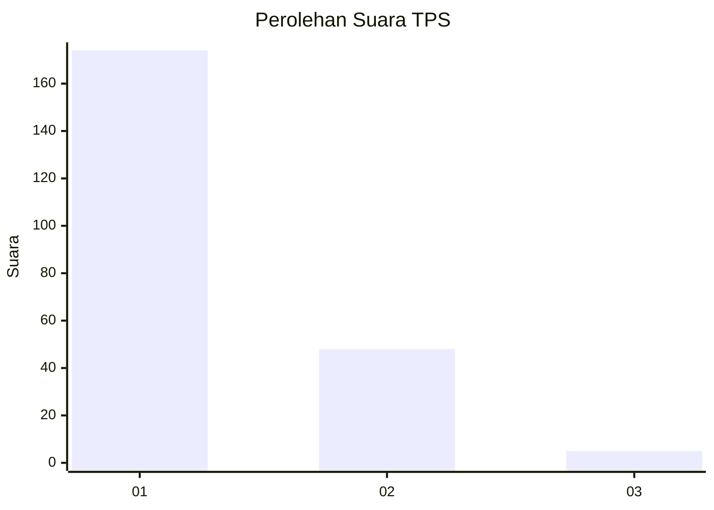
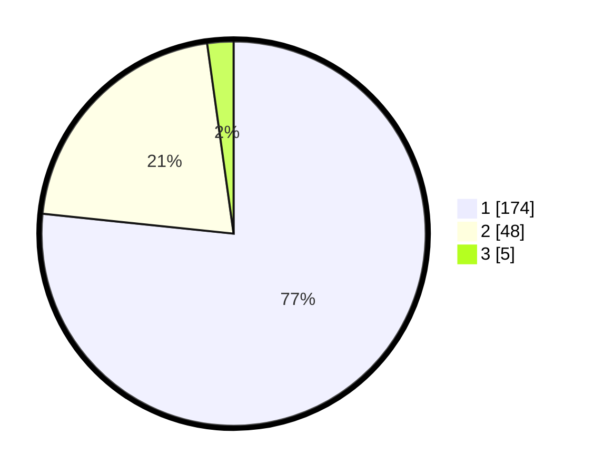

# Hasil

## Grafik

## Tabel

| No. | Nama Paslon    | Suara | Suara (raw) | Persentase |
|:--- |:-------------- | -----:| -----------:| ----------:|
| 1   | ANIES MUHAIMIN | 174   | [174][p-1]  | 76,65      |
| 2   | PRABOWO GIBRAN | 48    | [48][p-2]   | 21,15      |
| 3   | GANJAR MAHFUD  | 5     | [5][p-3]    | 2,20       |

[p-1]: https://github.com/gigit-pemilu/pemilu-2024-11-aceh/blob/main/pilpres/hitung-suara/sub/11-aceh/sub/12-aceh-barat-daya/sub/06-babah-rot/sub/2006-alue-peunawa/sub/001-tps/sub/paslon-1.txt
[p-2]: https://github.com/gigit-pemilu/pemilu-2024-11-aceh/blob/main/pilpres/hitung-suara/sub/11-aceh/sub/12-aceh-barat-daya/sub/06-babah-rot/sub/2006-alue-peunawa/sub/001-tps/sub/paslon-2.txt
[p-3]: https://github.com/gigit-pemilu/pemilu-2024-11-aceh/blob/main/pilpres/hitung-suara/sub/11-aceh/sub/12-aceh-barat-daya/sub/06-babah-rot/sub/2006-alue-peunawa/sub/001-tps/sub/paslon-3.txt

## Foto C Plano

https://sirekap-obj-formc.kpu.go.id/8286/pemilu/ppwp/11/12/06/20/06/1112062006001-20240214-201140--fe479276-82fd-4b9f-9c5f-9496b345bd72.jpg

https://sirekap-obj-formc.kpu.go.id/8286/pemilu/ppwp/11/12/06/20/06/1112062006001-20240214-202940--a649d9af-15d7-4b4c-a9bd-af68335d2c64.jpg

https://sirekap-obj-formc.kpu.go.id/8286/pemilu/ppwp/11/12/06/20/06/1112062006001-20240215-094910--f033c459-4e4a-4a9f-8291-a83696568409.jpg

## Metadata

| Key        | Value               |
| ---------- | ------------------- |
| Time Stamp | 2024-02-15 20:00:44 |

