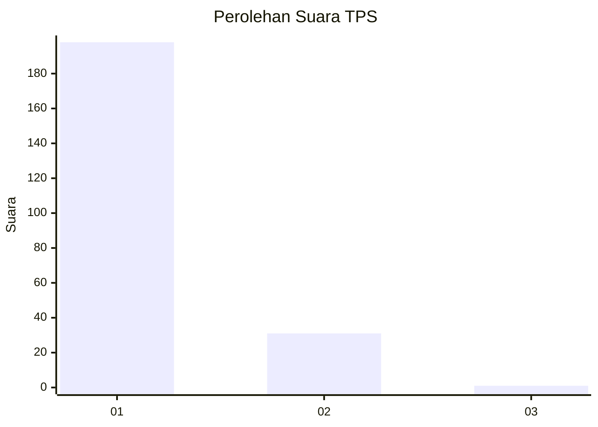
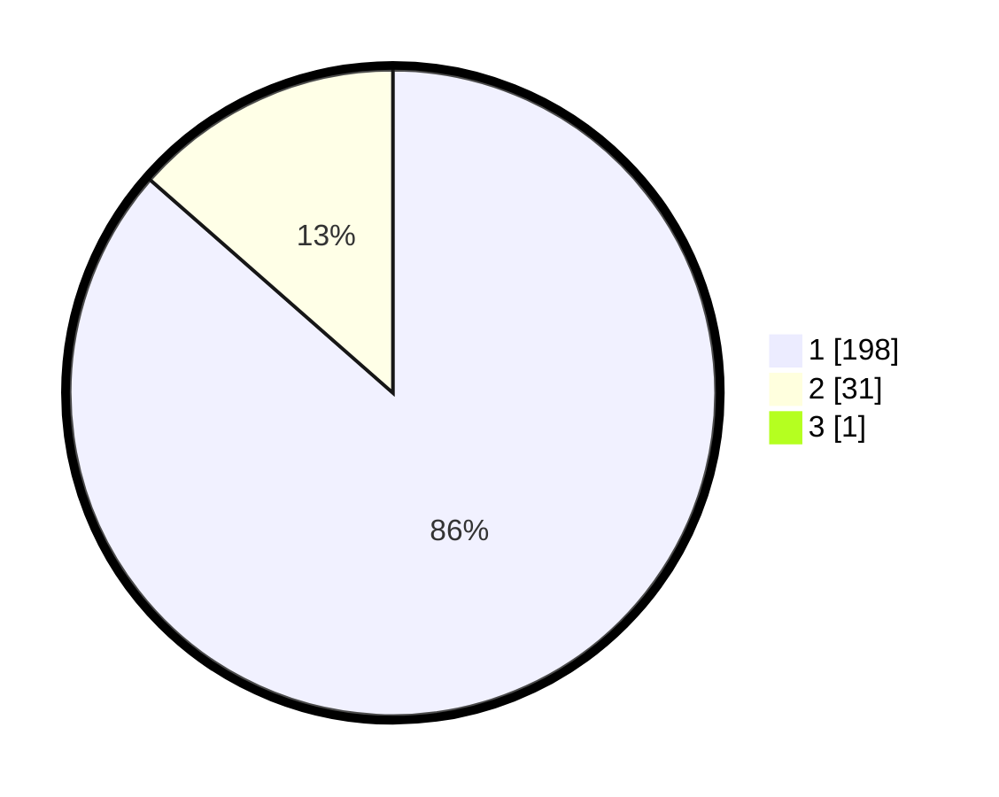

# Hasil

## Grafik

## Tabel

| No. | Nama Paslon    | Suara | Suara (raw) | Persentase |
|:--- |:-------------- | -----:| -----------:| ----------:|
| 1   | ANIES MUHAIMIN | 198   | [198][p-1]  | 86,09      |
| 2   | PRABOWO GIBRAN | 31    | [31][p-2]   | 13,48      |
| 3   | GANJAR MAHFUD  | 1     | [1][p-3]    | 0,43       |

[p-1]: https://github.com/gigit-pemilu/pemilu-2024-11-aceh/blob/main/pilpres/hitung-suara/sub/11-aceh/sub/12-aceh-barat-daya/sub/06-babah-rot/sub/2008-blang-raja/sub/002-tps/sub/paslon-1.txt
[p-2]: https://github.com/gigit-pemilu/pemilu-2024-11-aceh/blob/main/pilpres/hitung-suara/sub/11-aceh/sub/12-aceh-barat-daya/sub/06-babah-rot/sub/2008-blang-raja/sub/002-tps/sub/paslon-2.txt
[p-3]: https://github.com/gigit-pemilu/pemilu-2024-11-aceh/blob/main/pilpres/hitung-suara/sub/11-aceh/sub/12-aceh-barat-daya/sub/06-babah-rot/sub/2008-blang-raja/sub/002-tps/sub/paslon-3.txt

## Foto C Plano

https://sirekap-obj-formc.kpu.go.id/922c/pemilu/ppwp/11/12/06/20/08/1112062008002-20240215-132526--17178a6d-1a35-4198-a0dc-3a79781b7d36.jpg

https://sirekap-obj-formc.kpu.go.id/922c/pemilu/ppwp/11/12/06/20/08/1112062008002-20240215-132612--5fee7221-dec0-4fa4-998c-61f8e12dd06f.jpg

https://sirekap-obj-formc.kpu.go.id/922c/pemilu/ppwp/11/12/06/20/08/1112062008002-20240215-132815--cd1d06b9-9c3b-49e1-b943-b9dcbaa539b0.jpg

## Metadata

| Key        | Value               |
| ---------- | ------------------- |
| Time Stamp | 2024-02-15 20:00:44 |

