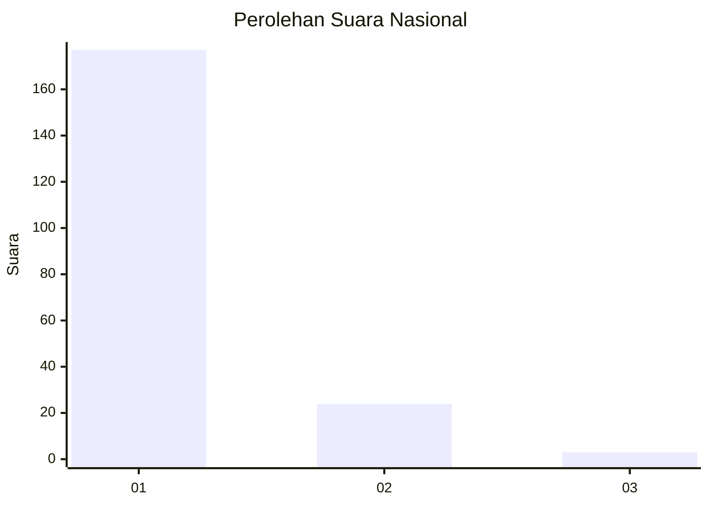
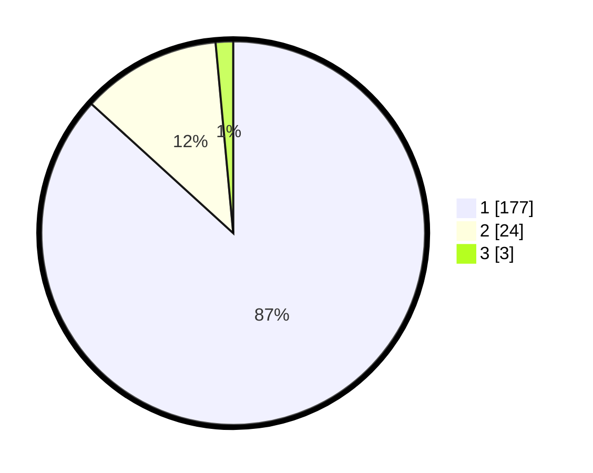

# Hasil

## Grafik

## Tabel

| No. | Nama Paslon    | Suara | Suara (raw) | Persentase |
|:--- |:-------------- | -----:| -----------:| ----------:|
| 1   | ANIES MUHAIMIN | 177   | [177][p-1]  | 86,76      |
| 2   | PRABOWO GIBRAN | 24    | [24][p-2]   | 11,76      |
| 3   | GANJAR MAHFUD  | 3     | [3][p-3]    | 1,47       |

[p-1]: https://github.com/gigit-pemilu/pemilu-2024/blob/main/pilpres/hitung-suara/sub/11-aceh/sub/12-aceh-barat-daya/sub/06-babah-rot/sub/2012-lhok-gayo/sub/002-tps/sub/paslon-1.txt
[p-2]: https://github.com/gigit-pemilu/pemilu-2024/blob/main/pilpres/hitung-suara/sub/11-aceh/sub/12-aceh-barat-daya/sub/06-babah-rot/sub/2012-lhok-gayo/sub/002-tps/sub/paslon-2.txt
[p-3]: https://github.com/gigit-pemilu/pemilu-2024/blob/main/pilpres/hitung-suara/sub/11-aceh/sub/12-aceh-barat-daya/sub/06-babah-rot/sub/2012-lhok-gayo/sub/002-tps/sub/paslon-3.txt

## Foto C Plano

https://sirekap-obj-formc.kpu.go.id/8c05/pemilu/ppwp/11/12/06/20/12/1112062012002-20240214-204953--9314d075-28e1-488b-9ef6-edca4fbbe84c.jpg

https://sirekap-obj-formc.kpu.go.id/8c05/pemilu/ppwp/11/12/06/20/12/1112062012002-20240214-222732--a6d758d4-efbe-4d81-a7b9-82b7dce53af5.jpg

https://sirekap-obj-formc.kpu.go.id/8c05/pemilu/ppwp/11/12/06/20/12/1112062012002-20240214-222913--509979fa-3c1b-4389-bbf8-ec0a5edf573b.jpg

## Metadata

| Key        | Value               |
| ---------- | ------------------- |
| Time Stamp | 2024-02-15 20:30:46 |

