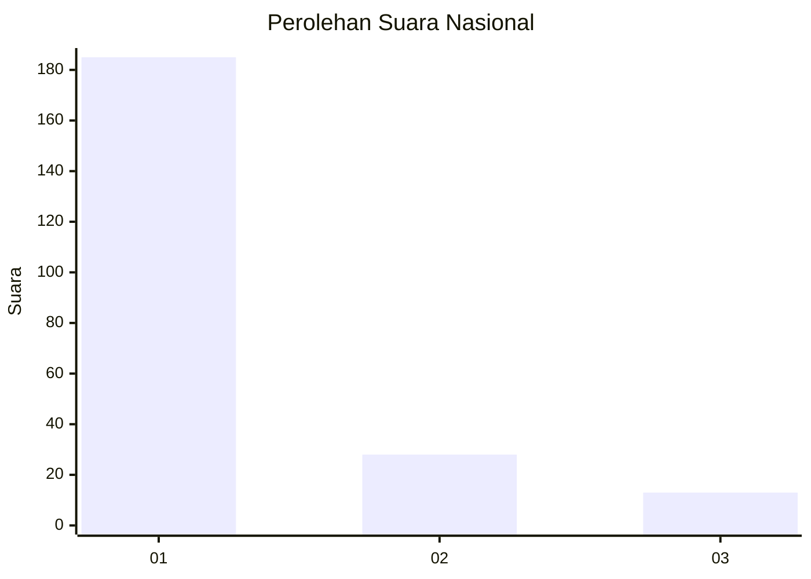
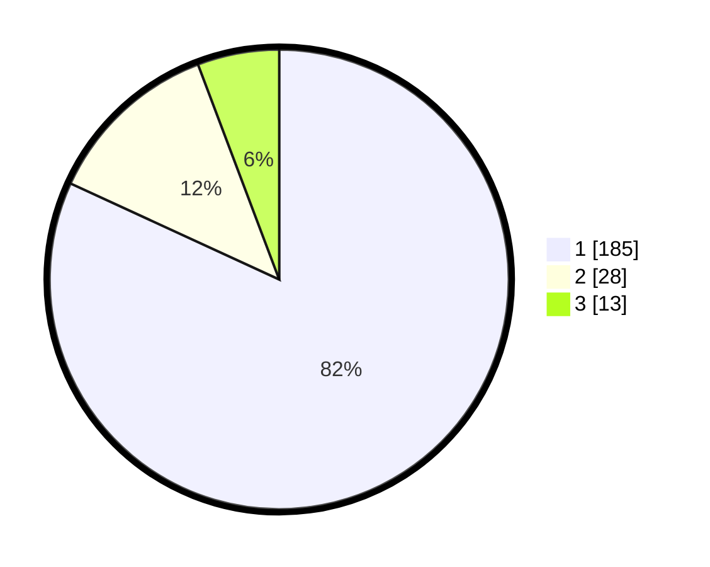

# Hasil

## Grafik

## Tabel

| No. | Nama Paslon    | Suara | Suara (raw) | Persentase |
|:--- |:-------------- | -----:| -----------:| ----------:|
| 1   | ANIES MUHAIMIN | 185   | [185][p-1]  | 81,86      |
| 2   | PRABOWO GIBRAN | 28    | [28][p-2]   | 12,39      |
| 3   | GANJAR MAHFUD  | 13    | [13][p-3]   | 5,75       |

[p-1]: https://github.com/gigit-pemilu/pemilu-2024/blob/main/pilpres/hitung-suara/sub/11-aceh/sub/12-aceh-barat-daya/sub/06-babah-rot/sub/2014-cot-seumantok/sub/002-tps/sub/paslon-1.txt
[p-2]: https://github.com/gigit-pemilu/pemilu-2024/blob/main/pilpres/hitung-suara/sub/11-aceh/sub/12-aceh-barat-daya/sub/06-babah-rot/sub/2014-cot-seumantok/sub/002-tps/sub/paslon-2.txt
[p-3]: https://github.com/gigit-pemilu/pemilu-2024/blob/main/pilpres/hitung-suara/sub/11-aceh/sub/12-aceh-barat-daya/sub/06-babah-rot/sub/2014-cot-seumantok/sub/002-tps/sub/paslon-3.txt

## Foto C Plano

https://sirekap-obj-formc.kpu.go.id/627e/pemilu/ppwp/11/12/06/20/14/1112062014002-20240215-212529--b98e0db7-5c5f-4600-91ae-1f4cc0f4b3a2.jpg

https://sirekap-obj-formc.kpu.go.id/627e/pemilu/ppwp/11/12/06/20/14/1112062014002-20240215-212533--87035d71-1f70-42b9-b7d1-3b15b18502fd.jpg

https://sirekap-obj-formc.kpu.go.id/627e/pemilu/ppwp/11/12/06/20/14/1112062014002-20240215-212531--16156a2e-1ac8-4420-9d4c-e0a038f9b037.jpg

## Metadata

| Key        | Value               |
| ---------- | ------------------- |
| Time Stamp | 2024-02-15 21:30:27 |

## DATA PEMILIH TETAP

Jumlah pemilih dalam DPT: **233**.
 * L: **116**.
 * P: **117**.

## DATA PENGGUNA HAK PILIH

Jumlah pengguna hak pilih dalam DPT: **204**.
 * L: **104**.
 * P: **100**.

Jumlah pengguna hak pilih dalam DPTb: **12**.
 * L: **5**.
 * P: **7**.

Jumlah pengguna hak pilih dalam DPK: **16**.
 * L: **13**.
 * P: **3**.

Jumlah pengguna hak pilih: **232**.
 * L: **122**.
 * P: **110**.

## JUMLAH SUARA SAH DAN TIDAK SAH

JUMLAH SELURUH SUARA SAH: **226**.

JUMLAH SUARA TIDAK SAH: **6**.

JUMLAH SELURUH SUARA SAH DAN SUARA TIDAK SAH: **232**.

