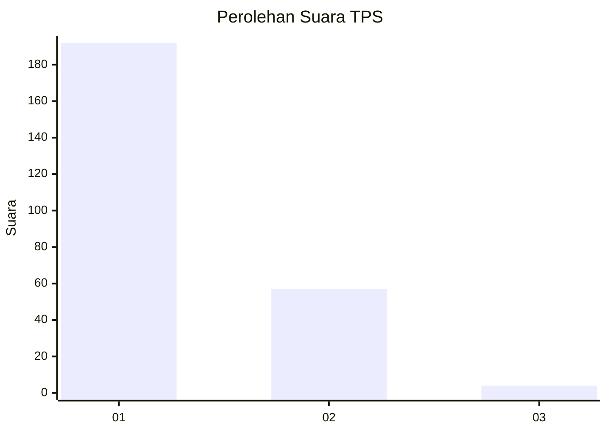
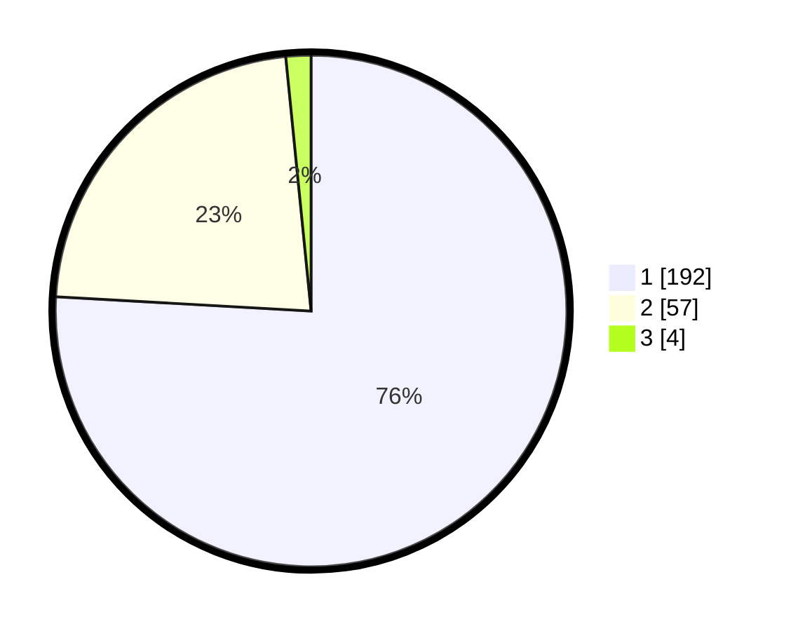

# Hasil

## Grafik

## Tabel

| No. | Nama Paslon    | Suara | Suara (raw) | Persentase |
|:--- |:-------------- | -----:| -----------:| ----------:|
| 1   | ANIES MUHAIMIN | 192   | [192][p-1]  | 75,89      |
| 2   | PRABOWO GIBRAN | 57    | [57][p-2]   | 22,53      |
| 3   | GANJAR MAHFUD  | 4     | [4][p-3]    | 1,58       |

[p-1]: https://github.com/gigit-pemilu/pemilu-2024-11-aceh/blob/main/pilpres/hitung-suara/sub/11-aceh/sub/12-aceh-barat-daya/sub/07-setia/sub/2001-lhang/sub/003-tps/sub/paslon-1.txt
[p-2]: https://github.com/gigit-pemilu/pemilu-2024-11-aceh/blob/main/pilpres/hitung-suara/sub/11-aceh/sub/12-aceh-barat-daya/sub/07-setia/sub/2001-lhang/sub/003-tps/sub/paslon-2.txt
[p-3]: https://github.com/gigit-pemilu/pemilu-2024-11-aceh/blob/main/pilpres/hitung-suara/sub/11-aceh/sub/12-aceh-barat-daya/sub/07-setia/sub/2001-lhang/sub/003-tps/sub/paslon-3.txt

## Foto C Plano

https://sirekap-obj-formc.kpu.go.id/abfd/pemilu/ppwp/11/12/07/20/01/1112072001003-20240216-162540--f82e4fdf-c753-4de5-a35a-b1c382ab3e10.jpg

https://sirekap-obj-formc.kpu.go.id/abfd/pemilu/ppwp/11/12/07/20/01/1112072001003-20240216-162542--c6ce2612-dc98-4342-a61d-72f62d3ecc67.jpg

https://sirekap-obj-formc.kpu.go.id/abfd/pemilu/ppwp/11/12/07/20/01/1112072001003-20240216-162541--1ed4086f-b793-4fc6-af07-0c1d3c2864fb.jpg

## Metadata

| Key        | Value               |
| ---------- | ------------------- |
| Time Stamp | 2024-02-21 12:00:00 |

## DATA PEMILIH TETAP

Jumlah pemilih dalam DPT: **288**.
 * L: **141**.
 * P: **147**.

## DATA PENGGUNA HAK PILIH

Jumlah pengguna hak pilih dalam DPT: **247**.
 * L: **109**.
 * P: **138**.

Jumlah pengguna hak pilih dalam DPTb: **2**.
 * L: **1**.
 * P: **1**.

Jumlah pengguna hak pilih dalam DPK: **7**.
 * L: **6**.
 * P: **1**.

Jumlah pengguna hak pilih: **256**.
 * L: **116**.
 * P: **140**.

## JUMLAH SUARA SAH DAN TIDAK SAH

JUMLAH SELURUH SUARA SAH: **253**.

JUMLAH SUARA TIDAK SAH: **3**.

JUMLAH SELURUH SUARA SAH DAN SUARA TIDAK SAH: **256**.

