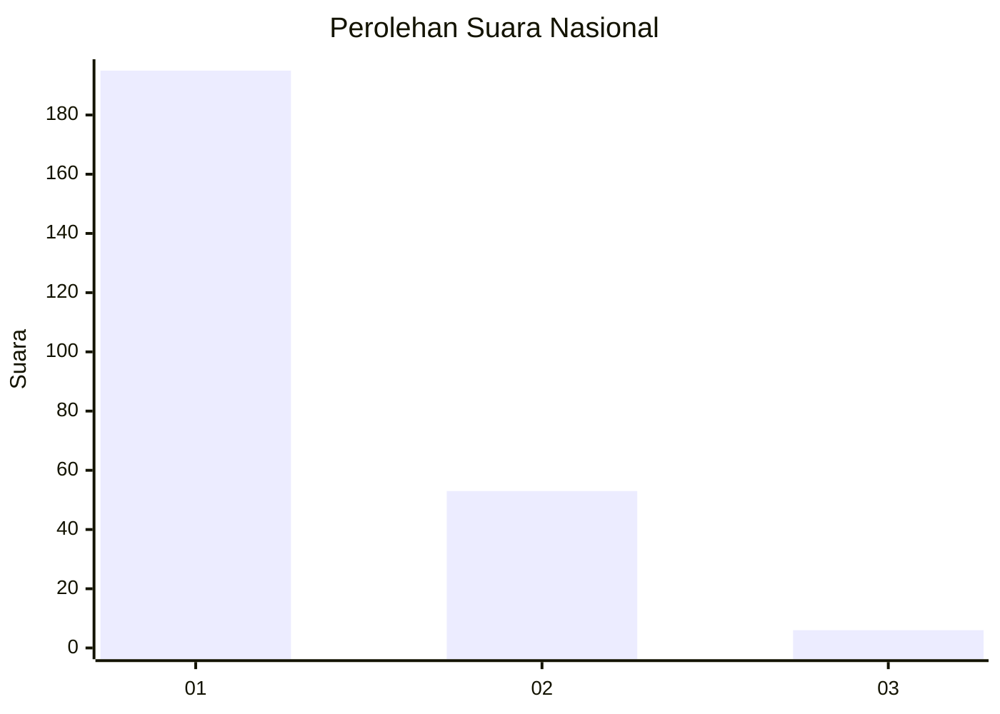
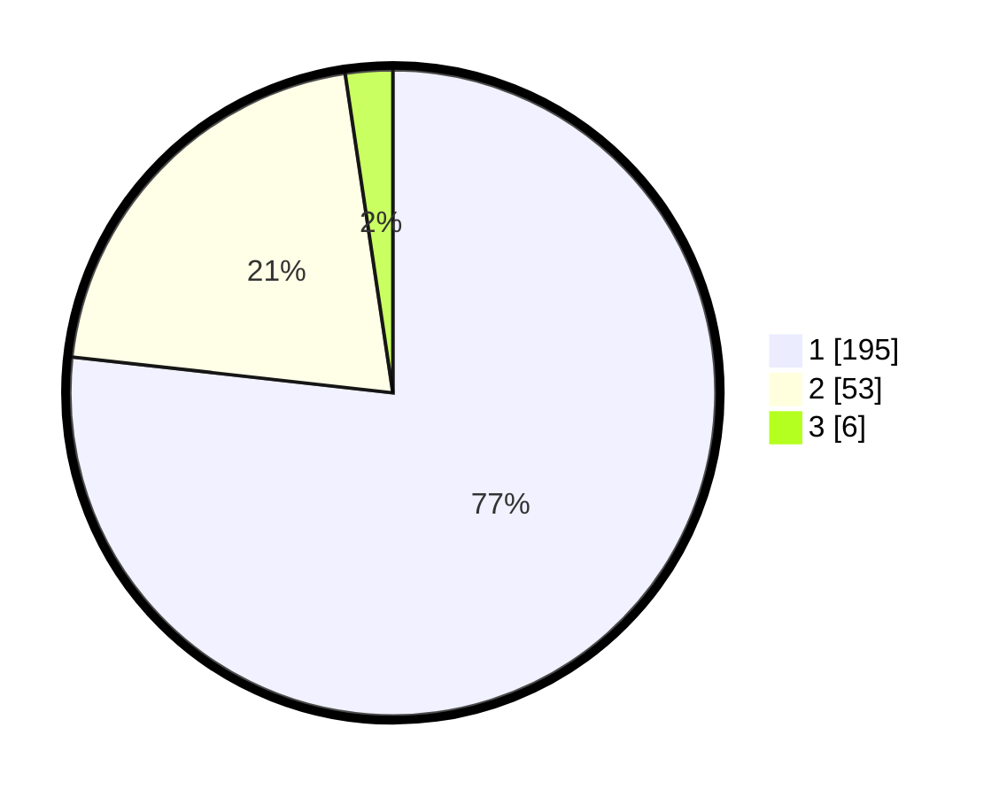

# Hasil

## Grafik

## Tabel

| No. | Nama Paslon    | Suara | Suara (raw) | Persentase |
|:--- |:-------------- | -----:| -----------:| ----------:|
| 1   | ANIES MUHAIMIN | 195   | [195][p-1]  | 76,77      |
| 2   | PRABOWO GIBRAN | 53    | [53][p-2]   | 20,87      |
| 3   | GANJAR MAHFUD  | 6     | [6][p-3]    | 2,36       |

[p-1]: https://github.com/gigit-pemilu/pemilu-2024/blob/main/pilpres/hitung-suara/sub/11-aceh/sub/12-aceh-barat-daya/sub/07-setia/sub/2001-lhang/sub/004-tps/sub/paslon-1.txt
[p-2]: https://github.com/gigit-pemilu/pemilu-2024/blob/main/pilpres/hitung-suara/sub/11-aceh/sub/12-aceh-barat-daya/sub/07-setia/sub/2001-lhang/sub/004-tps/sub/paslon-2.txt
[p-3]: https://github.com/gigit-pemilu/pemilu-2024/blob/main/pilpres/hitung-suara/sub/11-aceh/sub/12-aceh-barat-daya/sub/07-setia/sub/2001-lhang/sub/004-tps/sub/paslon-3.txt

## Foto C Plano

https://sirekap-obj-formc.kpu.go.id/b583/pemilu/ppwp/11/12/07/20/01/1112072001004-20240216-135449--d51c0bc4-5023-41c0-af47-7808dc067967.jpg

https://sirekap-obj-formc.kpu.go.id/b583/pemilu/ppwp/11/12/07/20/01/1112072001004-20240216-135451--00654c61-6168-4fbc-bfc8-cce6e5a05503.jpg

https://sirekap-obj-formc.kpu.go.id/b583/pemilu/ppwp/11/12/07/20/01/1112072001004-20240216-135450--488eb6e6-afd5-4191-8245-800a34aa8e3e.jpg

## Metadata

| Key        | Value               |
| ---------- | ------------------- |
| Time Stamp | 2024-02-21 12:00:00 |

## DATA PEMILIH TETAP

Jumlah pemilih dalam DPT: **292**.
 * L: **135**.
 * P: **157**.

## DATA PENGGUNA HAK PILIH

Jumlah pengguna hak pilih dalam DPT: **251**.
 * L: **114**.
 * P: **137**.

Jumlah pengguna hak pilih dalam DPTb: **3**.
 * L: **3**.
 * P: **0**.

Jumlah pengguna hak pilih dalam DPK: **5**.
 * L: **3**.
 * P: **2**.

Jumlah pengguna hak pilih: **259**.
 * L: **120**.
 * P: **139**.

## JUMLAH SUARA SAH DAN TIDAK SAH

JUMLAH SELURUH SUARA SAH: **254**.

JUMLAH SUARA TIDAK SAH: **5**.

JUMLAH SELURUH SUARA SAH DAN SUARA TIDAK SAH: **259**.

