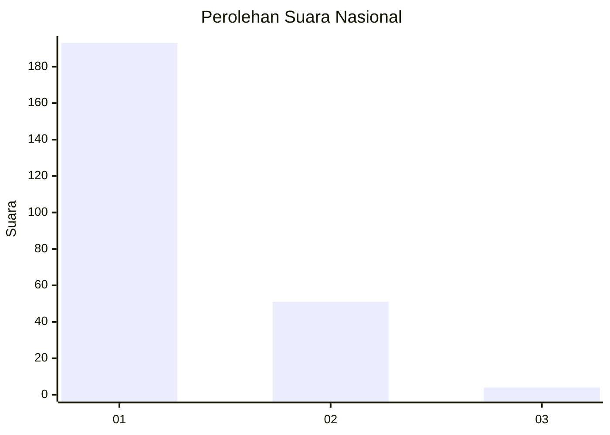
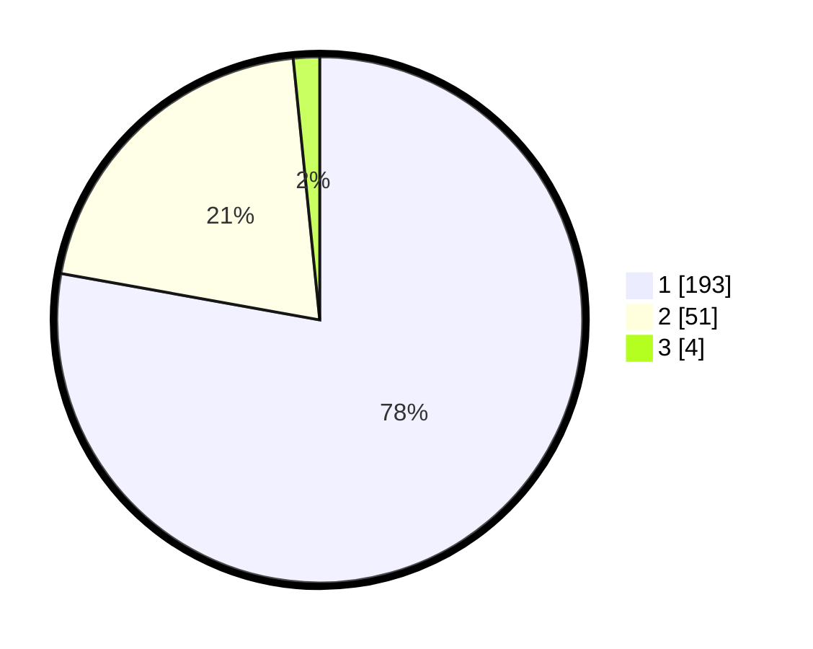

# Hasil

## Grafik

## Tabel

| No. | Nama Paslon    | Suara | Suara (raw) | Persentase |
|:--- |:-------------- | -----:| -----------:| ----------:|
| 1   | ANIES MUHAIMIN | 193   | [193][p-1]  | 77,82      |
| 2   | PRABOWO GIBRAN | 51    | [51][p-2]   | 20,56      |
| 3   | GANJAR MAHFUD  | 4     | [4][p-3]    | 1,61       |

[p-1]: https://github.com/gigit-pemilu/pemilu-2024/blob/main/pilpres/hitung-suara/sub/11-aceh/sub/12-aceh-barat-daya/sub/07-setia/sub/2003-pisang/sub/002-tps/sub/paslon-1.txt
[p-2]: https://github.com/gigit-pemilu/pemilu-2024/blob/main/pilpres/hitung-suara/sub/11-aceh/sub/12-aceh-barat-daya/sub/07-setia/sub/2003-pisang/sub/002-tps/sub/paslon-2.txt
[p-3]: https://github.com/gigit-pemilu/pemilu-2024/blob/main/pilpres/hitung-suara/sub/11-aceh/sub/12-aceh-barat-daya/sub/07-setia/sub/2003-pisang/sub/002-tps/sub/paslon-3.txt

## Foto C Plano

https://sirekap-obj-formc.kpu.go.id/93eb/pemilu/ppwp/11/12/07/20/03/1112072003002-20240215-004728--6952018e-aac3-445b-9282-b249e52be7bf.jpg

https://sirekap-obj-formc.kpu.go.id/93eb/pemilu/ppwp/11/12/07/20/03/1112072003002-20240215-004943--e8fa8dbe-958a-411f-9c12-a9ec68946633.jpg

https://sirekap-obj-formc.kpu.go.id/93eb/pemilu/ppwp/11/12/07/20/03/1112072003002-20240215-005047--b1a9eb4a-279e-4936-92db-c4f4a126b789.jpg

## Metadata

| Key        | Value               |
| ---------- | ------------------- |
| Time Stamp | 2024-02-15 19:30:26 |

