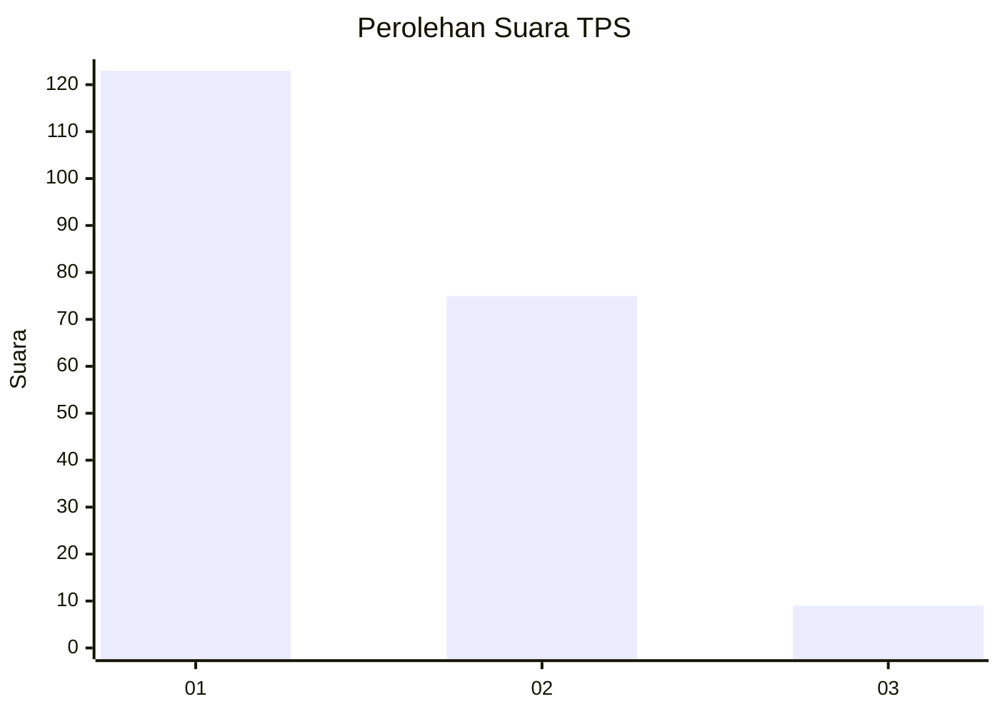
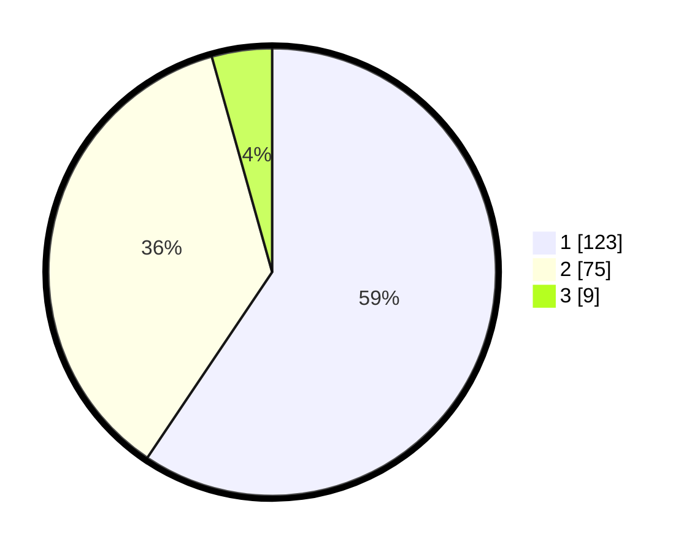

# Hasil

## Grafik

## Tabel

| No. | Nama Paslon    | Suara | Suara (raw) | Persentase |
|:--- |:-------------- | -----:| -----------:| ----------:|
| 1   | ANIES MUHAIMIN | 123   | [123][p-1]  | 59,42      |
| 2   | PRABOWO GIBRAN | 75    | [75][p-2]   | 36,23      |
| 3   | GANJAR MAHFUD  | 9     | [9][p-3]    | 4,35       |

[p-1]: https://github.com/gigit-pemilu/pemilu-2024-11-aceh/blob/main/pilpres/hitung-suara/sub/11-aceh/sub/12-aceh-barat-daya/sub/07-setia/sub/2005-alue-dama/sub/901-tps/sub/paslon-1.txt
[p-2]: https://github.com/gigit-pemilu/pemilu-2024-11-aceh/blob/main/pilpres/hitung-suara/sub/11-aceh/sub/12-aceh-barat-daya/sub/07-setia/sub/2005-alue-dama/sub/901-tps/sub/paslon-2.txt
[p-3]: https://github.com/gigit-pemilu/pemilu-2024-11-aceh/blob/main/pilpres/hitung-suara/sub/11-aceh/sub/12-aceh-barat-daya/sub/07-setia/sub/2005-alue-dama/sub/901-tps/sub/paslon-3.txt

## Foto C Plano

https://sirekap-obj-formc.kpu.go.id/19b2/pemilu/ppwp/11/12/07/20/05/1112072005901-20240215-082341--ba1d74f5-c20b-4813-8a96-ee3f606e401f.jpg

https://sirekap-obj-formc.kpu.go.id/19b2/pemilu/ppwp/11/12/07/20/05/1112072005901-20240215-082430--fdbed70f-5e9a-43c8-a140-d0dcb78e9ffd.jpg

https://sirekap-obj-formc.kpu.go.id/19b2/pemilu/ppwp/11/12/07/20/05/1112072005901-20240215-082524--835e6293-4ba4-4aee-b1c8-8001f2c42156.jpg

## Metadata

| Key        | Value               |
| ---------- | ------------------- |
| Time Stamp | 2024-02-15 17:30:25 |

## DATA PEMILIH TETAP

Jumlah pemilih dalam DPT: **156**.
 * L: **156**.
 * P: **0**.

## DATA PENGGUNA HAK PILIH

Jumlah pengguna hak pilih dalam DPT: **156**.
 * L: **156**.
 * P: **0**.

Jumlah pengguna hak pilih dalam DPTb: **53**.
 * L: **53**.
 * P: **0**.

Jumlah pengguna hak pilih dalam DPK: **0**.
 * L: **0**.
 * P: **0**.

Jumlah pengguna hak pilih: **209**.
 * L: **209**.
 * P: **0**.

## JUMLAH SUARA SAH DAN TIDAK SAH

JUMLAH SELURUH SUARA SAH: **207**.

JUMLAH SUARA TIDAK SAH: **2**.

JUMLAH SELURUH SUARA SAH DAN SUARA TIDAK SAH: **209**.

