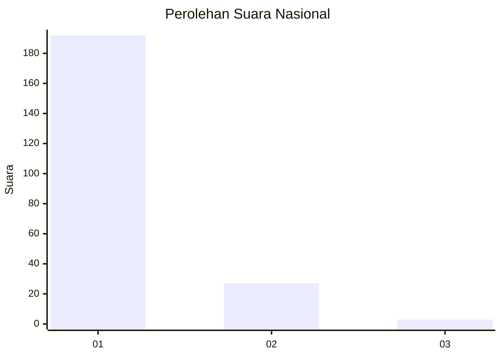
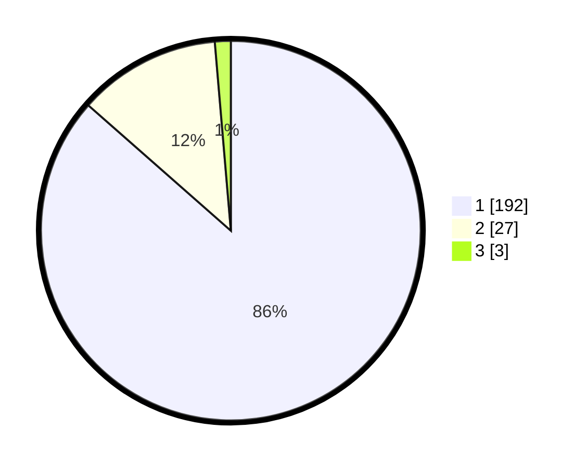

# Hasil

## Grafik

## Tabel

| No. | Nama Paslon    | Suara | Suara (raw) | Persentase |
|:--- |:-------------- | -----:| -----------:| ----------:|
| 1   | ANIES MUHAIMIN | 192   | [192][p-1]  | 86,49      |
| 2   | PRABOWO GIBRAN | 27    | [27][p-2]   | 12,16      |
| 3   | GANJAR MAHFUD  | 3     | [3][p-3]    | 1,35       |

[p-1]: https://github.com/gigit-pemilu/pemilu-2024/blob/main/pilpres/hitung-suara/sub/11-aceh/sub/12-aceh-barat-daya/sub/08-jeumpa/sub/2001-baru/sub/001-tps/sub/paslon-1.txt
[p-2]: https://github.com/gigit-pemilu/pemilu-2024/blob/main/pilpres/hitung-suara/sub/11-aceh/sub/12-aceh-barat-daya/sub/08-jeumpa/sub/2001-baru/sub/001-tps/sub/paslon-2.txt
[p-3]: https://github.com/gigit-pemilu/pemilu-2024/blob/main/pilpres/hitung-suara/sub/11-aceh/sub/12-aceh-barat-daya/sub/08-jeumpa/sub/2001-baru/sub/001-tps/sub/paslon-3.txt

## Foto C Plano

https://sirekap-obj-formc.kpu.go.id/d582/pemilu/ppwp/11/12/08/20/01/1112082001001-20240214-221733--d59c9b79-d445-48cf-a945-8e57452e1bc7.jpg

https://sirekap-obj-formc.kpu.go.id/d582/pemilu/ppwp/11/12/08/20/01/1112082001001-20240214-221928--a5195ff4-cbcd-42da-99b7-07644aa2fe3d.jpg

https://sirekap-obj-formc.kpu.go.id/d582/pemilu/ppwp/11/12/08/20/01/1112082001001-20240214-222049--8a6fd347-d9e8-4877-8bea-f87fd7cca14e.jpg

## Metadata

| Key        | Value               |
| ---------- | ------------------- |
| Time Stamp | 2024-02-15 16:30:25 |

