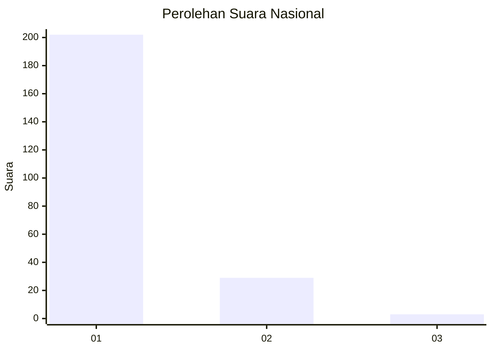
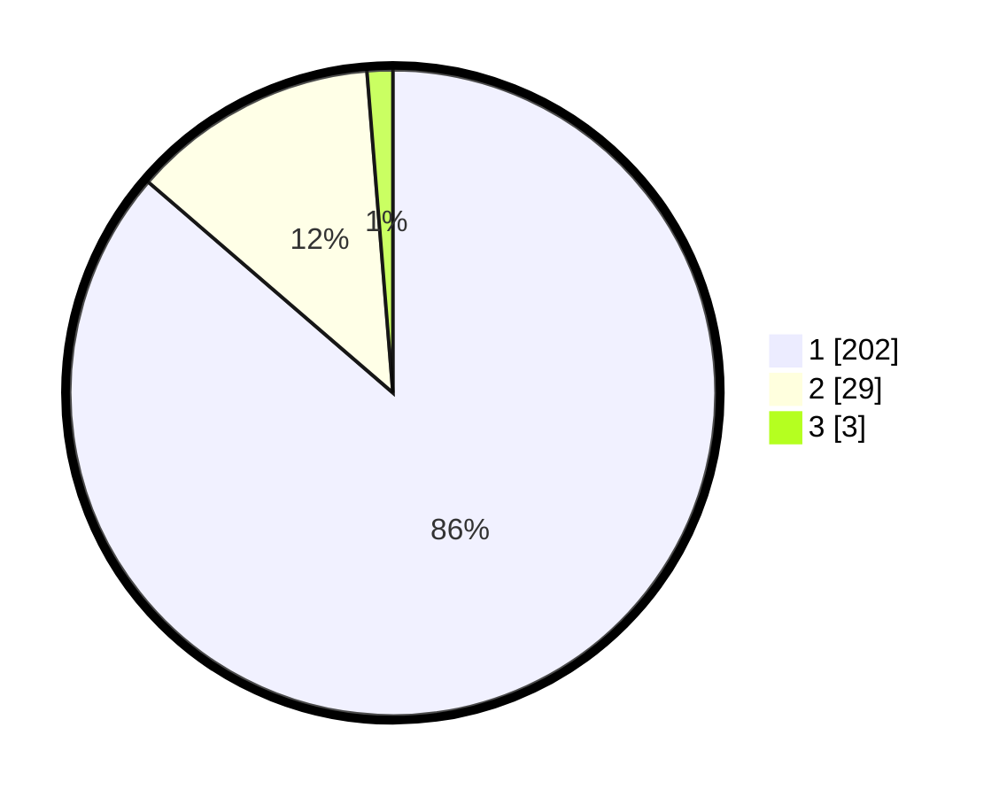

# Hasil

## Grafik

## Tabel

| No. | Nama Paslon    | Suara | Suara (raw) | Persentase |
|:--- |:-------------- | -----:| -----------:| ----------:|
| 1   | ANIES MUHAIMIN | 202   | [202][p-1]  | 86,32      |
| 2   | PRABOWO GIBRAN | 29    | [29][p-2]   | 12,39      |
| 3   | GANJAR MAHFUD  | 3     | [3][p-3]    | 1,28       |

[p-1]: https://github.com/gigit-pemilu/pemilu-2024/blob/main/pilpres/hitung-suara/sub/11-aceh/sub/12-aceh-barat-daya/sub/08-jeumpa/sub/2002-alue-rambot/sub/001-tps/sub/paslon-1.txt
[p-2]: https://github.com/gigit-pemilu/pemilu-2024/blob/main/pilpres/hitung-suara/sub/11-aceh/sub/12-aceh-barat-daya/sub/08-jeumpa/sub/2002-alue-rambot/sub/001-tps/sub/paslon-2.txt
[p-3]: https://github.com/gigit-pemilu/pemilu-2024/blob/main/pilpres/hitung-suara/sub/11-aceh/sub/12-aceh-barat-daya/sub/08-jeumpa/sub/2002-alue-rambot/sub/001-tps/sub/paslon-3.txt

## Foto C Plano

https://sirekap-obj-formc.kpu.go.id/661a/pemilu/ppwp/11/12/08/20/02/1112082002001-20240216-220401--dcc224db-149e-49e0-812a-4fbd5b13b92f.jpg

https://sirekap-obj-formc.kpu.go.id/661a/pemilu/ppwp/11/12/08/20/02/1112082002001-20240216-220601--a573f9db-c242-4c47-a46c-39db427c1261.jpg

https://sirekap-obj-formc.kpu.go.id/661a/pemilu/ppwp/11/12/08/20/02/1112082002001-20240216-220809--d1bfb2be-372c-4e43-8293-0391d40f1c3c.jpg

## Metadata

| Key        | Value               |
| ---------- | ------------------- |
| Time Stamp | 2024-02-19 10:00:00 |

