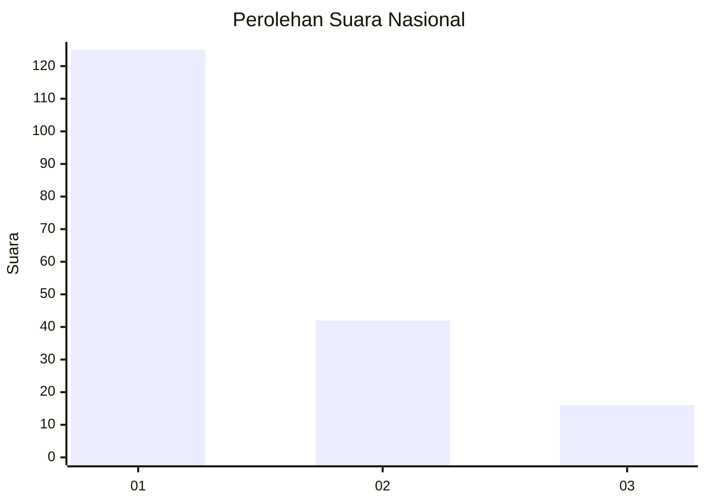
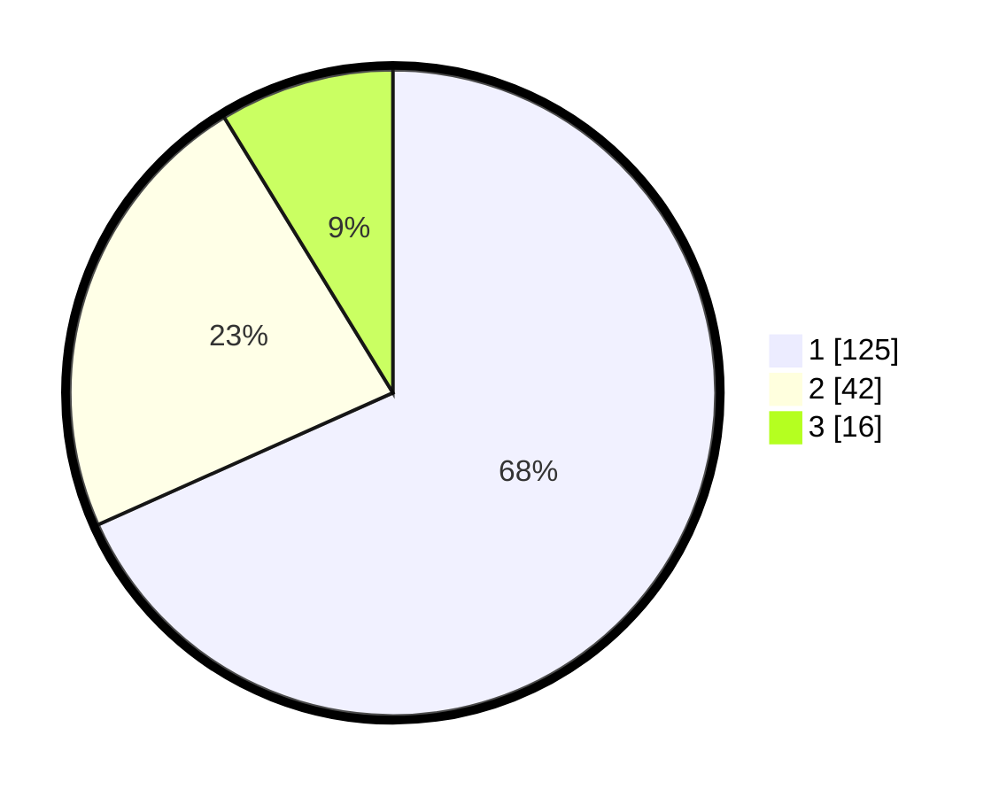

# Hasil

## Grafik

## Tabel

| No. | Nama Paslon    | Suara | Suara (raw) | Persentase |
|:--- |:-------------- | -----:| -----------:| ----------:|
| 1   | ANIES MUHAIMIN | 125   | [125][p-1]  | 68,31      |
| 2   | PRABOWO GIBRAN | 42    | [42][p-2]   | 22,95      |
| 3   | GANJAR MAHFUD  | 16    | [16][p-3]   | 8,74       |

[p-1]: https://github.com/gigit-pemilu/pemilu-2024/blob/main/pilpres/hitung-suara/sub/11-aceh/sub/12-aceh-barat-daya/sub/09-lembah-sabil/sub/2001-meurandeh/sub/003-tps/sub/paslon-1.txt
[p-2]: https://github.com/gigit-pemilu/pemilu-2024/blob/main/pilpres/hitung-suara/sub/11-aceh/sub/12-aceh-barat-daya/sub/09-lembah-sabil/sub/2001-meurandeh/sub/003-tps/sub/paslon-2.txt
[p-3]: https://github.com/gigit-pemilu/pemilu-2024/blob/main/pilpres/hitung-suara/sub/11-aceh/sub/12-aceh-barat-daya/sub/09-lembah-sabil/sub/2001-meurandeh/sub/003-tps/sub/paslon-3.txt

## Foto C Plano

https://sirekap-obj-formc.kpu.go.id/2eeb/pemilu/ppwp/11/12/09/20/01/1112092001003-20240216-102550--7feb420a-d532-4608-b7cb-668977fe1e4c.jpg

https://sirekap-obj-formc.kpu.go.id/2eeb/pemilu/ppwp/11/12/09/20/01/1112092001003-20240216-102601--af51465b-c74a-476d-a2d0-5a4e864a7485.jpg

https://sirekap-obj-formc.kpu.go.id/2eeb/pemilu/ppwp/11/12/09/20/01/1112092001003-20240216-102557--4855fc8b-f014-4abf-990d-7dd79c5199c7.jpg

## Metadata

| Key        | Value               |
| ---------- | ------------------- |
| Time Stamp | 2024-03-10 22:00:00 |

## DATA PEMILIH TETAP

Jumlah pemilih dalam DPT: **219**.
 * L: **103**.
 * P: **116**.

## DATA PENGGUNA HAK PILIH

Jumlah pengguna hak pilih dalam DPT: **180**.
 * L: **79**.
 * P: **101**.

Jumlah pengguna hak pilih dalam DPTb: **2**.
 * L: **1**.
 * P: **1**.

Jumlah pengguna hak pilih dalam DPK: **1**.
 * L: **1**.
 * P: **0**.

Jumlah pengguna hak pilih: **183**.
 * L: **81**.
 * P: **102**.

## JUMLAH SUARA SAH DAN TIDAK SAH

JUMLAH SELURUH SUARA SAH: **183**.

JUMLAH SUARA TIDAK SAH: **0**.

JUMLAH SELURUH SUARA SAH DAN SUARA TIDAK SAH: **183**.

