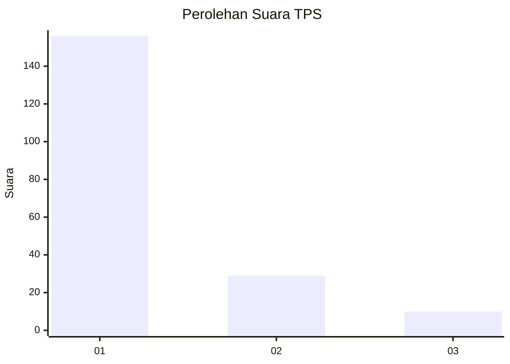
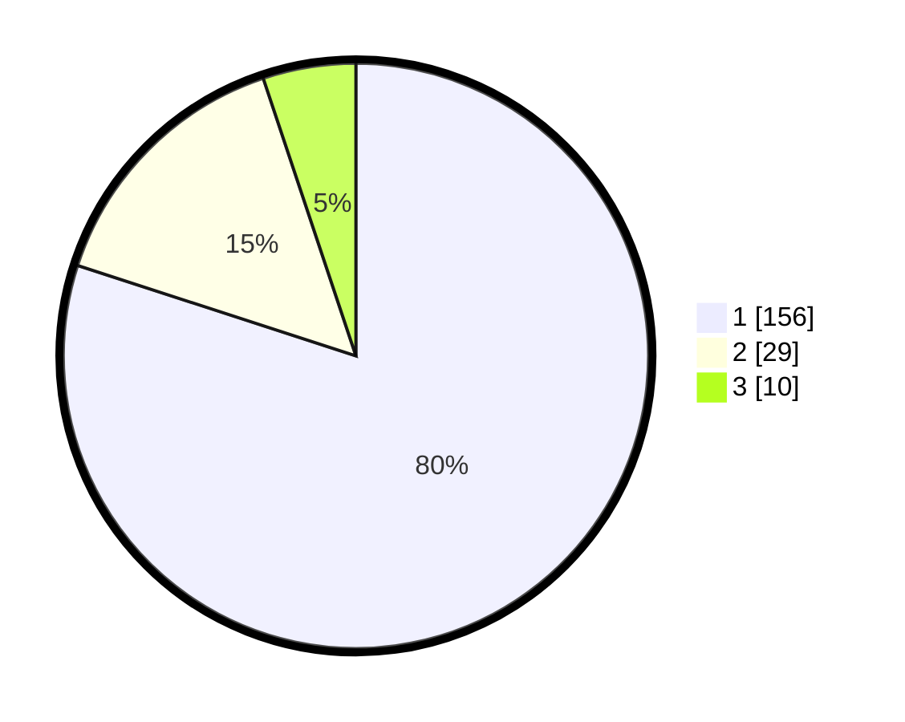

# Hasil

## Grafik

## Tabel

| No. | Nama Paslon    | Suara | Suara (raw) | Persentase |
|:--- |:-------------- | -----:| -----------:| ----------:|
| 1   | ANIES MUHAIMIN | 156   | [156][p-1]  | 80,00      |
| 2   | PRABOWO GIBRAN | 29    | [29][p-2]   | 14,87      |
| 3   | GANJAR MAHFUD  | 10    | [10][p-3]   | 5,13       |

[p-1]: https://github.com/gigit-pemilu/pemilu-2024-11-aceh/blob/main/pilpres/hitung-suara/sub/11-aceh/sub/12-aceh-barat-daya/sub/09-lembah-sabil/sub/2002-sukadamai/sub/002-tps/sub/paslon-1.txt
[p-2]: https://github.com/gigit-pemilu/pemilu-2024-11-aceh/blob/main/pilpres/hitung-suara/sub/11-aceh/sub/12-aceh-barat-daya/sub/09-lembah-sabil/sub/2002-sukadamai/sub/002-tps/sub/paslon-2.txt
[p-3]: https://github.com/gigit-pemilu/pemilu-2024-11-aceh/blob/main/pilpres/hitung-suara/sub/11-aceh/sub/12-aceh-barat-daya/sub/09-lembah-sabil/sub/2002-sukadamai/sub/002-tps/sub/paslon-3.txt

## Foto C Plano

https://sirekap-obj-formc.kpu.go.id/1724/pemilu/ppwp/11/12/09/20/02/1112092002002-20240215-054905--280a50af-5219-40a2-be42-7708a7537fe0.jpg

https://sirekap-obj-formc.kpu.go.id/1724/pemilu/ppwp/11/12/09/20/02/1112092002002-20240215-054933--8cf4daa7-48b8-49d7-95cc-4c81d36cd135.jpg

https://sirekap-obj-formc.kpu.go.id/1724/pemilu/ppwp/11/12/09/20/02/1112092002002-20240215-054916--d71f4d0e-2caa-483e-9b80-a80adb40579f.jpg

## Metadata

| Key        | Value               |
| ---------- | ------------------- |
| Time Stamp | 2024-02-15 09:00:24 |

## DATA PEMILIH TETAP

Jumlah pemilih dalam DPT: **232**.
 * L: **132**.
 * P: **100**.

## DATA PENGGUNA HAK PILIH

Jumlah pengguna hak pilih dalam DPT: **194**.
 * L: **110**.
 * P: **84**.

Jumlah pengguna hak pilih dalam DPTb: **2**.
 * L: **1**.
 * P: **1**.

Jumlah pengguna hak pilih dalam DPK: **0**.
 * L: **0**.
 * P: **0**.

Jumlah pengguna hak pilih: **196**.
 * L: **111**.
 * P: **85**.

## JUMLAH SUARA SAH DAN TIDAK SAH

JUMLAH SELURUH SUARA SAH: **195**.

JUMLAH SUARA TIDAK SAH: **1**.

JUMLAH SELURUH SUARA SAH DAN SUARA TIDAK SAH: **196**.

