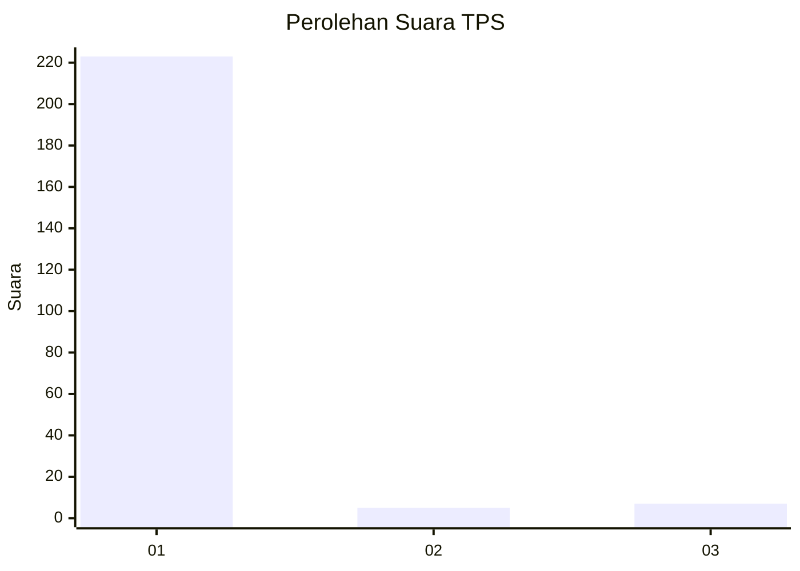
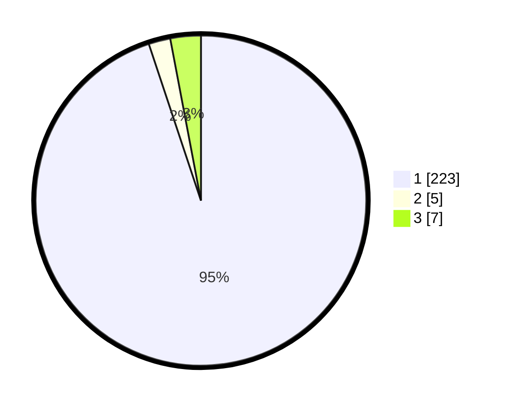

# Hasil

## Grafik

## Tabel

| No. | Nama Paslon    | Suara | Suara (raw) | Persentase |
|:--- |:-------------- | -----:| -----------:| ----------:|
| 1   | ANIES MUHAIMIN | 223   | [223][p-1]  | 94,89      |
| 2   | PRABOWO GIBRAN | 5     | [5][p-2]    | 2,13       |
| 3   | GANJAR MAHFUD  | 7     | [7][p-3]    | 2,98       |

[p-1]: https://github.com/gigit-pemilu/pemilu-2024-11-aceh/blob/main/pilpres/hitung-suara/sub/11-aceh/sub/12-aceh-barat-daya/sub/09-lembah-sabil/sub/2003-cot-bak-u/sub/001-tps/sub/paslon-1.txt
[p-2]: https://github.com/gigit-pemilu/pemilu-2024-11-aceh/blob/main/pilpres/hitung-suara/sub/11-aceh/sub/12-aceh-barat-daya/sub/09-lembah-sabil/sub/2003-cot-bak-u/sub/001-tps/sub/paslon-2.txt
[p-3]: https://github.com/gigit-pemilu/pemilu-2024-11-aceh/blob/main/pilpres/hitung-suara/sub/11-aceh/sub/12-aceh-barat-daya/sub/09-lembah-sabil/sub/2003-cot-bak-u/sub/001-tps/sub/paslon-3.txt

## Foto C Plano

https://sirekap-obj-formc.kpu.go.id/9ecc/pemilu/ppwp/11/12/09/20/03/1112092003001-20240215-201551--c8f1ef00-a816-477d-ac5b-e6ee3278397e.jpg

https://sirekap-obj-formc.kpu.go.id/9ecc/pemilu/ppwp/11/12/09/20/03/1112092003001-20240215-201655--de1ae8bb-2cbc-4097-9129-6c8d80a0d1c8.jpg

https://sirekap-obj-formc.kpu.go.id/9ecc/pemilu/ppwp/11/12/09/20/03/1112092003001-20240215-201739--5f7b375a-a5ed-4bf2-a6c2-aaee6e2cd59e.jpg

## Metadata

| Key        | Value               |
| ---------- | ------------------- |
| Time Stamp | 2024-02-19 20:00:00 |

