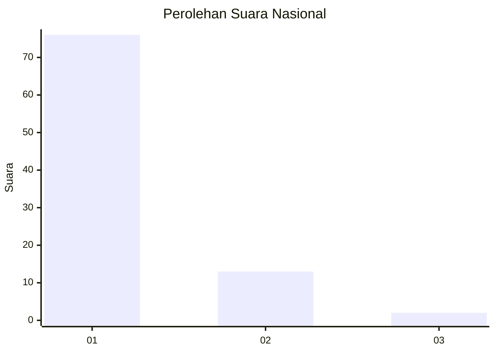
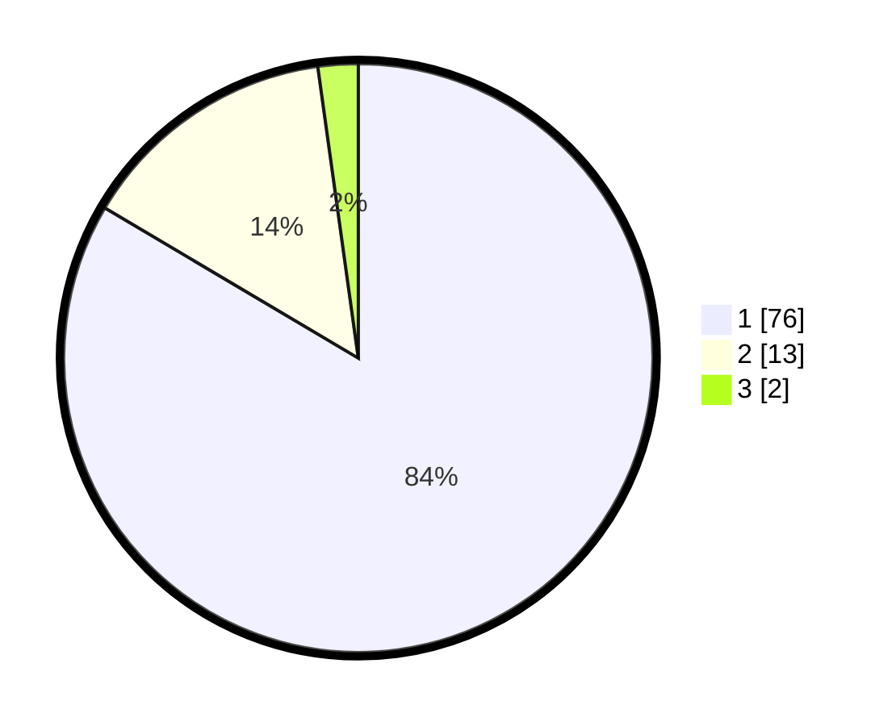

# Hasil

## Grafik

## Tabel

| No. | Nama Paslon    | Suara | Suara (raw) | Persentase |
|:--- |:-------------- | -----:| -----------:| ----------:|
| 1   | ANIES MUHAIMIN | 76    | [76][p-1]   | 83,52      |
| 2   | PRABOWO GIBRAN | 13    | [13][p-2]   | 14,29      |
| 3   | GANJAR MAHFUD  | 2     | [2][p-3]    | 2,20       |

[p-1]: https://github.com/gigit-pemilu/pemilu-2024/blob/main/pilpres/hitung-suara/sub/11-aceh/sub/12-aceh-barat-daya/sub/09-lembah-sabil/sub/2005-meunasah-tengah/sub/003-tps/sub/paslon-1.txt
[p-2]: https://github.com/gigit-pemilu/pemilu-2024/blob/main/pilpres/hitung-suara/sub/11-aceh/sub/12-aceh-barat-daya/sub/09-lembah-sabil/sub/2005-meunasah-tengah/sub/003-tps/sub/paslon-2.txt
[p-3]: https://github.com/gigit-pemilu/pemilu-2024/blob/main/pilpres/hitung-suara/sub/11-aceh/sub/12-aceh-barat-daya/sub/09-lembah-sabil/sub/2005-meunasah-tengah/sub/003-tps/sub/paslon-3.txt

## Foto C Plano

https://sirekap-obj-formc.kpu.go.id/7ba4/pemilu/ppwp/11/12/09/20/05/1112092005003-20240214-155907--37315a3f-8ec1-45b4-b385-fcd0f5734b04.jpg

https://sirekap-obj-formc.kpu.go.id/7ba4/pemilu/ppwp/11/12/09/20/05/1112092005003-20240214-160108--082bdbc3-d805-44f4-a27f-75975341fedc.jpg

https://sirekap-obj-formc.kpu.go.id/7ba4/pemilu/ppwp/11/12/09/20/05/1112092005003-20240214-160154--fe6cda1c-71d3-453b-8471-a090882771db.jpg

## Metadata

| Key        | Value               |
| ---------- | ------------------- |
| Time Stamp | 2024-02-14 21:46:01 |

## DATA PEMILIH TETAP

Jumlah pemilih dalam DPT: **115**.
 * L: **58**.
 * P: **57**.

## DATA PENGGUNA HAK PILIH

Jumlah pengguna hak pilih dalam DPT: **88**.
 * L: **39**.
 * P: **49**.

Jumlah pengguna hak pilih dalam DPTb: **0**.
 * L: **0**.
 * P: **0**.

Jumlah pengguna hak pilih dalam DPK: **4**.
 * L: **0**.
 * P: **4**.

Jumlah pengguna hak pilih: **92**.
 * L: **39**.
 * P: **53**.

## JUMLAH SUARA SAH DAN TIDAK SAH

JUMLAH SELURUH SUARA SAH: **91**.

JUMLAH SUARA TIDAK SAH: **1**.

JUMLAH SELURUH SUARA SAH DAN SUARA TIDAK SAH: **92**.

