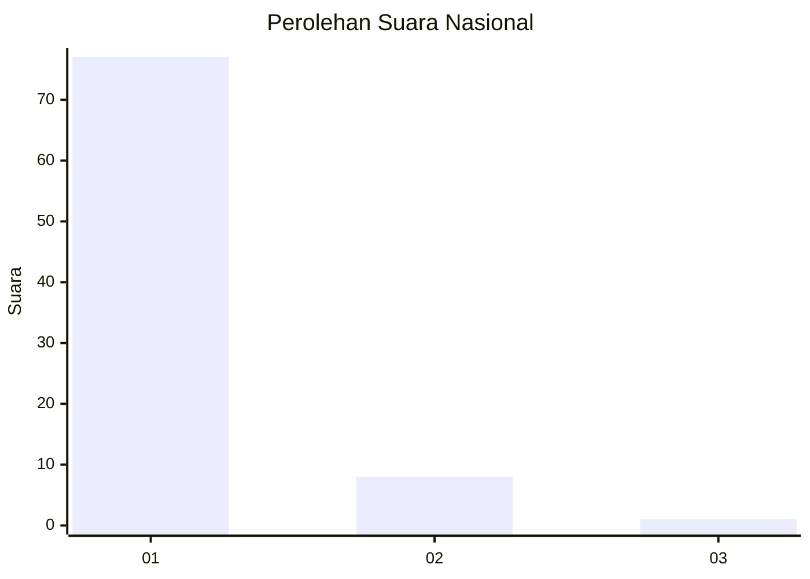
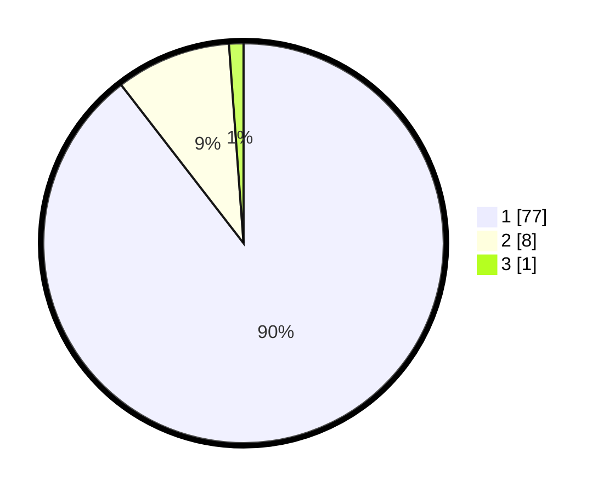

# Hasil

## Grafik

## Tabel

| No. | Nama Paslon    | Suara | Suara (raw) | Persentase |
|:--- |:-------------- | -----:| -----------:| ----------:|
| 1   | ANIES MUHAIMIN | 77    | [77][p-1]   | 89,53      |
| 2   | PRABOWO GIBRAN | 8     | [8][p-2]    | 9,30       |
| 3   | GANJAR MAHFUD  | 1     | [1][p-3]    | 1,16       |

[p-1]: https://github.com/gigit-pemilu/pemilu-2024/blob/main/pilpres/hitung-suara/sub/11-aceh/sub/12-aceh-barat-daya/sub/09-lembah-sabil/sub/2007-kuta-paya/sub/001-tps/sub/paslon-1.txt
[p-2]: https://github.com/gigit-pemilu/pemilu-2024/blob/main/pilpres/hitung-suara/sub/11-aceh/sub/12-aceh-barat-daya/sub/09-lembah-sabil/sub/2007-kuta-paya/sub/001-tps/sub/paslon-2.txt
[p-3]: https://github.com/gigit-pemilu/pemilu-2024/blob/main/pilpres/hitung-suara/sub/11-aceh/sub/12-aceh-barat-daya/sub/09-lembah-sabil/sub/2007-kuta-paya/sub/001-tps/sub/paslon-3.txt

## Foto C Plano

https://sirekap-obj-formc.kpu.go.id/d700/pemilu/ppwp/11/12/09/20/07/1112092007001-20240214-155026--91c7098c-6fe5-4de6-bf62-102ae5a61d30.jpg

https://sirekap-obj-formc.kpu.go.id/d700/pemilu/ppwp/11/12/09/20/07/1112092007001-20240214-155240--3ebbd080-5050-4421-9d5f-1329ce0efbcb.jpg

https://sirekap-obj-formc.kpu.go.id/d700/pemilu/ppwp/11/12/09/20/07/1112092007001-20240214-155435--ad89fd38-950e-47f4-9673-8f2f569f7087.jpg

## Metadata

| Key        | Value               |
| ---------- | ------------------- |
| Time Stamp | 2024-02-14 21:46:01 |

