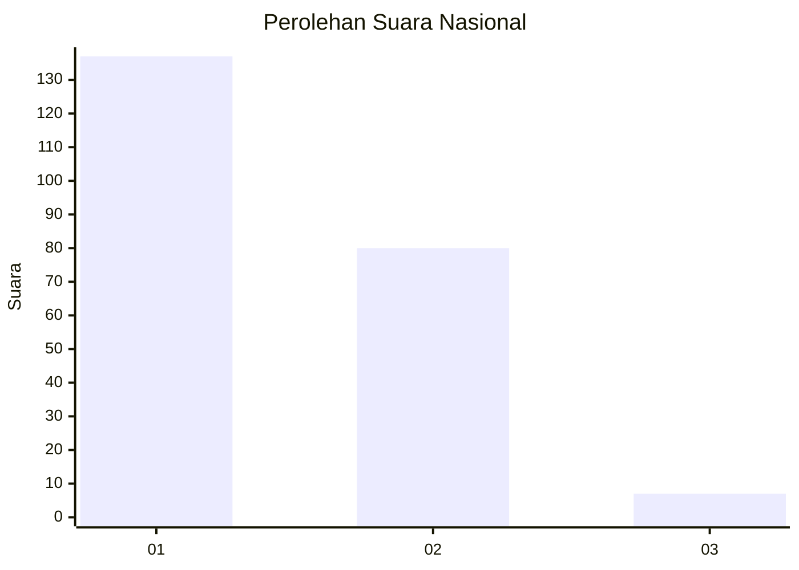
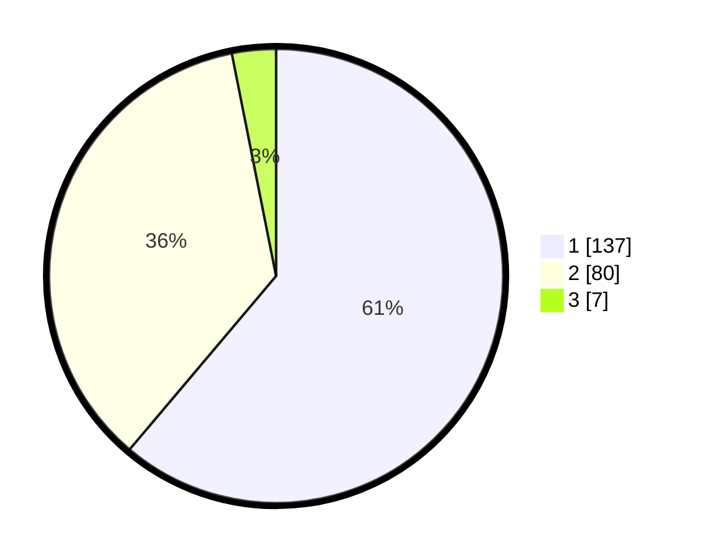

# Hasil

## Grafik

## Tabel

| No. | Nama Paslon    | Suara | Suara (raw) | Persentase |
|:--- |:-------------- | -----:| -----------:| ----------:|
| 1   | ANIES MUHAIMIN | 137   | [137][p-1]  | 61,16      |
| 2   | PRABOWO GIBRAN | 80    | [80][p-2]   | 35,71      |
| 3   | GANJAR MAHFUD  | 7     | [7][p-3]    | 3,13       |

[p-1]: https://github.com/gigit-pemilu/pemilu-2024/blob/main/pilpres/hitung-suara/sub/11-aceh/sub/13-gayo-lues/sub/01-blangkejeren/sub/2001-blangkejeren/sub/002-tps/sub/paslon-1.txt
[p-2]: https://github.com/gigit-pemilu/pemilu-2024/blob/main/pilpres/hitung-suara/sub/11-aceh/sub/13-gayo-lues/sub/01-blangkejeren/sub/2001-blangkejeren/sub/002-tps/sub/paslon-2.txt
[p-3]: https://github.com/gigit-pemilu/pemilu-2024/blob/main/pilpres/hitung-suara/sub/11-aceh/sub/13-gayo-lues/sub/01-blangkejeren/sub/2001-blangkejeren/sub/002-tps/sub/paslon-3.txt

## Foto C Plano

https://sirekap-obj-formc.kpu.go.id/297f/pemilu/ppwp/11/13/01/20/01/1113012001002-20240217-104940--8b11fd8e-59b7-4003-98cb-b1a08a69ada8.jpg

https://sirekap-obj-formc.kpu.go.id/297f/pemilu/ppwp/11/13/01/20/01/1113012001002-20240217-104941--f17f4f22-695c-4387-ba3f-3d1a86488e00.jpg

https://sirekap-obj-formc.kpu.go.id/297f/pemilu/ppwp/11/13/01/20/01/1113012001002-20240217-104940--dd2d5f3b-e7f8-4b59-ba1d-dadabf3b2b8b.jpg

## Metadata

| Key        | Value               |
| ---------- | ------------------- |
| Time Stamp | 2024-02-17 12:00:00 |

## DATA PEMILIH TETAP

Jumlah pemilih dalam DPT: **297**.
 * L: **138**.
 * P: **159**.

## DATA PENGGUNA HAK PILIH

Jumlah pengguna hak pilih dalam DPT: **221**.
 * L: **105**.
 * P: **116**.

Jumlah pengguna hak pilih dalam DPTb: **4**.
 * L: **3**.
 * P: **1**.

Jumlah pengguna hak pilih dalam DPK: **0**.
 * L: **0**.
 * P: **0**.

Jumlah pengguna hak pilih: **225**.
 * L: **108**.
 * P: **117**.

## JUMLAH SUARA SAH DAN TIDAK SAH

JUMLAH SELURUH SUARA SAH: **224**.

JUMLAH SUARA TIDAK SAH: **1**.

JUMLAH SELURUH SUARA SAH DAN SUARA TIDAK SAH: **225**.

