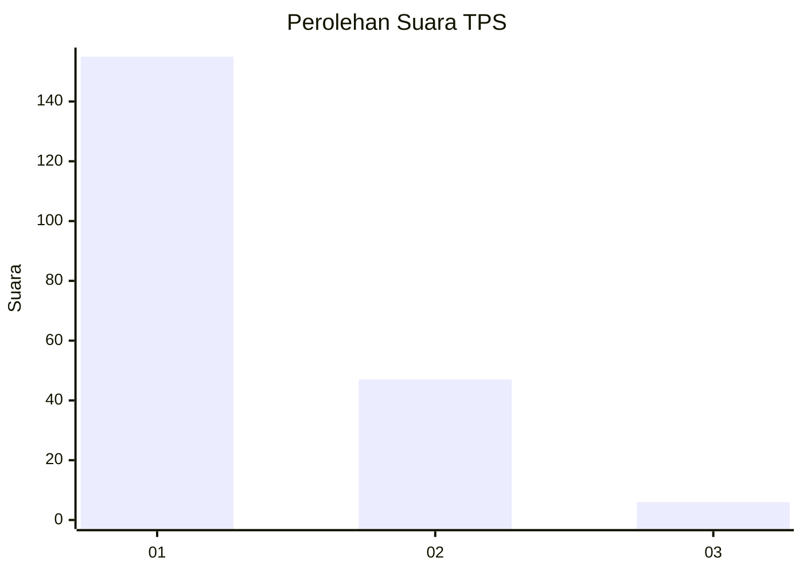
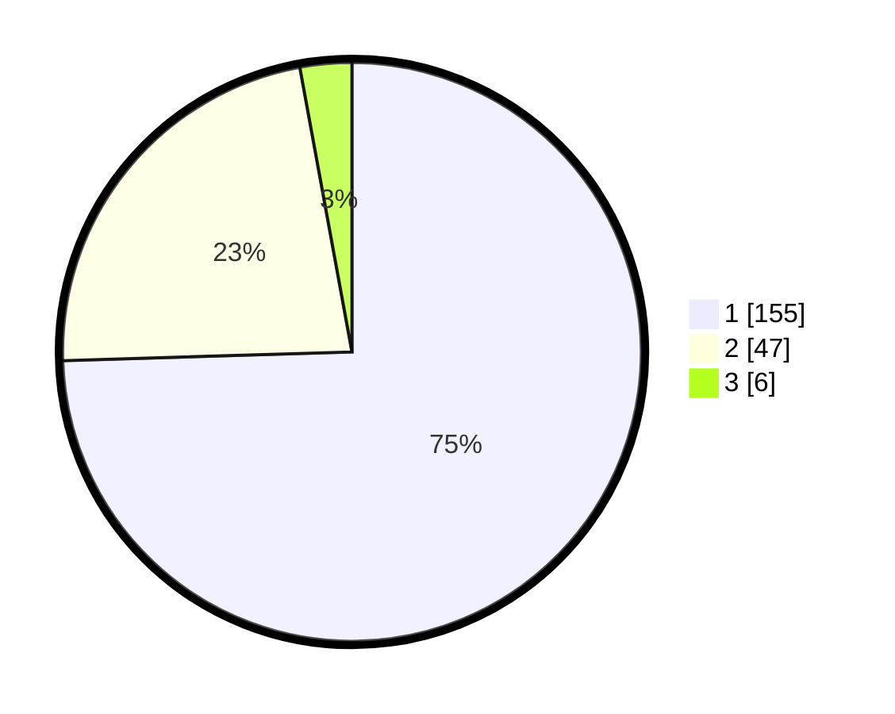

# Hasil

## Grafik

## Tabel

| No. | Nama Paslon    | Suara | Suara (raw) | Persentase |
|:--- |:-------------- | -----:| -----------:| ----------:|
| 1   | ANIES MUHAIMIN | 155   | [155][p-1]  | 74,52      |
| 2   | PRABOWO GIBRAN | 47    | [47][p-2]   | 22,60      |
| 3   | GANJAR MAHFUD  | 6     | [6][p-3]    | 2,88       |

[p-1]: https://github.com/gigit-pemilu/pemilu-2024-11-aceh/blob/main/pilpres/hitung-suara/sub/11-aceh/sub/13-gayo-lues/sub/01-blangkejeren/sub/2001-blangkejeren/sub/004-tps/sub/paslon-1.txt
[p-2]: https://github.com/gigit-pemilu/pemilu-2024-11-aceh/blob/main/pilpres/hitung-suara/sub/11-aceh/sub/13-gayo-lues/sub/01-blangkejeren/sub/2001-blangkejeren/sub/004-tps/sub/paslon-2.txt
[p-3]: https://github.com/gigit-pemilu/pemilu-2024-11-aceh/blob/main/pilpres/hitung-suara/sub/11-aceh/sub/13-gayo-lues/sub/01-blangkejeren/sub/2001-blangkejeren/sub/004-tps/sub/paslon-3.txt

## Foto C Plano

https://sirekap-obj-formc.kpu.go.id/f769/pemilu/ppwp/11/13/01/20/01/1113012001004-20240215-001244--d45676fc-d846-4d9f-8fec-604b634e7bdf.jpg

https://sirekap-obj-formc.kpu.go.id/f769/pemilu/ppwp/11/13/01/20/01/1113012001004-20240215-001416--ee6004fd-e0e9-4c31-9e9c-fa9dfa5dd0ff.jpg

https://sirekap-obj-formc.kpu.go.id/f769/pemilu/ppwp/11/13/01/20/01/1113012001004-20240215-001604--23a69810-f4d8-4f50-b13c-08b13d5983a7.jpg

## Metadata

| Key        | Value               |
| ---------- | ------------------- |
| Time Stamp | 2024-02-15 17:30:25 |

## DATA PEMILIH TETAP

Jumlah pemilih dalam DPT: **282**.
 * L: **132**.
 * P: **150**.

## DATA PENGGUNA HAK PILIH

Jumlah pengguna hak pilih dalam DPT: **203**.
 * L: **92**.
 * P: **111**.

Jumlah pengguna hak pilih dalam DPTb: **5**.
 * L: **3**.
 * P: **2**.

Jumlah pengguna hak pilih dalam DPK: **0**.
 * L: **0**.
 * P: **0**.

Jumlah pengguna hak pilih: **208**.
 * L: **95**.
 * P: **113**.

## JUMLAH SUARA SAH DAN TIDAK SAH

JUMLAH SELURUH SUARA SAH: **208**.

JUMLAH SUARA TIDAK SAH: **0**.

JUMLAH SELURUH SUARA SAH DAN SUARA TIDAK SAH: **208**.

