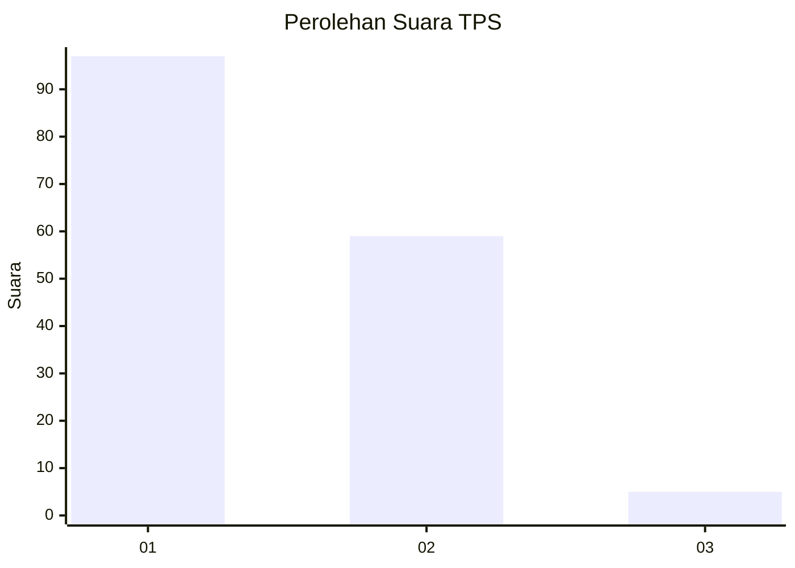
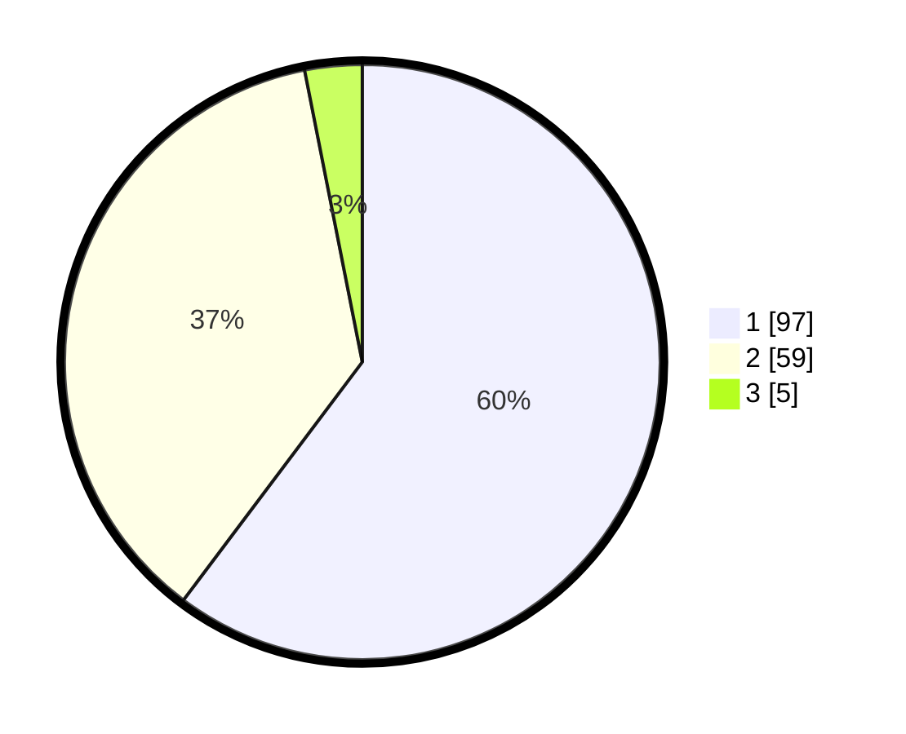

# Hasil

## Grafik

## Tabel

| No. | Nama Paslon    | Suara | Suara (raw) | Persentase |
|:--- |:-------------- | -----:| -----------:| ----------:|
| 1   | ANIES MUHAIMIN | 97    | [97][p-1]   | 60,25      |
| 2   | PRABOWO GIBRAN | 59    | [59][p-2]   | 36,65      |
| 3   | GANJAR MAHFUD  | 5     | [5][p-3]    | 3,11       |

[p-1]: https://github.com/gigit-pemilu/pemilu-2024-11-aceh/blob/main/pilpres/hitung-suara/sub/11-aceh/sub/13-gayo-lues/sub/01-blangkejeren/sub/2001-blangkejeren/sub/005-tps/sub/paslon-1.txt
[p-2]: https://github.com/gigit-pemilu/pemilu-2024-11-aceh/blob/main/pilpres/hitung-suara/sub/11-aceh/sub/13-gayo-lues/sub/01-blangkejeren/sub/2001-blangkejeren/sub/005-tps/sub/paslon-2.txt
[p-3]: https://github.com/gigit-pemilu/pemilu-2024-11-aceh/blob/main/pilpres/hitung-suara/sub/11-aceh/sub/13-gayo-lues/sub/01-blangkejeren/sub/2001-blangkejeren/sub/005-tps/sub/paslon-3.txt

## Foto C Plano

https://sirekap-obj-formc.kpu.go.id/378c/pemilu/ppwp/11/13/01/20/01/1113012001005-20240214-184649--420ae624-0f5a-435f-971e-88354b08cc0d.jpg

https://sirekap-obj-formc.kpu.go.id/378c/pemilu/ppwp/11/13/01/20/01/1113012001005-20240215-040011--a42bb94c-c452-435b-837b-fa69f8f175f8.jpg

https://sirekap-obj-formc.kpu.go.id/378c/pemilu/ppwp/11/13/01/20/01/1113012001005-20240214-184950--d71a9b79-daad-462f-a1e5-aad7453f270c.jpg

## Metadata

| Key        | Value               |
| ---------- | ------------------- |
| Time Stamp | 2024-02-15 17:30:25 |

## DATA PEMILIH TETAP

Jumlah pemilih dalam DPT: **210**.
 * L: **94**.
 * P: **116**.

## DATA PENGGUNA HAK PILIH

Jumlah pengguna hak pilih dalam DPT: **156**.
 * L: **67**.
 * P: **89**.

Jumlah pengguna hak pilih dalam DPTb: **5**.
 * L: **1**.
 * P: **4**.

Jumlah pengguna hak pilih dalam DPK: **1**.
 * L: **0**.
 * P: **1**.

Jumlah pengguna hak pilih: **162**.
 * L: **68**.
 * P: **94**.

## JUMLAH SUARA SAH DAN TIDAK SAH

JUMLAH SELURUH SUARA SAH: **161**.

JUMLAH SUARA TIDAK SAH: **1**.

JUMLAH SELURUH SUARA SAH DAN SUARA TIDAK SAH: **162**.

