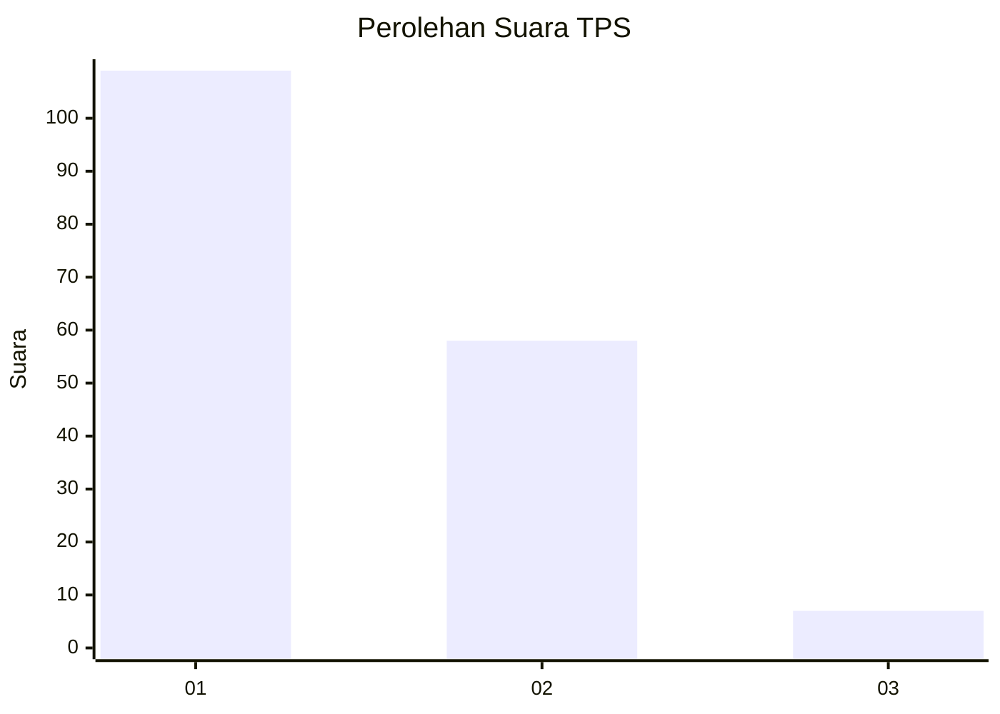
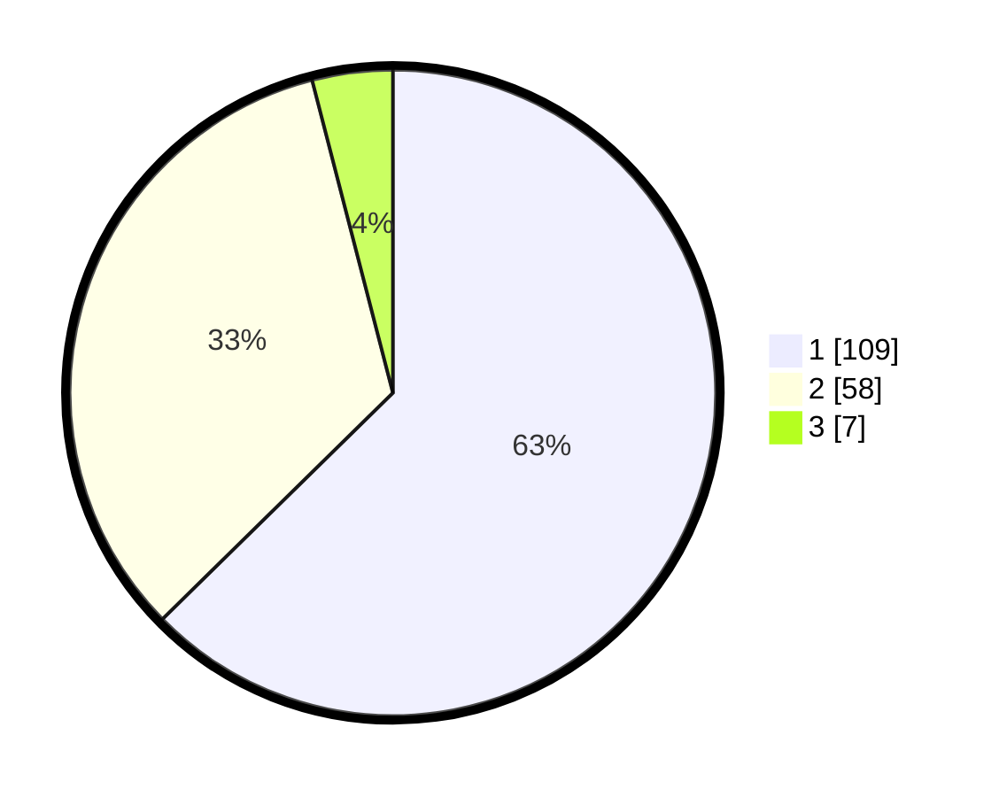

# Hasil

## Grafik

## Tabel

| No. | Nama Paslon    | Suara | Suara (raw) | Persentase |
|:--- |:-------------- | -----:| -----------:| ----------:|
| 1   | ANIES MUHAIMIN | 109   | [109][p-1]  | 62,64      |
| 2   | PRABOWO GIBRAN | 58    | [58][p-2]   | 33,33      |
| 3   | GANJAR MAHFUD  | 7     | [7][p-3]    | 4,02       |

[p-1]: https://github.com/gigit-pemilu/pemilu-2024-11-aceh/blob/main/pilpres/hitung-suara/sub/11-aceh/sub/13-gayo-lues/sub/01-blangkejeren/sub/2001-blangkejeren/sub/006-tps/sub/paslon-1.txt
[p-2]: https://github.com/gigit-pemilu/pemilu-2024-11-aceh/blob/main/pilpres/hitung-suara/sub/11-aceh/sub/13-gayo-lues/sub/01-blangkejeren/sub/2001-blangkejeren/sub/006-tps/sub/paslon-2.txt
[p-3]: https://github.com/gigit-pemilu/pemilu-2024-11-aceh/blob/main/pilpres/hitung-suara/sub/11-aceh/sub/13-gayo-lues/sub/01-blangkejeren/sub/2001-blangkejeren/sub/006-tps/sub/paslon-3.txt

## Foto C Plano

https://sirekap-obj-formc.kpu.go.id/cd87/pemilu/ppwp/11/13/01/20/01/1113012001006-20240214-155635--44dadf53-b967-4804-ae9d-2d6d6b458b52.jpg

https://sirekap-obj-formc.kpu.go.id/cd87/pemilu/ppwp/11/13/01/20/01/1113012001006-20240214-155717--89707693-8362-4d1d-bf79-d37cd593676e.jpg

https://sirekap-obj-formc.kpu.go.id/cd87/pemilu/ppwp/11/13/01/20/01/1113012001006-20240214-155741--fa1bff4e-dfe8-42ea-acbb-d2418c8bbb85.jpg

## Metadata

| Key        | Value               |
| ---------- | ------------------- |
| Time Stamp | 2024-02-15 17:30:25 |

## DATA PEMILIH TETAP

Jumlah pemilih dalam DPT: **237**.
 * L: **115**.
 * P: **122**.

## DATA PENGGUNA HAK PILIH

Jumlah pengguna hak pilih dalam DPT: **162**.
 * L: **80**.
 * P: **82**.

Jumlah pengguna hak pilih dalam DPTb: **11**.
 * L: **7**.
 * P: **4**.

Jumlah pengguna hak pilih dalam DPK: **5**.
 * L: **3**.
 * P: **2**.

Jumlah pengguna hak pilih: **178**.
 * L: **90**.
 * P: **88**.

## JUMLAH SUARA SAH DAN TIDAK SAH

JUMLAH SELURUH SUARA SAH: **174**.

JUMLAH SUARA TIDAK SAH: **4**.

JUMLAH SELURUH SUARA SAH DAN SUARA TIDAK SAH: **178**.

