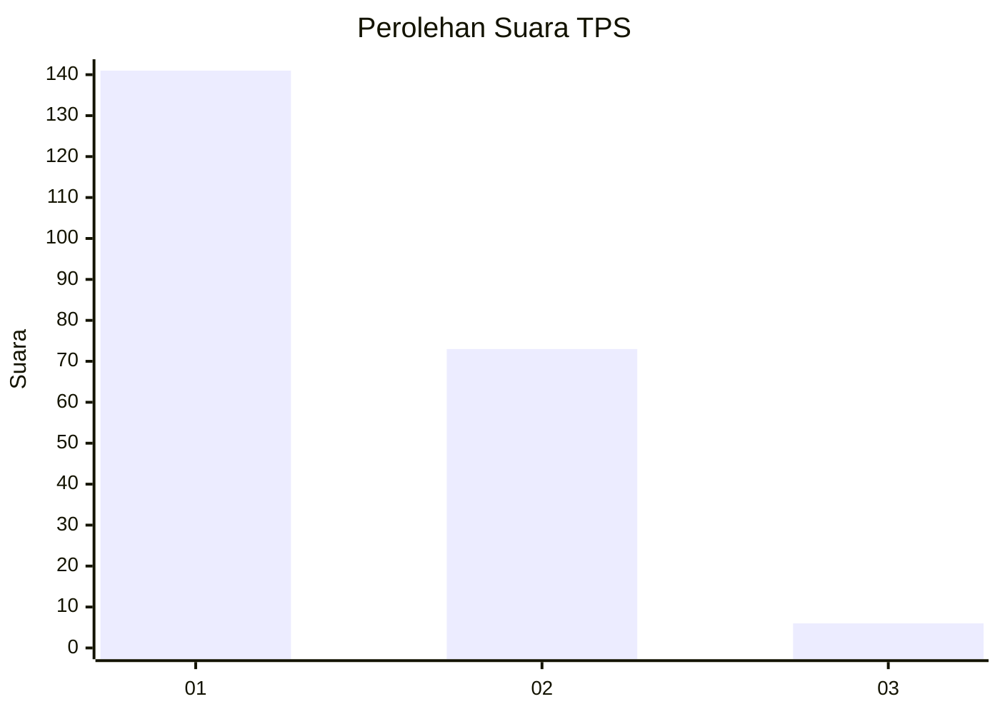
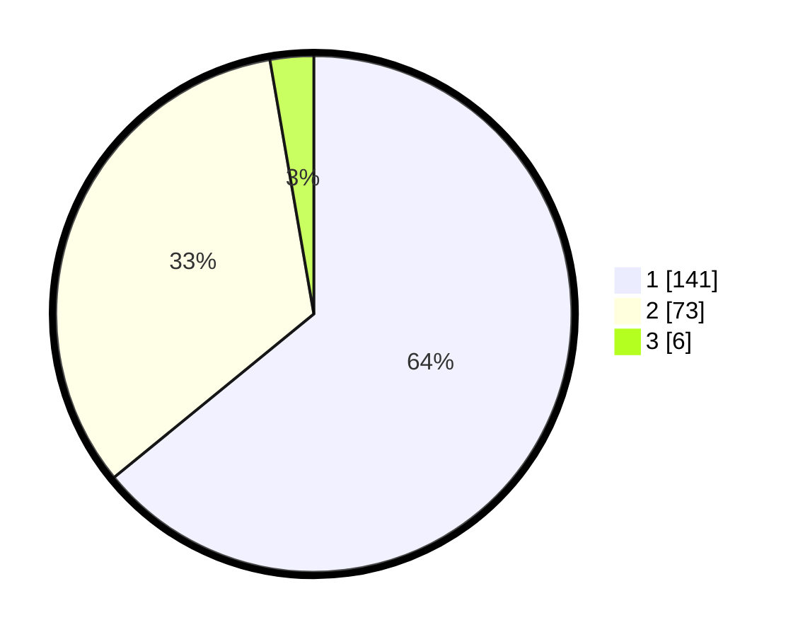

# Hasil

## Grafik

## Tabel

| No. | Nama Paslon    | Suara | Suara (raw) | Persentase |
|:--- |:-------------- | -----:| -----------:| ----------:|
| 1   | ANIES MUHAIMIN | 141   | [141][p-1]  | 64,09      |
| 2   | PRABOWO GIBRAN | 73    | [73][p-2]   | 33,18      |
| 3   | GANJAR MAHFUD  | 6     | [6][p-3]    | 2,73       |

[p-1]: https://github.com/gigit-pemilu/pemilu-2024-11-aceh/blob/main/pilpres/hitung-suara/sub/11-aceh/sub/13-gayo-lues/sub/01-blangkejeren/sub/2001-blangkejeren/sub/007-tps/sub/paslon-1.txt
[p-2]: https://github.com/gigit-pemilu/pemilu-2024-11-aceh/blob/main/pilpres/hitung-suara/sub/11-aceh/sub/13-gayo-lues/sub/01-blangkejeren/sub/2001-blangkejeren/sub/007-tps/sub/paslon-2.txt
[p-3]: https://github.com/gigit-pemilu/pemilu-2024-11-aceh/blob/main/pilpres/hitung-suara/sub/11-aceh/sub/13-gayo-lues/sub/01-blangkejeren/sub/2001-blangkejeren/sub/007-tps/sub/paslon-3.txt

## Foto C Plano

https://sirekap-obj-formc.kpu.go.id/eb73/pemilu/ppwp/11/13/01/20/01/1113012001007-20240214-233036--d1245454-c73c-4d38-8638-80b9753af05e.jpg

https://sirekap-obj-formc.kpu.go.id/eb73/pemilu/ppwp/11/13/01/20/01/1113012001007-20240214-233131--5d6427e1-923f-4c29-83c5-ef3eb04b6154.jpg

https://sirekap-obj-formc.kpu.go.id/eb73/pemilu/ppwp/11/13/01/20/01/1113012001007-20240214-233435--042636e5-1028-4cf7-996b-bc816a7f95f8.jpg

## Metadata

| Key        | Value               |
| ---------- | ------------------- |
| Time Stamp | 2024-02-15 09:00:24 |

## DATA PEMILIH TETAP

Jumlah pemilih dalam DPT: **263**.
 * L: **130**.
 * P: **133**.

## DATA PENGGUNA HAK PILIH

Jumlah pengguna hak pilih dalam DPT: **210**.
 * L: **106**.
 * P: **104**.

Jumlah pengguna hak pilih dalam DPTb: **8**.
 * L: **4**.
 * P: **4**.

Jumlah pengguna hak pilih dalam DPK: **3**.
 * L: **1**.
 * P: **2**.

Jumlah pengguna hak pilih: **221**.
 * L: **111**.
 * P: **110**.

## JUMLAH SUARA SAH DAN TIDAK SAH

JUMLAH SELURUH SUARA SAH: **220**.

JUMLAH SUARA TIDAK SAH: **1**.

JUMLAH SELURUH SUARA SAH DAN SUARA TIDAK SAH: **221**.

