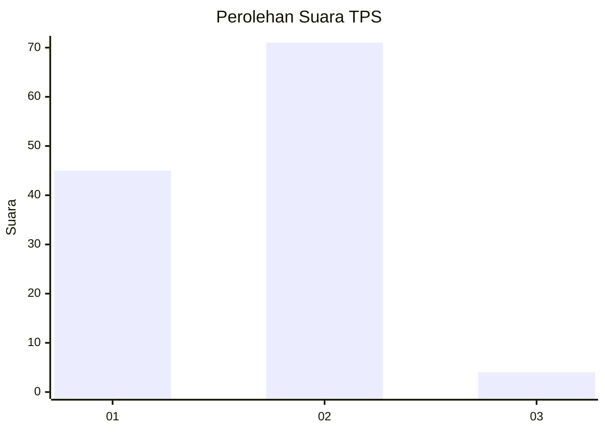
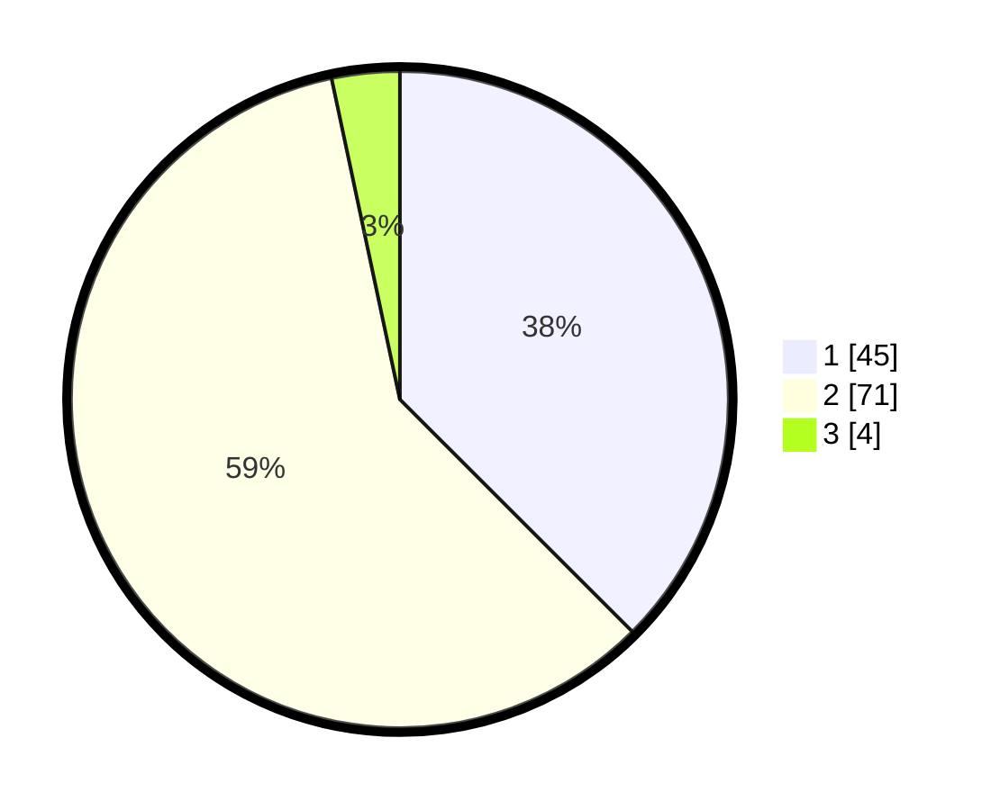

# Hasil

## Grafik

## Tabel

| No. | Nama Paslon    | Suara | Suara (raw) | Persentase |
|:--- |:-------------- | -----:| -----------:| ----------:|
| 1   | ANIES MUHAIMIN | 45    | [45][p-1]   | 37,50      |
| 2   | PRABOWO GIBRAN | 71    | [71][p-2]   | 59,17      |
| 3   | GANJAR MAHFUD  | 4     | [4][p-3]    | 3,33       |

[p-1]: https://github.com/gigit-pemilu/pemilu-2024-11-aceh/blob/main/pilpres/hitung-suara/sub/11-aceh/sub/13-gayo-lues/sub/01-blangkejeren/sub/2001-blangkejeren/sub/901-tps/sub/paslon-1.txt
[p-2]: https://github.com/gigit-pemilu/pemilu-2024-11-aceh/blob/main/pilpres/hitung-suara/sub/11-aceh/sub/13-gayo-lues/sub/01-blangkejeren/sub/2001-blangkejeren/sub/901-tps/sub/paslon-2.txt
[p-3]: https://github.com/gigit-pemilu/pemilu-2024-11-aceh/blob/main/pilpres/hitung-suara/sub/11-aceh/sub/13-gayo-lues/sub/01-blangkejeren/sub/2001-blangkejeren/sub/901-tps/sub/paslon-3.txt

## Foto C Plano

https://sirekap-obj-formc.kpu.go.id/7e7e/pemilu/ppwp/11/13/01/20/01/1113012001901-20240214-155810--2daa09c9-4374-43db-b12f-dd252108d958.jpg

https://sirekap-obj-formc.kpu.go.id/7e7e/pemilu/ppwp/11/13/01/20/01/1113012001901-20240214-155820--d7768d08-f64f-4a54-abb6-fc5d7f255685.jpg

https://sirekap-obj-formc.kpu.go.id/7e7e/pemilu/ppwp/11/13/01/20/01/1113012001901-20240214-155827--8c67c436-2623-4bce-87aa-df1c860a9d91.jpg

## Metadata

| Key        | Value               |
| ---------- | ------------------- |
| Time Stamp | 2024-02-15 00:41:44 |

## DATA PEMILIH TETAP

Jumlah pemilih dalam DPT: **119**.
 * L: **116**.
 * P: **3**.

## DATA PENGGUNA HAK PILIH

Jumlah pengguna hak pilih dalam DPT: **87**.
 * L: **84**.
 * P: **3**.

Jumlah pengguna hak pilih dalam DPTb: **32**.
 * L: **32**.
 * P: **0**.

Jumlah pengguna hak pilih dalam DPK: **3**.
 * L: **3**.
 * P: **0**.

Jumlah pengguna hak pilih: **122**.
 * L: **119**.
 * P: **3**.

## JUMLAH SUARA SAH DAN TIDAK SAH

JUMLAH SELURUH SUARA SAH: **120**.

JUMLAH SUARA TIDAK SAH: **2**.

JUMLAH SELURUH SUARA SAH DAN SUARA TIDAK SAH: **122**.

