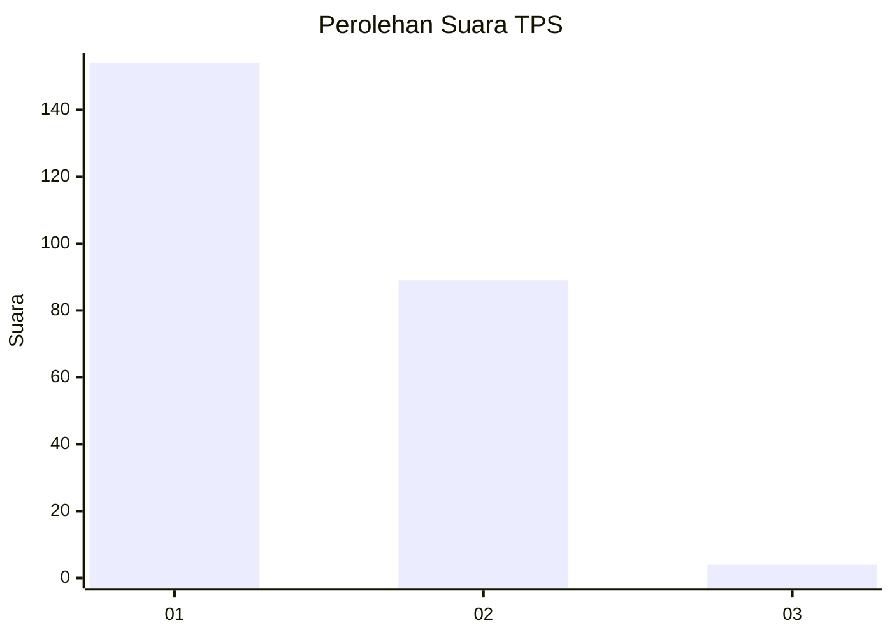
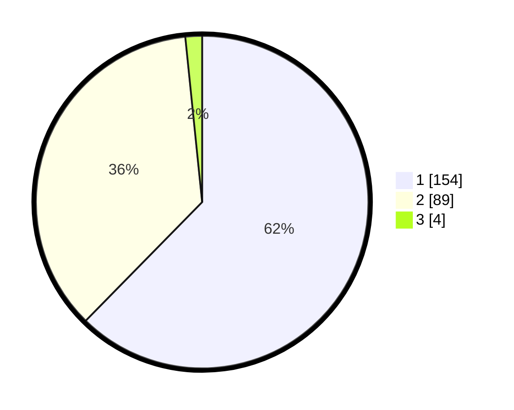

# Hasil

## Grafik

## Tabel

| No. | Nama Paslon    | Suara | Suara (raw) | Persentase |
|:--- |:-------------- | -----:| -----------:| ----------:|
| 1   | ANIES MUHAIMIN | 154   | [154][p-1]  | 62,35      |
| 2   | PRABOWO GIBRAN | 89    | [89][p-2]   | 36,03      |
| 3   | GANJAR MAHFUD  | 4     | [4][p-3]    | 1,62       |

[p-1]: https://github.com/gigit-pemilu/pemilu-2024-11-aceh/blob/main/pilpres/hitung-suara/sub/11-aceh/sub/13-gayo-lues/sub/01-blangkejeren/sub/2002-penampaan/sub/001-tps/sub/paslon-1.txt
[p-2]: https://github.com/gigit-pemilu/pemilu-2024-11-aceh/blob/main/pilpres/hitung-suara/sub/11-aceh/sub/13-gayo-lues/sub/01-blangkejeren/sub/2002-penampaan/sub/001-tps/sub/paslon-2.txt
[p-3]: https://github.com/gigit-pemilu/pemilu-2024-11-aceh/blob/main/pilpres/hitung-suara/sub/11-aceh/sub/13-gayo-lues/sub/01-blangkejeren/sub/2002-penampaan/sub/001-tps/sub/paslon-3.txt

## Foto C Plano

https://sirekap-obj-formc.kpu.go.id/8b59/pemilu/ppwp/11/13/01/20/02/1113012002001-20240215-135202--1e3350d6-4580-4885-a959-6e851a635370.jpg

https://sirekap-obj-formc.kpu.go.id/8b59/pemilu/ppwp/11/13/01/20/02/1113012002001-20240215-135342--df7373b8-a11e-4cff-8ade-c510aa92a72a.jpg

https://sirekap-obj-formc.kpu.go.id/8b59/pemilu/ppwp/11/13/01/20/02/1113012002001-20240215-135507--b449b8b9-f9c3-4c2f-9938-0ed101d399e9.jpg

## Metadata

| Key        | Value               |
| ---------- | ------------------- |
| Time Stamp | 2024-02-16 21:01:00 |

