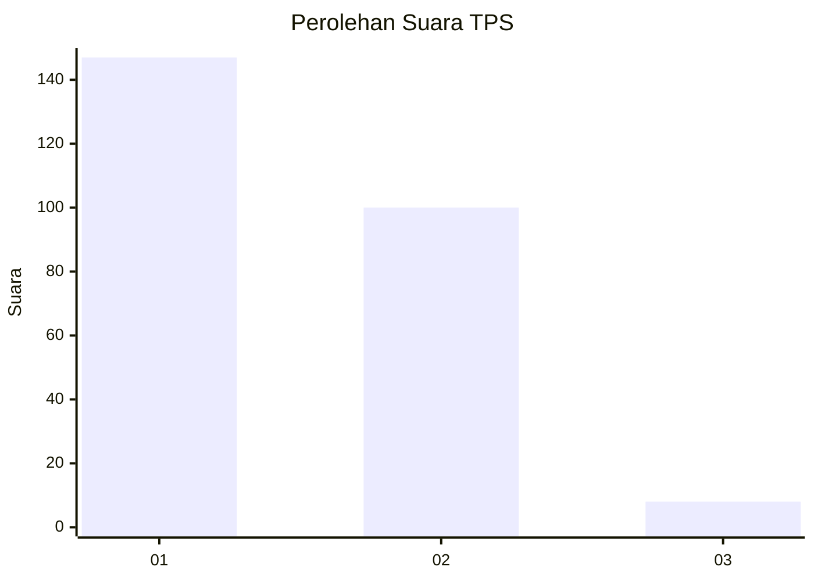
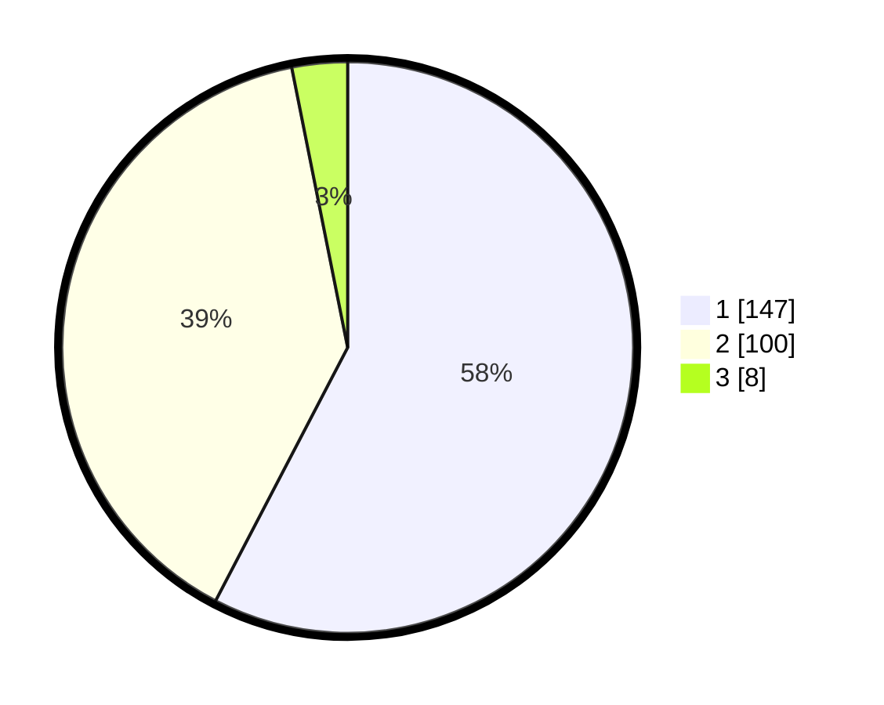

# Hasil

## Grafik

## Tabel

| No. | Nama Paslon    | Suara | Suara (raw) | Persentase |
|:--- |:-------------- | -----:| -----------:| ----------:|
| 1   | ANIES MUHAIMIN | 147   | [147][p-1]  | 57,65      |
| 2   | PRABOWO GIBRAN | 100   | [100][p-2]  | 39,22      |
| 3   | GANJAR MAHFUD  | 8     | [8][p-3]    | 3,14       |

[p-1]: https://github.com/gigit-pemilu/pemilu-2024-11-aceh/blob/main/pilpres/hitung-suara/sub/11-aceh/sub/13-gayo-lues/sub/01-blangkejeren/sub/2002-penampaan/sub/002-tps/sub/paslon-1.txt
[p-2]: https://github.com/gigit-pemilu/pemilu-2024-11-aceh/blob/main/pilpres/hitung-suara/sub/11-aceh/sub/13-gayo-lues/sub/01-blangkejeren/sub/2002-penampaan/sub/002-tps/sub/paslon-2.txt
[p-3]: https://github.com/gigit-pemilu/pemilu-2024-11-aceh/blob/main/pilpres/hitung-suara/sub/11-aceh/sub/13-gayo-lues/sub/01-blangkejeren/sub/2002-penampaan/sub/002-tps/sub/paslon-3.txt

## Foto C Plano

https://sirekap-obj-formc.kpu.go.id/578d/pemilu/ppwp/11/13/01/20/02/1113012002002-20240215-172406--3412e306-4d34-457d-b814-6b6fde613fce.jpg

https://sirekap-obj-formc.kpu.go.id/578d/pemilu/ppwp/11/13/01/20/02/1113012002002-20240215-153107--aeb52f0e-7e24-4431-9a44-2a3f59a47d36.jpg

https://sirekap-obj-formc.kpu.go.id/578d/pemilu/ppwp/11/13/01/20/02/1113012002002-20240215-153021--394c7ddd-6443-4dfd-81f9-9c620278b0bd.jpg

## Metadata

| Key        | Value               |
| ---------- | ------------------- |
| Time Stamp | 2024-02-19 06:16:00 |

