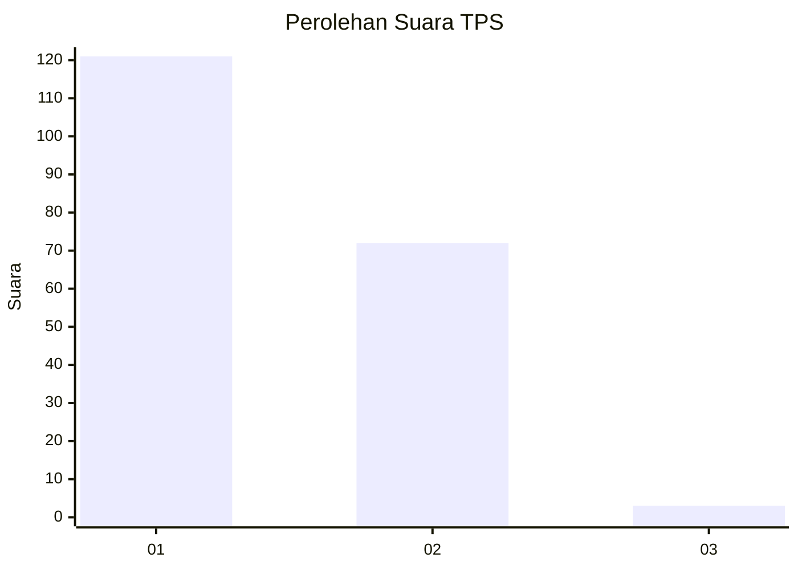
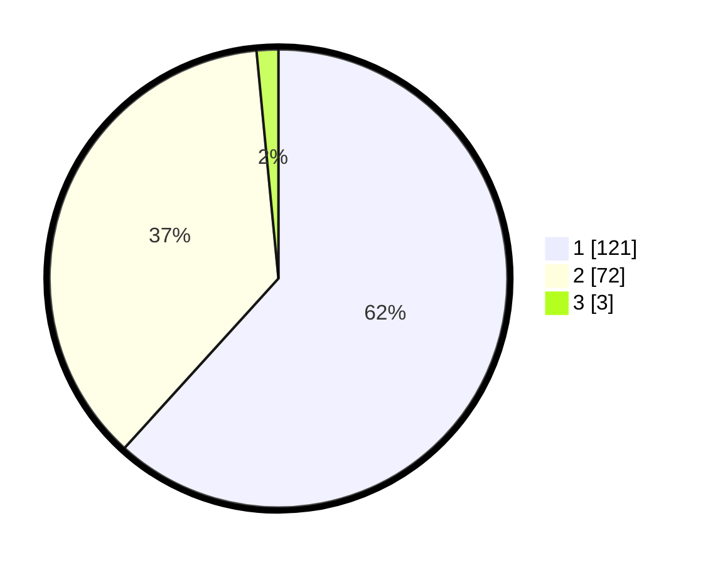

# Hasil

## Grafik

## Tabel

| No. | Nama Paslon    | Suara | Suara (raw) | Persentase |
|:--- |:-------------- | -----:| -----------:| ----------:|
| 1   | ANIES MUHAIMIN | 121   | [121][p-1]  | 61,73      |
| 2   | PRABOWO GIBRAN | 72    | [72][p-2]   | 36,73      |
| 3   | GANJAR MAHFUD  | 3     | [3][p-3]    | 1,53       |

[p-1]: https://github.com/gigit-pemilu/pemilu-2024-11-aceh/blob/main/pilpres/hitung-suara/sub/11-aceh/sub/13-gayo-lues/sub/01-blangkejeren/sub/2005-durin/sub/002-tps/sub/paslon-1.txt
[p-2]: https://github.com/gigit-pemilu/pemilu-2024-11-aceh/blob/main/pilpres/hitung-suara/sub/11-aceh/sub/13-gayo-lues/sub/01-blangkejeren/sub/2005-durin/sub/002-tps/sub/paslon-2.txt
[p-3]: https://github.com/gigit-pemilu/pemilu-2024-11-aceh/blob/main/pilpres/hitung-suara/sub/11-aceh/sub/13-gayo-lues/sub/01-blangkejeren/sub/2005-durin/sub/002-tps/sub/paslon-3.txt

## Foto C Plano

https://sirekap-obj-formc.kpu.go.id/b579/pemilu/ppwp/11/13/01/20/05/1113012005002-20240215-160355--ced7dfcb-4dd8-4f66-9dc1-fb5a98ee91e1.jpg

https://sirekap-obj-formc.kpu.go.id/b579/pemilu/ppwp/11/13/01/20/05/1113012005002-20240215-155329--01092843-07a9-4be7-89f4-c43091350fc4.jpg

https://sirekap-obj-formc.kpu.go.id/b579/pemilu/ppwp/11/13/01/20/05/1113012005002-20240215-155514--e0a9cf75-47ae-4e55-8d9f-d7ff7a439e00.jpg

## Metadata

| Key        | Value               |
| ---------- | ------------------- |
| Time Stamp | 2024-02-15 17:30:25 |

