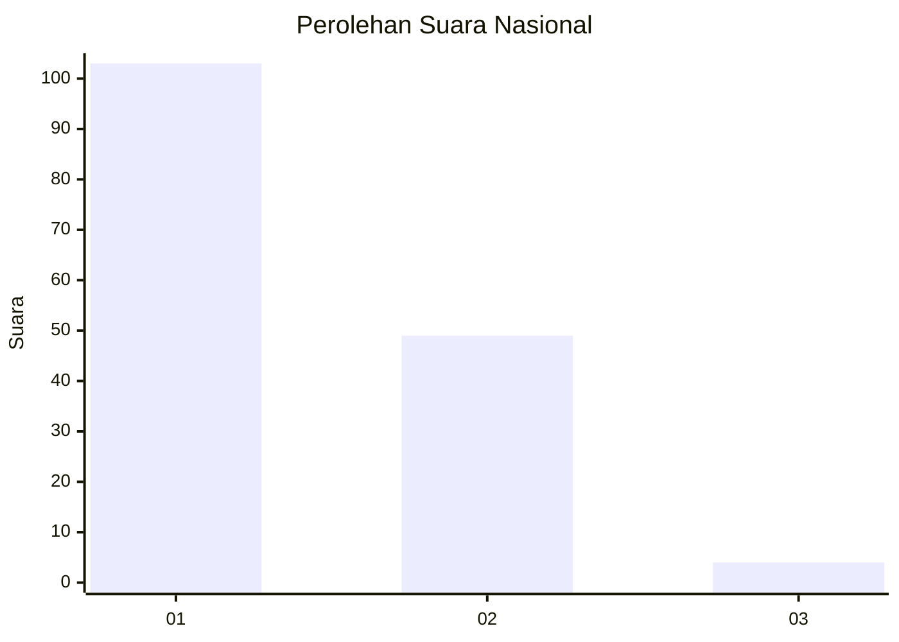
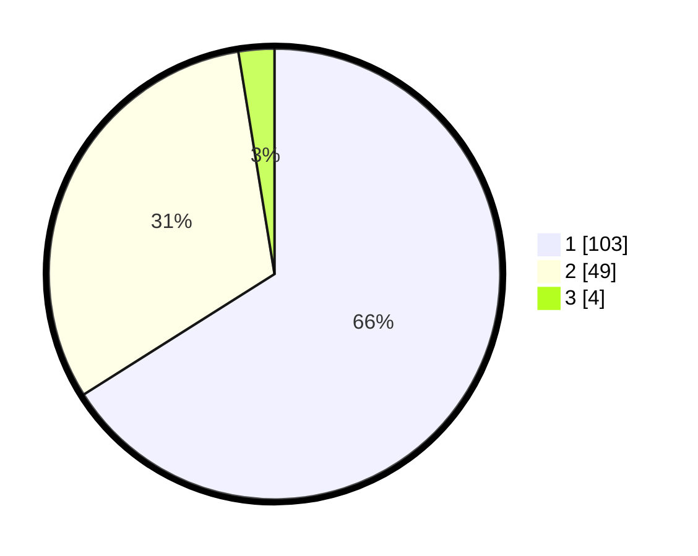

# Hasil

## Grafik

## Tabel

| No. | Nama Paslon    | Suara | Suara (raw) | Persentase |
|:--- |:-------------- | -----:| -----------:| ----------:|
| 1   | ANIES MUHAIMIN | 103   | [103][p-1]  | 66,03      |
| 2   | PRABOWO GIBRAN | 49    | [49][p-2]   | 31,41      |
| 3   | GANJAR MAHFUD  | 4     | [4][p-3]    | 2,56       |

[p-1]: https://github.com/gigit-pemilu/pemilu-2024/blob/main/pilpres/hitung-suara/sub/11-aceh/sub/13-gayo-lues/sub/01-blangkejeren/sub/2007-kampung-jawa/sub/006-tps/sub/paslon-1.txt
[p-2]: https://github.com/gigit-pemilu/pemilu-2024/blob/main/pilpres/hitung-suara/sub/11-aceh/sub/13-gayo-lues/sub/01-blangkejeren/sub/2007-kampung-jawa/sub/006-tps/sub/paslon-2.txt
[p-3]: https://github.com/gigit-pemilu/pemilu-2024/blob/main/pilpres/hitung-suara/sub/11-aceh/sub/13-gayo-lues/sub/01-blangkejeren/sub/2007-kampung-jawa/sub/006-tps/sub/paslon-3.txt

## Foto C Plano

https://sirekap-obj-formc.kpu.go.id/36fb/pemilu/ppwp/11/13/01/20/07/1113012007006-20240216-140106--35bf46b6-acae-4d1f-ad6d-b4184bcebdd1.jpg

https://sirekap-obj-formc.kpu.go.id/36fb/pemilu/ppwp/11/13/01/20/07/1113012007006-20240216-140107--47334170-7c33-4837-9497-90a2b059281f.jpg

https://sirekap-obj-formc.kpu.go.id/36fb/pemilu/ppwp/11/13/01/20/07/1113012007006-20240216-140107--53bdae5b-68b2-42ac-9530-213105e574b4.jpg

## Metadata

| Key        | Value               |
| ---------- | ------------------- |
| Time Stamp | 2024-02-16 14:30:33 |

## DATA PEMILIH TETAP

Jumlah pemilih dalam DPT: **186**.
 * L: **88**.
 * P: **98**.

## DATA PENGGUNA HAK PILIH

Jumlah pengguna hak pilih dalam DPT: **141**.
 * L: **65**.
 * P: **76**.

Jumlah pengguna hak pilih dalam DPTb: **5**.
 * L: **2**.
 * P: **3**.

Jumlah pengguna hak pilih dalam DPK: **13**.
 * L: **2**.
 * P: **11**.

Jumlah pengguna hak pilih: **159**.
 * L: **69**.
 * P: **90**.

## JUMLAH SUARA SAH DAN TIDAK SAH

JUMLAH SELURUH SUARA SAH: **156**.

JUMLAH SUARA TIDAK SAH: **3**.

JUMLAH SELURUH SUARA SAH DAN SUARA TIDAK SAH: **159**.

