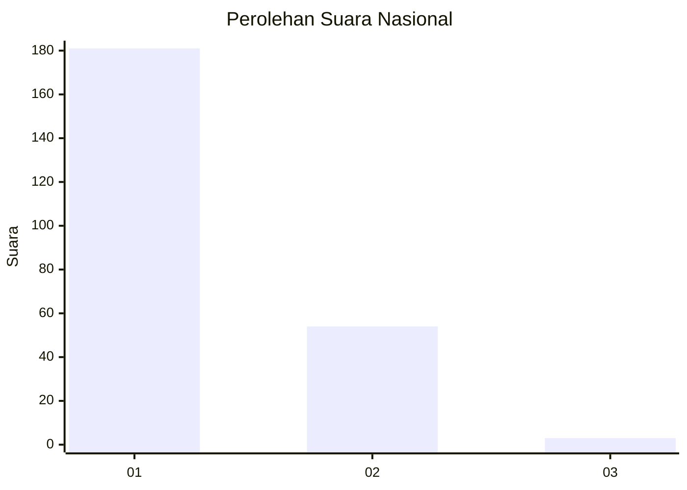
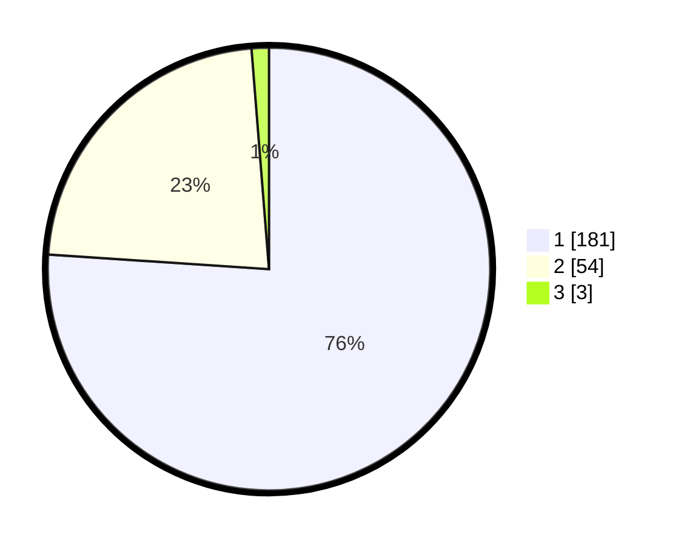

# Hasil

## Grafik

## Tabel

| No. | Nama Paslon    | Suara | Suara (raw) | Persentase |
|:--- |:-------------- | -----:| -----------:| ----------:|
| 1   | ANIES MUHAIMIN | 181   | [181][p-1]  | 76,05      |
| 2   | PRABOWO GIBRAN | 54    | [54][p-2]   | 22,69      |
| 3   | GANJAR MAHFUD  | 3     | [3][p-3]    | 1,26       |

[p-1]: https://github.com/gigit-pemilu/pemilu-2024/blob/main/pilpres/hitung-suara/sub/11-aceh/sub/13-gayo-lues/sub/01-blangkejeren/sub/2008-porang/sub/001-tps/sub/paslon-1.txt
[p-2]: https://github.com/gigit-pemilu/pemilu-2024/blob/main/pilpres/hitung-suara/sub/11-aceh/sub/13-gayo-lues/sub/01-blangkejeren/sub/2008-porang/sub/001-tps/sub/paslon-2.txt
[p-3]: https://github.com/gigit-pemilu/pemilu-2024/blob/main/pilpres/hitung-suara/sub/11-aceh/sub/13-gayo-lues/sub/01-blangkejeren/sub/2008-porang/sub/001-tps/sub/paslon-3.txt

## Foto C Plano

https://sirekap-obj-formc.kpu.go.id/d340/pemilu/ppwp/11/13/01/20/08/1113012008001-20240215-072408--01458f5a-a4de-41aa-b526-d5baca556cb8.jpg

https://sirekap-obj-formc.kpu.go.id/d340/pemilu/ppwp/11/13/01/20/08/1113012008001-20240215-072518--5500b44d-5630-4ee6-a1ef-107b754904fe.jpg

https://sirekap-obj-formc.kpu.go.id/d340/pemilu/ppwp/11/13/01/20/08/1113012008001-20240215-072614--d4e76f1a-b6a2-42d5-9a7b-8a042e29db19.jpg

## Metadata

| Key        | Value               |
| ---------- | ------------------- |
| Time Stamp | 2024-02-19 06:16:00 |

