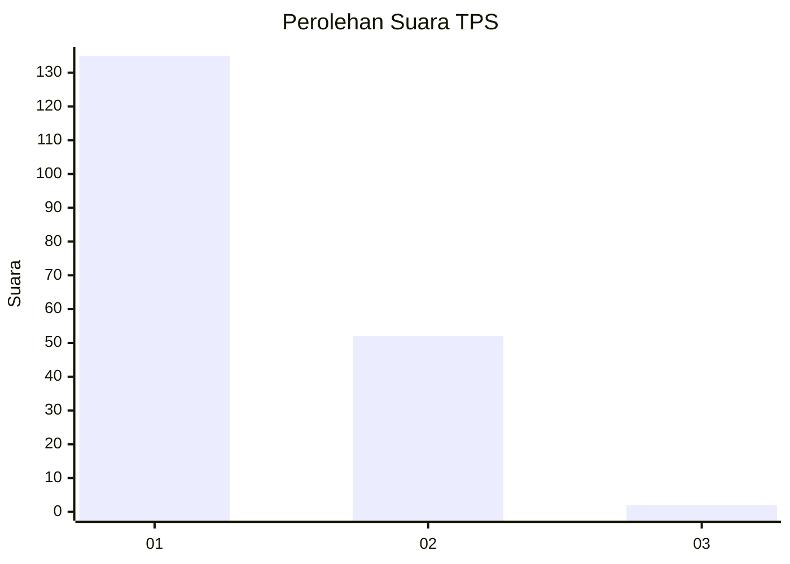
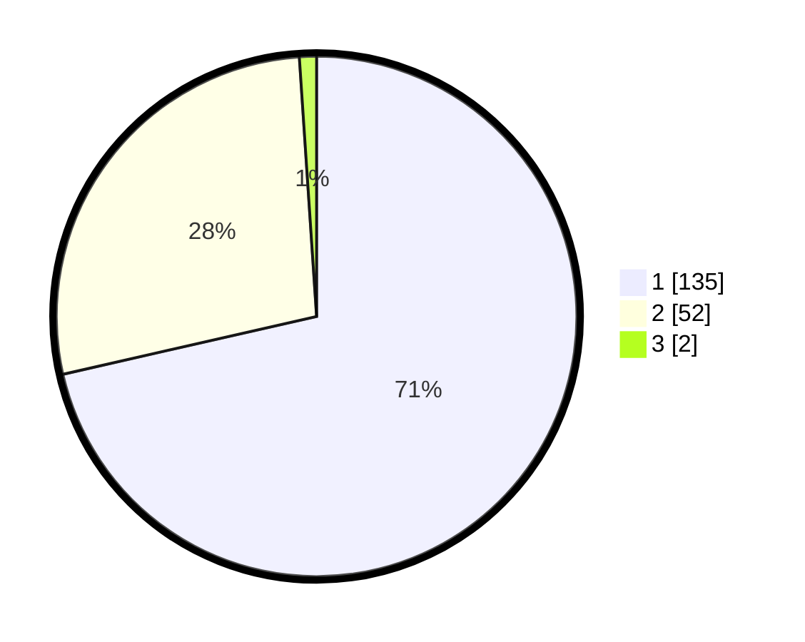

# Hasil

## Grafik

## Tabel

| No. | Nama Paslon    | Suara | Suara (raw) | Persentase |
|:--- |:-------------- | -----:| -----------:| ----------:|
| 1   | ANIES MUHAIMIN | 135   | [135][p-1]  | 71,43      |
| 2   | PRABOWO GIBRAN | 52    | [52][p-2]   | 27,51      |
| 3   | GANJAR MAHFUD  | 2     | [2][p-3]    | 1,06       |

[p-1]: https://github.com/gigit-pemilu/pemilu-2024-11-aceh/blob/main/pilpres/hitung-suara/sub/11-aceh/sub/13-gayo-lues/sub/01-blangkejeren/sub/2008-porang/sub/002-tps/sub/paslon-1.txt
[p-2]: https://github.com/gigit-pemilu/pemilu-2024-11-aceh/blob/main/pilpres/hitung-suara/sub/11-aceh/sub/13-gayo-lues/sub/01-blangkejeren/sub/2008-porang/sub/002-tps/sub/paslon-2.txt
[p-3]: https://github.com/gigit-pemilu/pemilu-2024-11-aceh/blob/main/pilpres/hitung-suara/sub/11-aceh/sub/13-gayo-lues/sub/01-blangkejeren/sub/2008-porang/sub/002-tps/sub/paslon-3.txt

## Foto C Plano

https://sirekap-obj-formc.kpu.go.id/c3d9/pemilu/ppwp/11/13/01/20/08/1113012008002-20240215-082611--81505c1a-c72f-4ab9-8bcf-58cdb85fa7eb.jpg

https://sirekap-obj-formc.kpu.go.id/c3d9/pemilu/ppwp/11/13/01/20/08/1113012008002-20240215-082635--2014a484-2490-4e28-94eb-a60f1b7e6820.jpg

https://sirekap-obj-formc.kpu.go.id/c3d9/pemilu/ppwp/11/13/01/20/08/1113012008002-20240215-082637--77a203ef-3b3b-4e8e-af17-d12e2e5e9d15.jpg

## Metadata

| Key        | Value               |
| ---------- | ------------------- |
| Time Stamp | 2024-02-19 06:16:00 |

