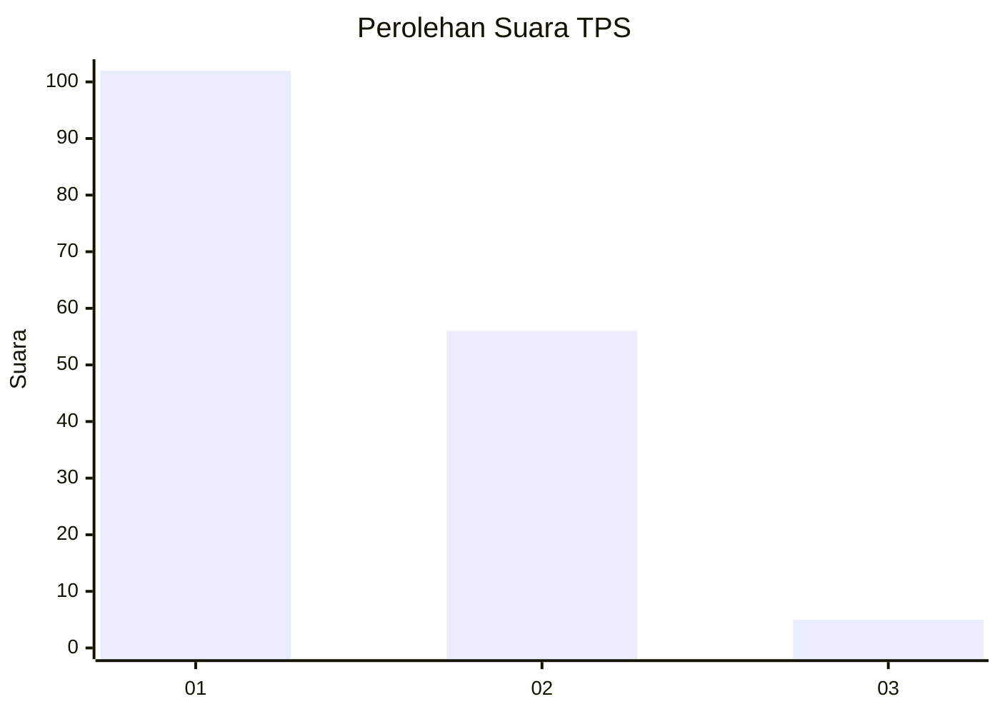
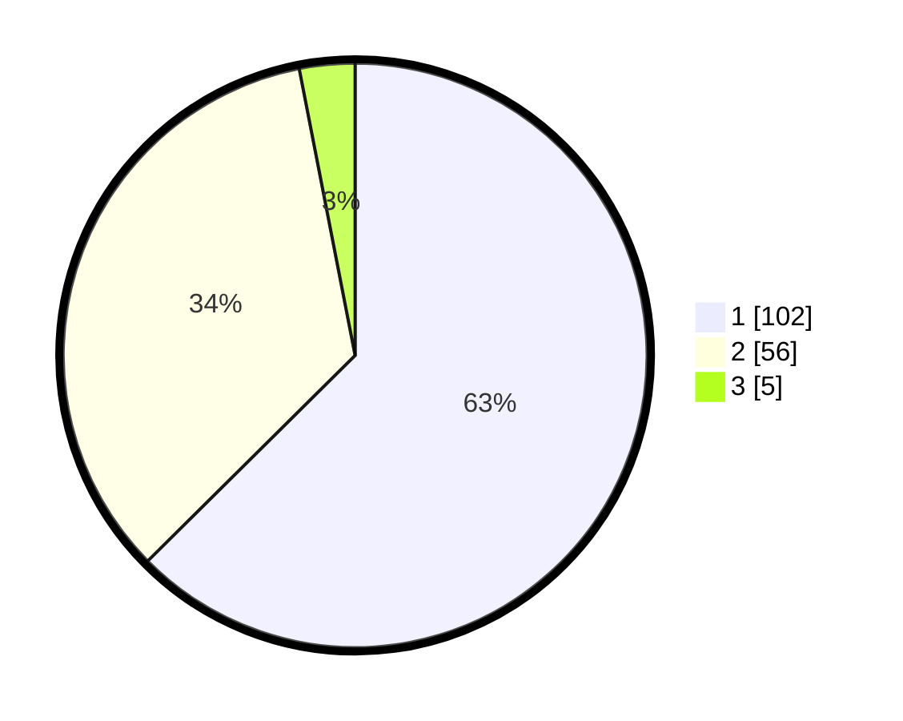

# Hasil

## Grafik

## Tabel

| No. | Nama Paslon    | Suara | Suara (raw) | Persentase |
|:--- |:-------------- | -----:| -----------:| ----------:|
| 1   | ANIES MUHAIMIN | 102   | [102][p-1]  | 62,58      |
| 2   | PRABOWO GIBRAN | 56    | [56][p-2]   | 34,36      |
| 3   | GANJAR MAHFUD  | 5     | [5][p-3]    | 3,07       |

[p-1]: https://github.com/gigit-pemilu/pemilu-2024-11-aceh/blob/main/pilpres/hitung-suara/sub/11-aceh/sub/13-gayo-lues/sub/01-blangkejeren/sub/2016-gele/sub/005-tps/sub/paslon-1.txt
[p-2]: https://github.com/gigit-pemilu/pemilu-2024-11-aceh/blob/main/pilpres/hitung-suara/sub/11-aceh/sub/13-gayo-lues/sub/01-blangkejeren/sub/2016-gele/sub/005-tps/sub/paslon-2.txt
[p-3]: https://github.com/gigit-pemilu/pemilu-2024-11-aceh/blob/main/pilpres/hitung-suara/sub/11-aceh/sub/13-gayo-lues/sub/01-blangkejeren/sub/2016-gele/sub/005-tps/sub/paslon-3.txt

## Foto C Plano

https://sirekap-obj-formc.kpu.go.id/e066/pemilu/ppwp/11/13/01/20/16/1113012016005-20240215-024639--491a5ca5-f75f-4297-a808-37c53647e7af.jpg

https://sirekap-obj-formc.kpu.go.id/e066/pemilu/ppwp/11/13/01/20/16/1113012016005-20240215-024728--9996d910-db34-48c8-abed-2d4e0fc0940b.jpg

https://sirekap-obj-formc.kpu.go.id/e066/pemilu/ppwp/11/13/01/20/16/1113012016005-20240215-025628--258cac6a-97f1-4c96-920b-bad2bdac3d2d.jpg

## Metadata

| Key        | Value               |
| ---------- | ------------------- |
| Time Stamp | 2024-02-24 22:31:28 |

