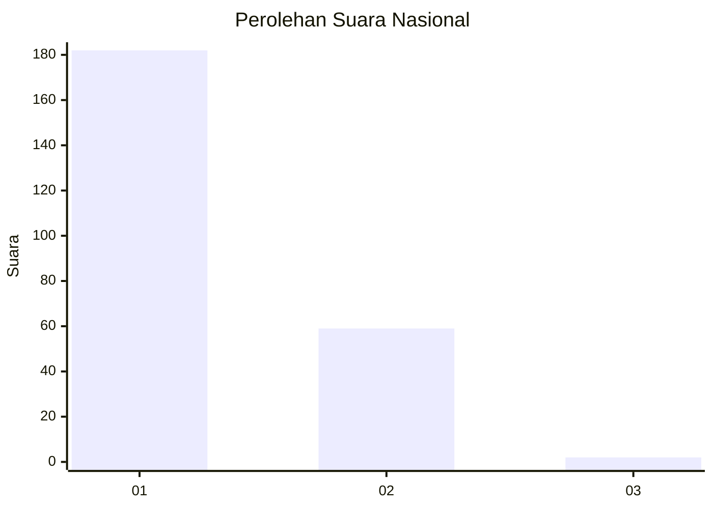
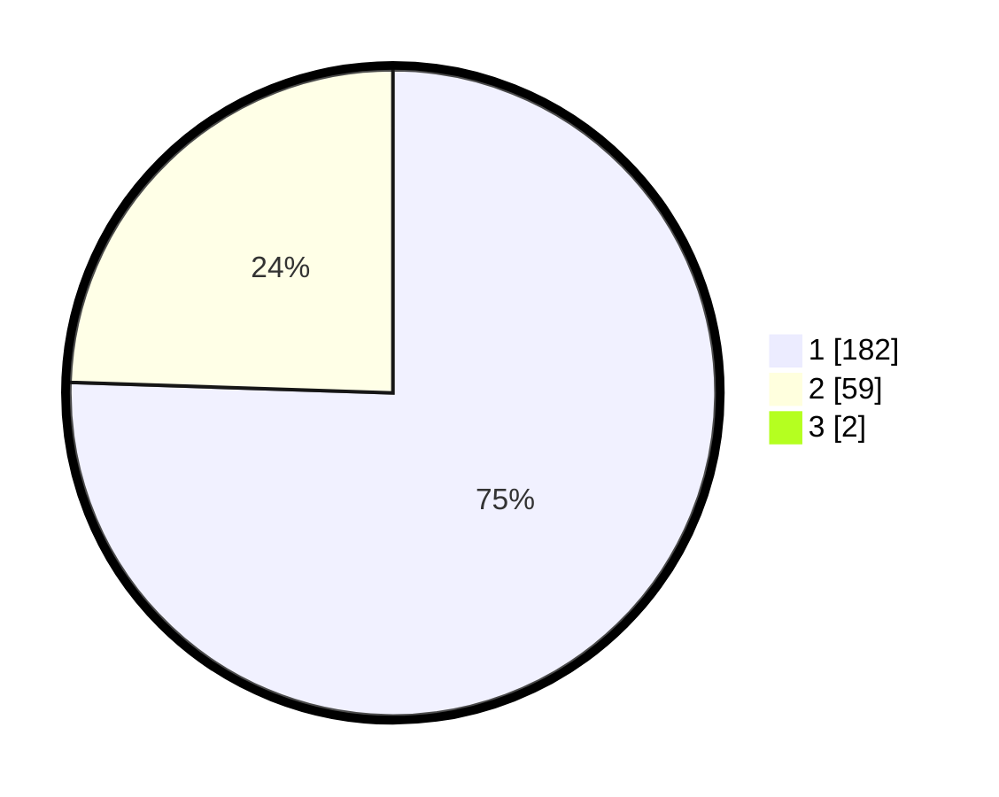

# Hasil

## Grafik

## Tabel

| No. | Nama Paslon    | Suara | Suara (raw) | Persentase |
|:--- |:-------------- | -----:| -----------:| ----------:|
| 1   | ANIES MUHAIMIN | 182   | [182][p-1]  | 74,90      |
| 2   | PRABOWO GIBRAN | 59    | [59][p-2]   | 24,28      |
| 3   | GANJAR MAHFUD  | 2     | [2][p-3]    | 0,82       |

[p-1]: https://github.com/gigit-pemilu/pemilu-2024/blob/main/pilpres/hitung-suara/sub/11-aceh/sub/13-gayo-lues/sub/01-blangkejeren/sub/2022-penggalangan/sub/003-tps/sub/paslon-1.txt
[p-2]: https://github.com/gigit-pemilu/pemilu-2024/blob/main/pilpres/hitung-suara/sub/11-aceh/sub/13-gayo-lues/sub/01-blangkejeren/sub/2022-penggalangan/sub/003-tps/sub/paslon-2.txt
[p-3]: https://github.com/gigit-pemilu/pemilu-2024/blob/main/pilpres/hitung-suara/sub/11-aceh/sub/13-gayo-lues/sub/01-blangkejeren/sub/2022-penggalangan/sub/003-tps/sub/paslon-3.txt

## Foto C Plano

https://sirekap-obj-formc.kpu.go.id/6431/pemilu/ppwp/11/13/01/20/22/1113012022003-20240215-162104--95eaf03f-cecd-467e-91f9-52648f95653e.jpg

https://sirekap-obj-formc.kpu.go.id/6431/pemilu/ppwp/11/13/01/20/22/1113012022003-20240215-162229--480c2f5e-da82-46f4-bf3f-5ba83768fe40.jpg

https://sirekap-obj-formc.kpu.go.id/6431/pemilu/ppwp/11/13/01/20/22/1113012022003-20240215-162412--f735edb3-d136-492b-87c0-08bada8ee0c6.jpg

## Metadata

| Key        | Value               |
| ---------- | ------------------- |
| Time Stamp | 2024-02-24 22:31:28 |

