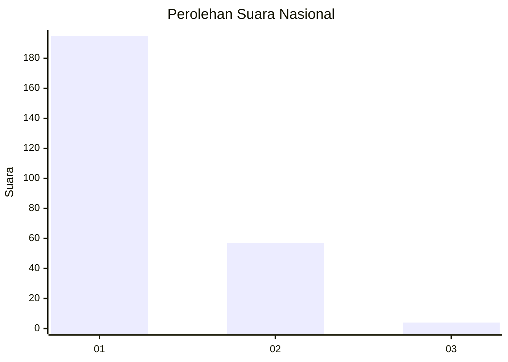
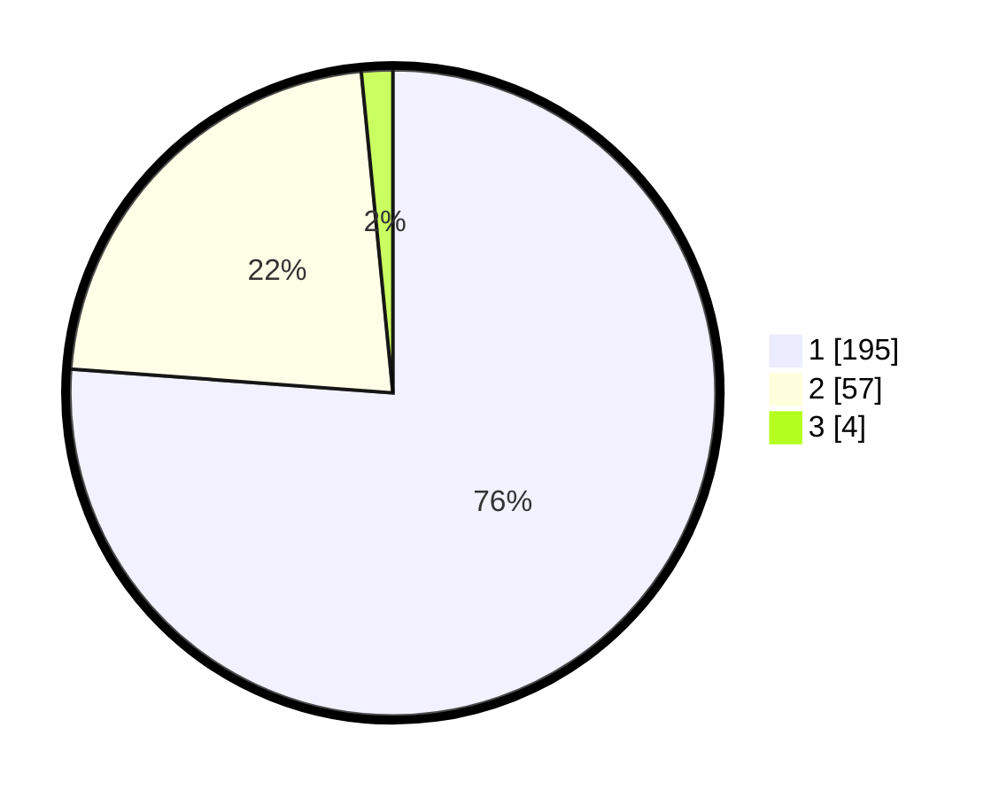

# Hasil

## Grafik

## Tabel

| No. | Nama Paslon    | Suara | Suara (raw) | Persentase |
|:--- |:-------------- | -----:| -----------:| ----------:|
| 1   | ANIES MUHAIMIN | 195   | [195][p-1]  | 76,17      |
| 2   | PRABOWO GIBRAN | 57    | [57][p-2]   | 22,27      |
| 3   | GANJAR MAHFUD  | 4     | [4][p-3]    | 1,56       |

[p-1]: https://github.com/gigit-pemilu/pemilu-2024/blob/main/pilpres/hitung-suara/sub/11-aceh/sub/13-gayo-lues/sub/01-blangkejeren/sub/2031-bustanussalam/sub/002-tps/sub/paslon-1.txt
[p-2]: https://github.com/gigit-pemilu/pemilu-2024/blob/main/pilpres/hitung-suara/sub/11-aceh/sub/13-gayo-lues/sub/01-blangkejeren/sub/2031-bustanussalam/sub/002-tps/sub/paslon-2.txt
[p-3]: https://github.com/gigit-pemilu/pemilu-2024/blob/main/pilpres/hitung-suara/sub/11-aceh/sub/13-gayo-lues/sub/01-blangkejeren/sub/2031-bustanussalam/sub/002-tps/sub/paslon-3.txt

## Foto C Plano

https://sirekap-obj-formc.kpu.go.id/3cda/pemilu/ppwp/11/13/01/20/31/1113012031002-20240215-065443--28b29edd-a7d9-4e74-8979-d02008eeb9e0.jpg

https://sirekap-obj-formc.kpu.go.id/3cda/pemilu/ppwp/11/13/01/20/31/1113012031002-20240215-065733--dcf81f16-865d-4f7d-8385-6e8518219e70.jpg

https://sirekap-obj-formc.kpu.go.id/3cda/pemilu/ppwp/11/13/01/20/31/1113012031002-20240215-070217--437488b5-38d0-47a8-8246-d28ae852cdfa.jpg

## Metadata

| Key        | Value               |
| ---------- | ------------------- |
| Time Stamp | 2024-02-24 22:31:28 |

