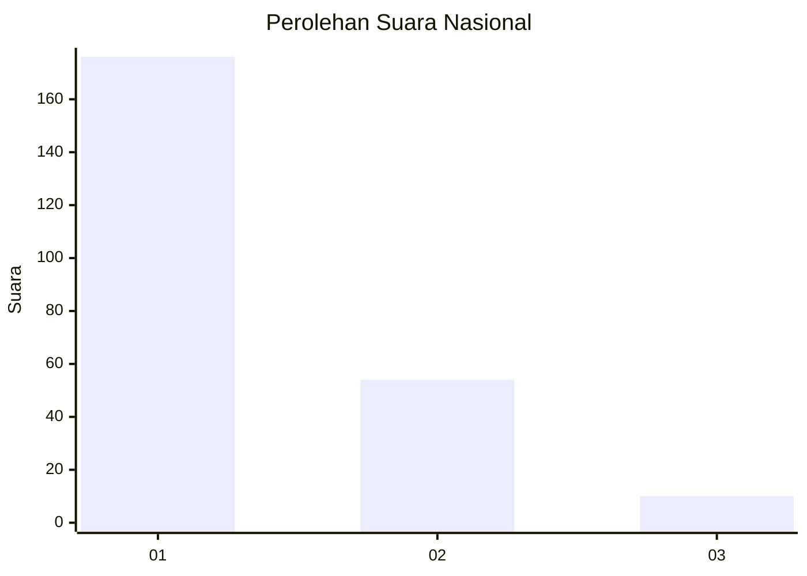
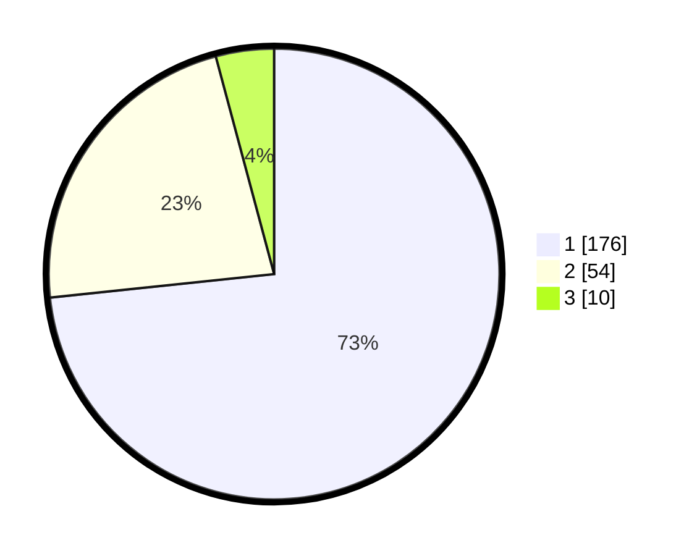

# Hasil

## Grafik

## Tabel

| No. | Nama Paslon    | Suara | Suara (raw) | Persentase |
|:--- |:-------------- | -----:| -----------:| ----------:|
| 1   | ANIES MUHAIMIN | 176   | [176][p-1]  | 73,33      |
| 2   | PRABOWO GIBRAN | 54    | [54][p-2]   | 22,50      |
| 3   | GANJAR MAHFUD  | 10    | [10][p-3]   | 4,17       |

[p-1]: https://github.com/gigit-pemilu/pemilu-2024/blob/main/pilpres/hitung-suara/sub/11-aceh/sub/13-gayo-lues/sub/02-kutapanjang/sub/2004-bener/sub/001-tps/sub/paslon-1.txt
[p-2]: https://github.com/gigit-pemilu/pemilu-2024/blob/main/pilpres/hitung-suara/sub/11-aceh/sub/13-gayo-lues/sub/02-kutapanjang/sub/2004-bener/sub/001-tps/sub/paslon-2.txt
[p-3]: https://github.com/gigit-pemilu/pemilu-2024/blob/main/pilpres/hitung-suara/sub/11-aceh/sub/13-gayo-lues/sub/02-kutapanjang/sub/2004-bener/sub/001-tps/sub/paslon-3.txt

## Foto C Plano

https://sirekap-obj-formc.kpu.go.id/491c/pemilu/ppwp/11/13/02/20/04/1113022004001-20240216-141802--ac0468af-bd5e-4290-8756-6e3b0b9b4522.jpg

https://sirekap-obj-formc.kpu.go.id/491c/pemilu/ppwp/11/13/02/20/04/1113022004001-20240216-141804--8f8e563c-7a44-439f-8e7f-49473b71c5ce.jpg

https://sirekap-obj-formc.kpu.go.id/491c/pemilu/ppwp/11/13/02/20/04/1113022004001-20240216-141803--17832194-4cba-4d3c-be68-47a310777da1.jpg

## Metadata

| Key        | Value               |
| ---------- | ------------------- |
| Time Stamp | 2024-02-16 14:30:33 |

## DATA PEMILIH TETAP

Jumlah pemilih dalam DPT: **256**.
 * L: **126**.
 * P: **130**.

## DATA PENGGUNA HAK PILIH

Jumlah pengguna hak pilih dalam DPT: **256**.
 * L: **126**.
 * P: **130**.

Jumlah pengguna hak pilih dalam DPTb: **2**.
 * L: **0**.
 * P: **2**.

Jumlah pengguna hak pilih dalam DPK: **0**.
 * L: **0**.
 * P: **0**.

Jumlah pengguna hak pilih: **258**.
 * L: **126**.
 * P: **132**.

## JUMLAH SUARA SAH DAN TIDAK SAH

JUMLAH SELURUH SUARA SAH: **240**.

JUMLAH SUARA TIDAK SAH: **18**.

JUMLAH SELURUH SUARA SAH DAN SUARA TIDAK SAH: **258**.

