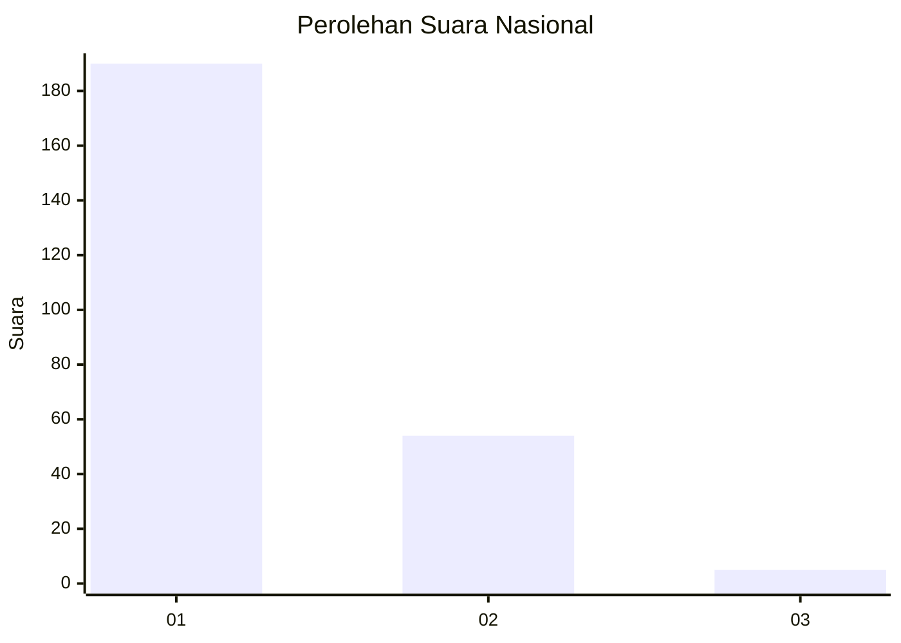
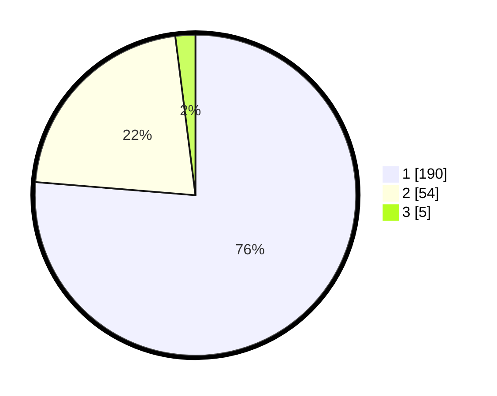

# Hasil

## Grafik

## Tabel

| No. | Nama Paslon    | Suara | Suara (raw) | Persentase |
|:--- |:-------------- | -----:| -----------:| ----------:|
| 1   | ANIES MUHAIMIN | 190   | [190][p-1]  | 76,31      |
| 2   | PRABOWO GIBRAN | 54    | [54][p-2]   | 21,69      |
| 3   | GANJAR MAHFUD  | 5     | [5][p-3]    | 2,01       |

[p-1]: https://github.com/gigit-pemilu/pemilu-2024/blob/main/pilpres/hitung-suara/sub/11-aceh/sub/13-gayo-lues/sub/02-kutapanjang/sub/2004-bener/sub/002-tps/sub/paslon-1.txt
[p-2]: https://github.com/gigit-pemilu/pemilu-2024/blob/main/pilpres/hitung-suara/sub/11-aceh/sub/13-gayo-lues/sub/02-kutapanjang/sub/2004-bener/sub/002-tps/sub/paslon-2.txt
[p-3]: https://github.com/gigit-pemilu/pemilu-2024/blob/main/pilpres/hitung-suara/sub/11-aceh/sub/13-gayo-lues/sub/02-kutapanjang/sub/2004-bener/sub/002-tps/sub/paslon-3.txt

## Foto C Plano

https://sirekap-obj-formc.kpu.go.id/55e6/pemilu/ppwp/11/13/02/20/04/1113022004002-20240216-142907--7970ecde-e8f2-4dc6-b962-857ed5296026.jpg

https://sirekap-obj-formc.kpu.go.id/55e6/pemilu/ppwp/11/13/02/20/04/1113022004002-20240216-142909--c5ffab1a-459d-4341-9c8b-a8350edba5ad.jpg

https://sirekap-obj-formc.kpu.go.id/55e6/pemilu/ppwp/11/13/02/20/04/1113022004002-20240216-142908--d7eab559-fedf-4abd-8633-cbc53cfc5ee1.jpg

## Metadata

| Key        | Value               |
| ---------- | ------------------- |
| Time Stamp | 2024-02-16 16:25:10 |

## DATA PEMILIH TETAP

Jumlah pemilih dalam DPT: **283**.
 * L: **139**.
 * P: **144**.

## DATA PENGGUNA HAK PILIH

Jumlah pengguna hak pilih dalam DPT: **260**.
 * L: **127**.
 * P: **133**.

Jumlah pengguna hak pilih dalam DPTb: **0**.
 * L: **0**.
 * P: **0**.

Jumlah pengguna hak pilih dalam DPK: **9**.
 * L: **2**.
 * P: **7**.

Jumlah pengguna hak pilih: **269**.
 * L: **129**.
 * P: **140**.

## JUMLAH SUARA SAH DAN TIDAK SAH

JUMLAH SELURUH SUARA SAH: **249**.

JUMLAH SUARA TIDAK SAH: **20**.

JUMLAH SELURUH SUARA SAH DAN SUARA TIDAK SAH: **269**.

