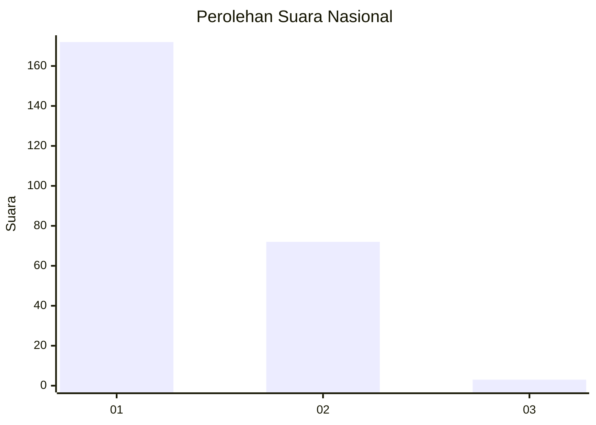
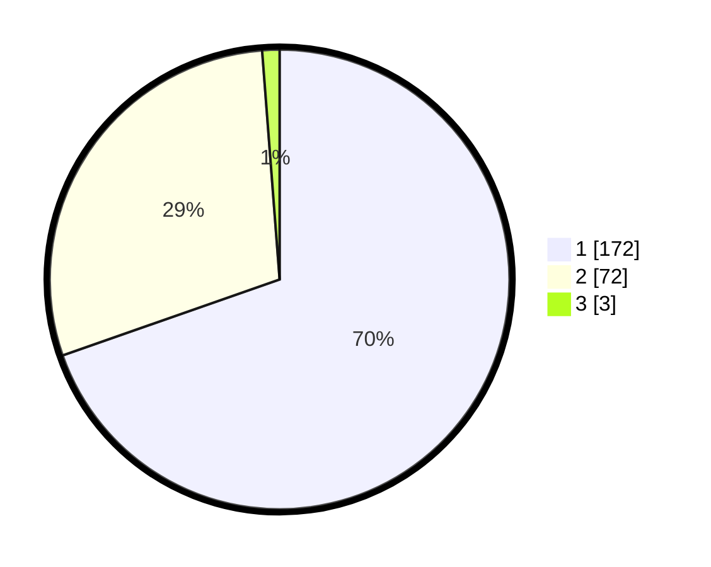

# Hasil

## Grafik

## Tabel

| No. | Nama Paslon    | Suara | Suara (raw) | Persentase |
|:--- |:-------------- | -----:| -----------:| ----------:|
| 1   | ANIES MUHAIMIN | 172   | [172][p-1]  | 69,64      |
| 2   | PRABOWO GIBRAN | 72    | [72][p-2]   | 29,15      |
| 3   | GANJAR MAHFUD  | 3     | [3][p-3]    | 1,21       |

[p-1]: https://github.com/gigit-pemilu/pemilu-2024/blob/main/pilpres/hitung-suara/sub/11-aceh/sub/13-gayo-lues/sub/03-rikit-gaib/sub/2001-ampa-kolak/sub/001-tps/sub/paslon-1.txt
[p-2]: https://github.com/gigit-pemilu/pemilu-2024/blob/main/pilpres/hitung-suara/sub/11-aceh/sub/13-gayo-lues/sub/03-rikit-gaib/sub/2001-ampa-kolak/sub/001-tps/sub/paslon-2.txt
[p-3]: https://github.com/gigit-pemilu/pemilu-2024/blob/main/pilpres/hitung-suara/sub/11-aceh/sub/13-gayo-lues/sub/03-rikit-gaib/sub/2001-ampa-kolak/sub/001-tps/sub/paslon-3.txt

## Foto C Plano

https://sirekap-obj-formc.kpu.go.id/3291/pemilu/ppwp/11/13/03/20/01/1113032001001-20240219-174230--4203b1df-418e-4408-8658-027b827c2c39.jpg

https://sirekap-obj-formc.kpu.go.id/3291/pemilu/ppwp/11/13/03/20/01/1113032001001-20240219-174219--1d66d5ea-7315-4fff-bac7-33c631139d17.jpg

## Metadata

| Key        | Value               |
| ---------- | ------------------- |
| Time Stamp | 2024-02-19 18:00:00 |

