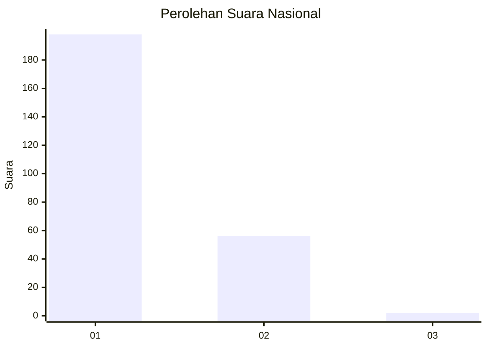
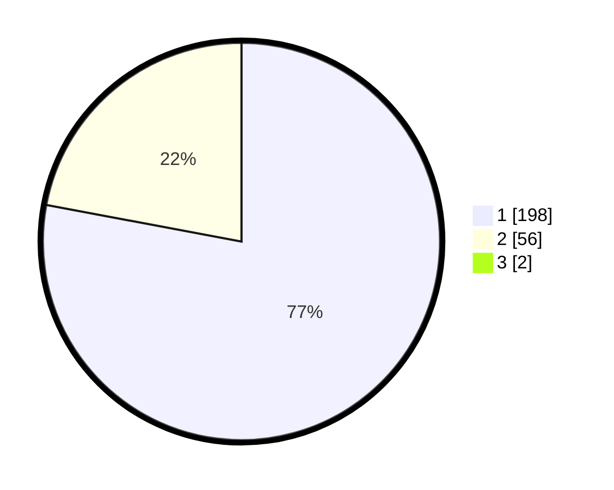

# Hasil

## Grafik

## Tabel

| No. | Nama Paslon    | Suara | Suara (raw) | Persentase |
|:--- |:-------------- | -----:| -----------:| ----------:|
| 1   | ANIES MUHAIMIN | 198   | [198][p-1]  | 77,34      |
| 2   | PRABOWO GIBRAN | 56    | [56][p-2]   | 21,88      |
| 3   | GANJAR MAHFUD  | 2     | [2][p-3]    | 0,78       |

[p-1]: https://github.com/gigit-pemilu/pemilu-2024/blob/main/pilpres/hitung-suara/sub/11-aceh/sub/13-gayo-lues/sub/03-rikit-gaib/sub/2002-cane-toa/sub/001-tps/sub/paslon-1.txt
[p-2]: https://github.com/gigit-pemilu/pemilu-2024/blob/main/pilpres/hitung-suara/sub/11-aceh/sub/13-gayo-lues/sub/03-rikit-gaib/sub/2002-cane-toa/sub/001-tps/sub/paslon-2.txt
[p-3]: https://github.com/gigit-pemilu/pemilu-2024/blob/main/pilpres/hitung-suara/sub/11-aceh/sub/13-gayo-lues/sub/03-rikit-gaib/sub/2002-cane-toa/sub/001-tps/sub/paslon-3.txt

## Foto C Plano

https://sirekap-obj-formc.kpu.go.id/1e3e/pemilu/ppwp/11/13/03/20/02/1113032002001-20240215-084516--95cf2fcc-9993-48e2-aec6-ac759ea06d98.jpg

https://sirekap-obj-formc.kpu.go.id/1e3e/pemilu/ppwp/11/13/03/20/02/1113032002001-20240215-084548--961c20a2-4b2e-470d-a3ca-b166823d76a1.jpg

https://sirekap-obj-formc.kpu.go.id/1e3e/pemilu/ppwp/11/13/03/20/02/1113032002001-20240219-174246--109e6170-6ec5-4f50-956e-7dd33504c92c.jpg

## Metadata

| Key        | Value               |
| ---------- | ------------------- |
| Time Stamp | 2024-02-19 18:00:00 |

