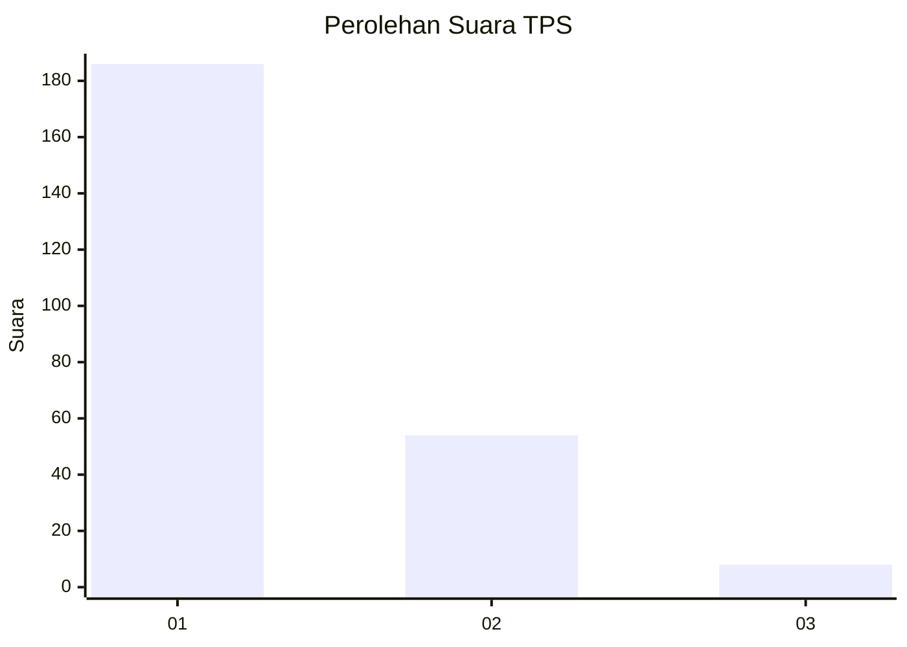
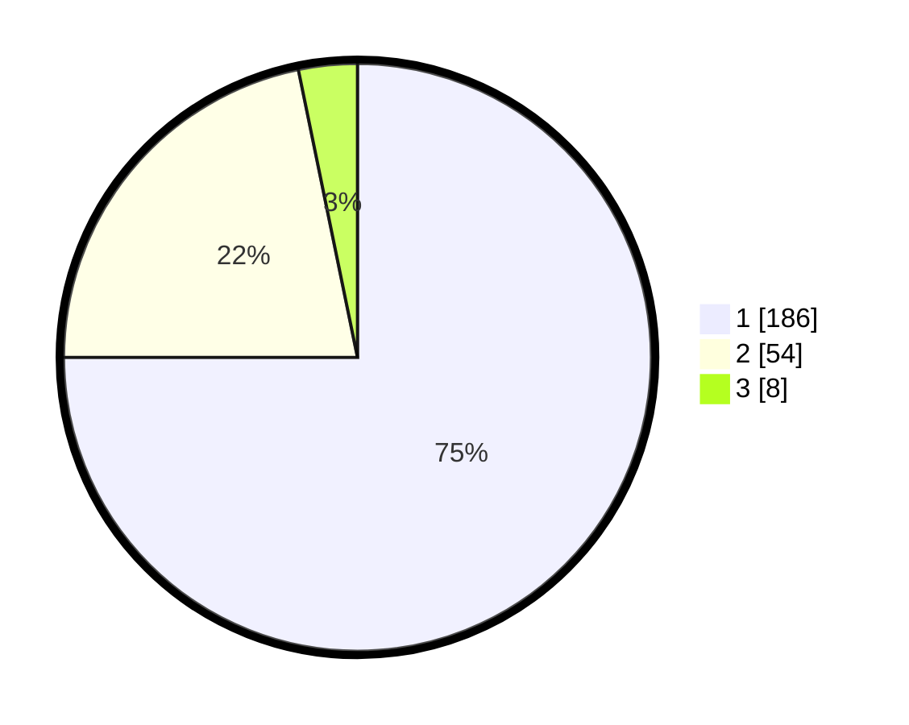

# Hasil

## Grafik

## Tabel

| No. | Nama Paslon    | Suara | Suara (raw) | Persentase |
|:--- |:-------------- | -----:| -----------:| ----------:|
| 1   | ANIES MUHAIMIN | 186   | [186][p-1]  | 75,00      |
| 2   | PRABOWO GIBRAN | 54    | [54][p-2]   | 21,77      |
| 3   | GANJAR MAHFUD  | 8     | [8][p-3]    | 3,23       |

[p-1]: https://github.com/gigit-pemilu/pemilu-2024-11-aceh/blob/main/pilpres/hitung-suara/sub/11-aceh/sub/13-gayo-lues/sub/04-terangun/sub/2003-padang/sub/001-tps/sub/paslon-1.txt
[p-2]: https://github.com/gigit-pemilu/pemilu-2024-11-aceh/blob/main/pilpres/hitung-suara/sub/11-aceh/sub/13-gayo-lues/sub/04-terangun/sub/2003-padang/sub/001-tps/sub/paslon-2.txt
[p-3]: https://github.com/gigit-pemilu/pemilu-2024-11-aceh/blob/main/pilpres/hitung-suara/sub/11-aceh/sub/13-gayo-lues/sub/04-terangun/sub/2003-padang/sub/001-tps/sub/paslon-3.txt

## Foto C Plano

https://sirekap-obj-formc.kpu.go.id/756e/pemilu/ppwp/11/13/04/20/03/1113042003001-20240219-193706--f562666f-cad9-455e-b3a7-0e97174b44fa.jpg

https://sirekap-obj-formc.kpu.go.id/756e/pemilu/ppwp/11/13/04/20/03/1113042003001-20240219-193708--8aff0c4b-3fee-47f0-9121-41d6d1652b30.jpg

https://sirekap-obj-formc.kpu.go.id/756e/pemilu/ppwp/11/13/04/20/03/1113042003001-20240219-193707--24e25e72-15e8-4853-96f4-de58ee6d6ad1.jpg

## Metadata

| Key        | Value               |
| ---------- | ------------------- |
| Time Stamp | 2024-02-21 10:00:00 |

## DATA PEMILIH TETAP

Jumlah pemilih dalam DPT: **285**.
 * L: **150**.
 * P: **135**.

## DATA PENGGUNA HAK PILIH

Jumlah pengguna hak pilih dalam DPT: **264**.
 * L: **136**.
 * P: **128**.

Jumlah pengguna hak pilih dalam DPTb: **0**.
 * L: **0**.
 * P: **0**.

Jumlah pengguna hak pilih dalam DPK: **2**.
 * L: **2**.
 * P: **0**.

Jumlah pengguna hak pilih: **266**.
 * L: **138**.
 * P: **128**.

## JUMLAH SUARA SAH DAN TIDAK SAH

JUMLAH SELURUH SUARA SAH: **248**.

JUMLAH SUARA TIDAK SAH: **18**.

JUMLAH SELURUH SUARA SAH DAN SUARA TIDAK SAH: **266**.

