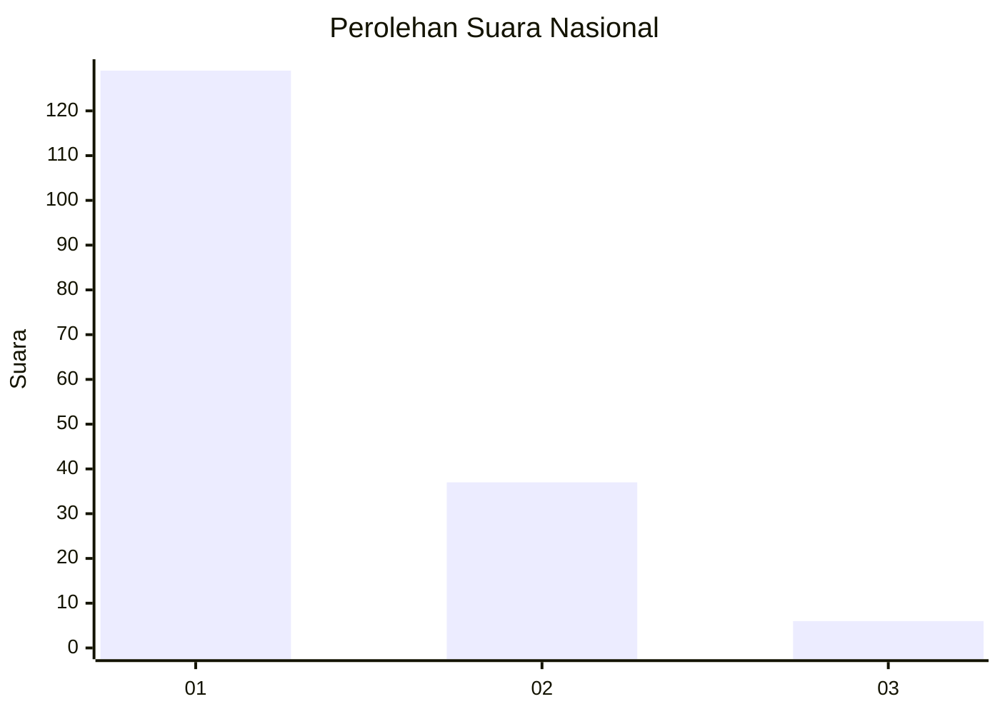
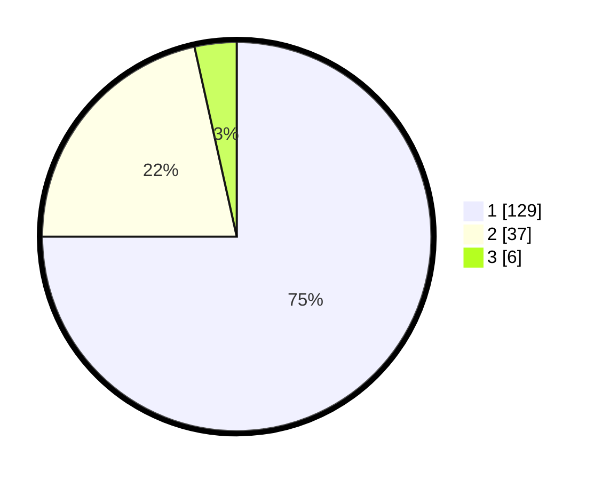

# Hasil

## Grafik

## Tabel

| No. | Nama Paslon    | Suara | Suara (raw) | Persentase |
|:--- |:-------------- | -----:| -----------:| ----------:|
| 1   | ANIES MUHAIMIN | 129   | [129][p-1]  | 75,00      |
| 2   | PRABOWO GIBRAN | 37    | [37][p-2]   | 21,51      |
| 3   | GANJAR MAHFUD  | 6     | [6][p-3]    | 3,49       |

[p-1]: https://github.com/gigit-pemilu/pemilu-2024/blob/main/pilpres/hitung-suara/sub/11-aceh/sub/13-gayo-lues/sub/04-terangun/sub/2003-padang/sub/003-tps/sub/paslon-1.txt
[p-2]: https://github.com/gigit-pemilu/pemilu-2024/blob/main/pilpres/hitung-suara/sub/11-aceh/sub/13-gayo-lues/sub/04-terangun/sub/2003-padang/sub/003-tps/sub/paslon-2.txt
[p-3]: https://github.com/gigit-pemilu/pemilu-2024/blob/main/pilpres/hitung-suara/sub/11-aceh/sub/13-gayo-lues/sub/04-terangun/sub/2003-padang/sub/003-tps/sub/paslon-3.txt

## Foto C Plano

https://sirekap-obj-formc.kpu.go.id/dcbc/pemilu/ppwp/11/13/04/20/03/1113042003003-20240219-184318--00c63d0b-7c49-45e7-ac16-a1adae242309.jpg

https://sirekap-obj-formc.kpu.go.id/dcbc/pemilu/ppwp/11/13/04/20/03/1113042003003-20240219-184319--5d55fa9d-fed2-4e1c-8381-bec69b733922.jpg

https://sirekap-obj-formc.kpu.go.id/dcbc/pemilu/ppwp/11/13/04/20/03/1113042003003-20240219-184318--c732b02f-3078-469d-9ce9-753037107db1.jpg

## Metadata

| Key        | Value               |
| ---------- | ------------------- |
| Time Stamp | 2024-02-21 10:00:00 |

## DATA PEMILIH TETAP

Jumlah pemilih dalam DPT: **193**.
 * L: **93**.
 * P: **100**.

## DATA PENGGUNA HAK PILIH

Jumlah pengguna hak pilih dalam DPT: **178**.
 * L: **85**.
 * P: **93**.

Jumlah pengguna hak pilih dalam DPTb: **2**.
 * L: **2**.
 * P: **0**.

Jumlah pengguna hak pilih dalam DPK: **2**.
 * L: **1**.
 * P: **1**.

Jumlah pengguna hak pilih: **182**.
 * L: **88**.
 * P: **94**.

## JUMLAH SUARA SAH DAN TIDAK SAH

JUMLAH SELURUH SUARA SAH: **172**.

JUMLAH SUARA TIDAK SAH: **10**.

JUMLAH SELURUH SUARA SAH DAN SUARA TIDAK SAH: **182**.

