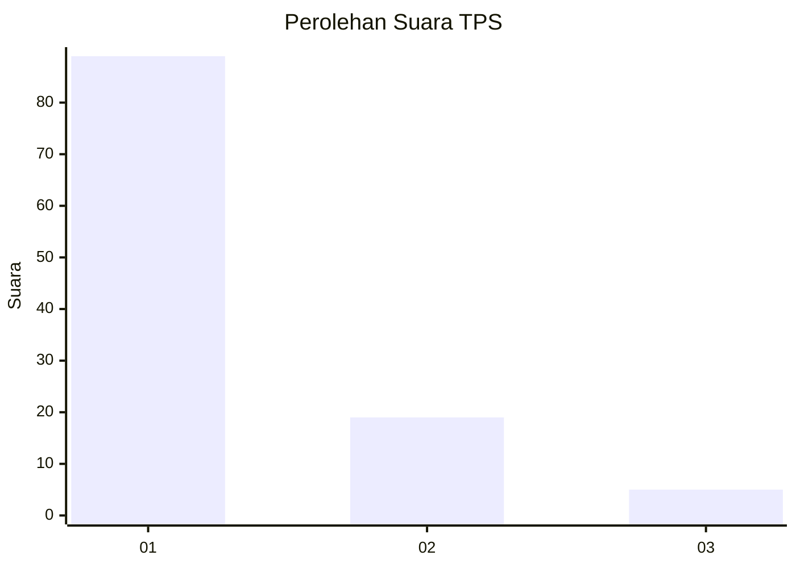
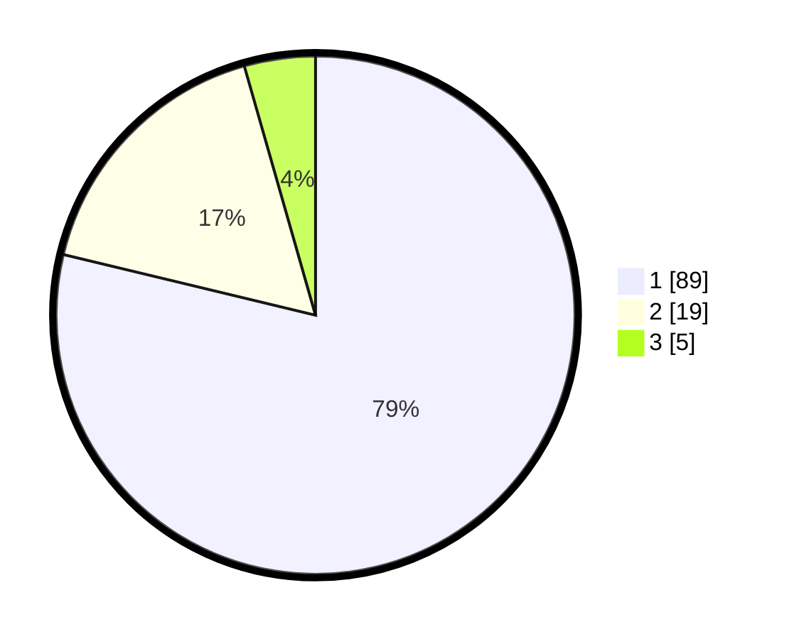

# Hasil

## Grafik

## Tabel

| No. | Nama Paslon    | Suara | Suara (raw) | Persentase |
|:--- |:-------------- | -----:| -----------:| ----------:|
| 1   | ANIES MUHAIMIN | 89    | [89][p-1]   | 78,76      |
| 2   | PRABOWO GIBRAN | 19    | [19][p-2]   | 16,81      |
| 3   | GANJAR MAHFUD  | 5     | [5][p-3]    | 4,42       |

[p-1]: https://github.com/gigit-pemilu/pemilu-2024-11-aceh/blob/main/pilpres/hitung-suara/sub/11-aceh/sub/13-gayo-lues/sub/04-terangun/sub/2013-kutereje/sub/001-tps/sub/paslon-1.txt
[p-2]: https://github.com/gigit-pemilu/pemilu-2024-11-aceh/blob/main/pilpres/hitung-suara/sub/11-aceh/sub/13-gayo-lues/sub/04-terangun/sub/2013-kutereje/sub/001-tps/sub/paslon-2.txt
[p-3]: https://github.com/gigit-pemilu/pemilu-2024-11-aceh/blob/main/pilpres/hitung-suara/sub/11-aceh/sub/13-gayo-lues/sub/04-terangun/sub/2013-kutereje/sub/001-tps/sub/paslon-3.txt

## Foto C Plano

https://sirekap-obj-formc.kpu.go.id/ea4b/pemilu/ppwp/11/13/04/20/13/1113042013001-20240214-182820--a3b5441c-b1d5-411d-87da-4ef72555294b.jpg

https://sirekap-obj-formc.kpu.go.id/ea4b/pemilu/ppwp/11/13/04/20/13/1113042013001-20240214-182823--24b7e13c-6490-413d-affe-d4897f922aed.jpg

https://sirekap-obj-formc.kpu.go.id/ea4b/pemilu/ppwp/11/13/04/20/13/1113042013001-20240214-182821--eb1fb69b-f29d-4bed-97fd-b20c3bde439b.jpg

## Metadata

| Key        | Value               |
| ---------- | ------------------- |
| Time Stamp | 2024-02-16 01:00:27 |

## DATA PEMILIH TETAP

Jumlah pemilih dalam DPT: **119**.
 * L: **56**.
 * P: **63**.

## DATA PENGGUNA HAK PILIH

Jumlah pengguna hak pilih dalam DPT: **117**.
 * L: **55**.
 * P: **62**.

Jumlah pengguna hak pilih dalam DPTb: **2**.
 * L: **1**.
 * P: **1**.

Jumlah pengguna hak pilih dalam DPK: **1**.
 * L: **1**.
 * P: **0**.

Jumlah pengguna hak pilih: **120**.
 * L: **57**.
 * P: **63**.

## JUMLAH SUARA SAH DAN TIDAK SAH

JUMLAH SELURUH SUARA SAH: **113**.

JUMLAH SUARA TIDAK SAH: **7**.

JUMLAH SELURUH SUARA SAH DAN SUARA TIDAK SAH: **120**.

