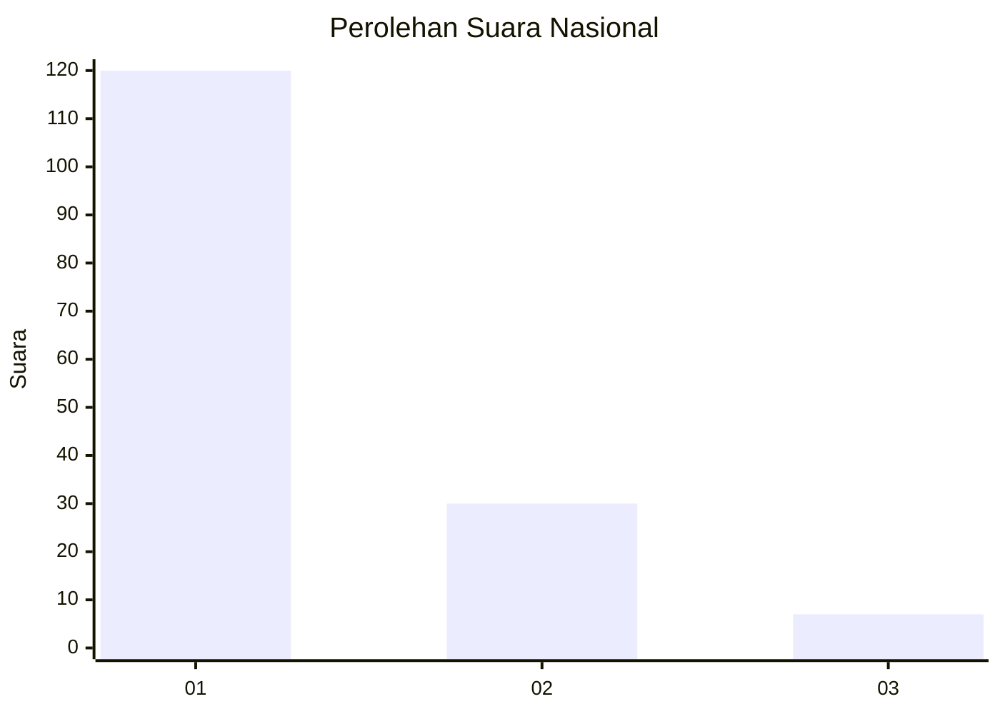
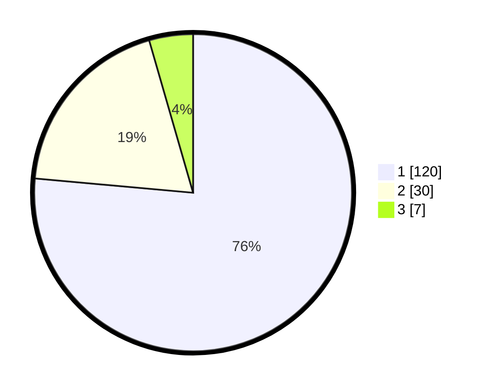

# Hasil

## Grafik

## Tabel

| No. | Nama Paslon    | Suara | Suara (raw) | Persentase |
|:--- |:-------------- | -----:| -----------:| ----------:|
| 1   | ANIES MUHAIMIN | 120   | [120][p-1]  | 76,43      |
| 2   | PRABOWO GIBRAN | 30    | [30][p-2]   | 19,11      |
| 3   | GANJAR MAHFUD  | 7     | [7][p-3]    | 4,46       |

[p-1]: https://github.com/gigit-pemilu/pemilu-2024/blob/main/pilpres/hitung-suara/sub/11-aceh/sub/13-gayo-lues/sub/05-pining/sub/2001-pining/sub/003-tps/sub/paslon-1.txt
[p-2]: https://github.com/gigit-pemilu/pemilu-2024/blob/main/pilpres/hitung-suara/sub/11-aceh/sub/13-gayo-lues/sub/05-pining/sub/2001-pining/sub/003-tps/sub/paslon-2.txt
[p-3]: https://github.com/gigit-pemilu/pemilu-2024/blob/main/pilpres/hitung-suara/sub/11-aceh/sub/13-gayo-lues/sub/05-pining/sub/2001-pining/sub/003-tps/sub/paslon-3.txt

## Foto C Plano

https://sirekap-obj-formc.kpu.go.id/b4cb/pemilu/ppwp/11/13/05/20/01/1113052001003-20240216-024219--6651afaf-08ab-4e1a-aca2-000b7f8a659d.jpg

https://sirekap-obj-formc.kpu.go.id/b4cb/pemilu/ppwp/11/13/05/20/01/1113052001003-20240216-024221--1dee3900-7ac6-4d92-acb2-e13b56b7b89b.jpg

https://sirekap-obj-formc.kpu.go.id/b4cb/pemilu/ppwp/11/13/05/20/01/1113052001003-20240216-024220--97eb10b2-1127-48a9-8480-92a519cc0fa8.jpg

## Metadata

| Key        | Value               |
| ---------- | ------------------- |
| Time Stamp | 2024-02-16 16:25:10 |

## DATA PEMILIH TETAP

Jumlah pemilih dalam DPT: **192**.
 * L: **104**.
 * P: **88**.

## DATA PENGGUNA HAK PILIH

Jumlah pengguna hak pilih dalam DPT: **167**.
 * L: **87**.
 * P: **80**.

Jumlah pengguna hak pilih dalam DPTb: **0**.
 * L: **0**.
 * P: **0**.

Jumlah pengguna hak pilih dalam DPK: **8**.
 * L: **3**.
 * P: **5**.

Jumlah pengguna hak pilih: **175**.
 * L: **90**.
 * P: **85**.

## JUMLAH SUARA SAH DAN TIDAK SAH

JUMLAH SELURUH SUARA SAH: **157**.

JUMLAH SUARA TIDAK SAH: **18**.

JUMLAH SELURUH SUARA SAH DAN SUARA TIDAK SAH: **175**.

