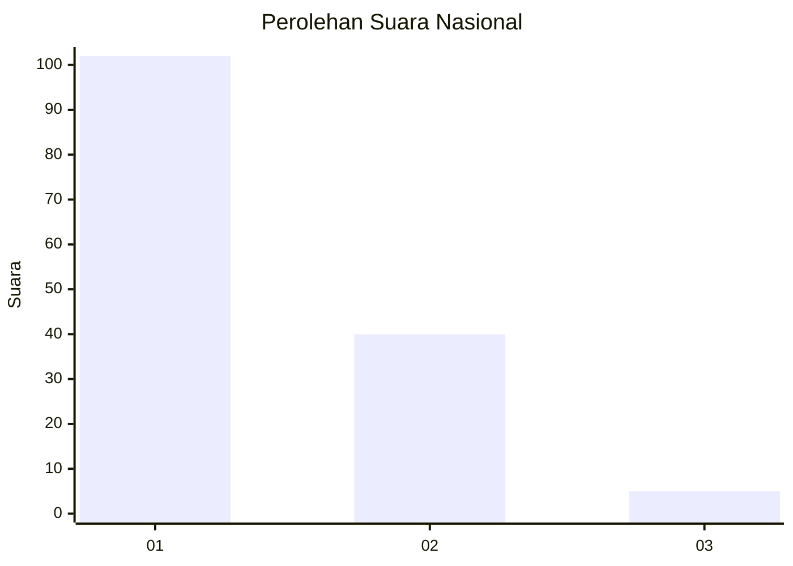
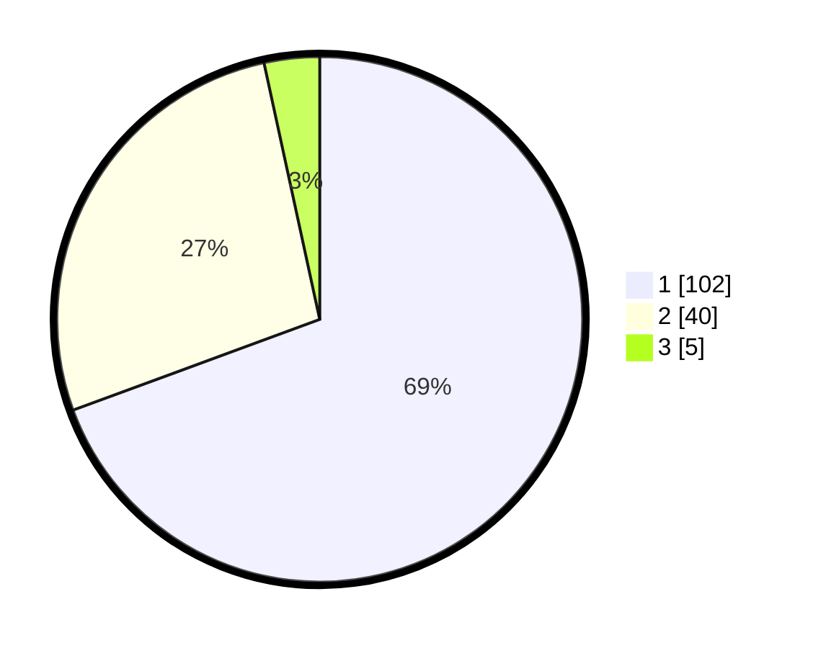

# Hasil

## Grafik

## Tabel

| No. | Nama Paslon    | Suara | Suara (raw) | Persentase |
|:--- |:-------------- | -----:| -----------:| ----------:|
| 1   | ANIES MUHAIMIN | 102   | [102][p-1]  | 69,39      |
| 2   | PRABOWO GIBRAN | 40    | [40][p-2]   | 27,21      |
| 3   | GANJAR MAHFUD  | 5     | [5][p-3]    | 3,40       |

[p-1]: https://github.com/gigit-pemilu/pemilu-2024/blob/main/pilpres/hitung-suara/sub/11-aceh/sub/13-gayo-lues/sub/05-pining/sub/2001-pining/sub/004-tps/sub/paslon-1.txt
[p-2]: https://github.com/gigit-pemilu/pemilu-2024/blob/main/pilpres/hitung-suara/sub/11-aceh/sub/13-gayo-lues/sub/05-pining/sub/2001-pining/sub/004-tps/sub/paslon-2.txt
[p-3]: https://github.com/gigit-pemilu/pemilu-2024/blob/main/pilpres/hitung-suara/sub/11-aceh/sub/13-gayo-lues/sub/05-pining/sub/2001-pining/sub/004-tps/sub/paslon-3.txt

## Foto C Plano

https://sirekap-obj-formc.kpu.go.id/7195/pemilu/ppwp/11/13/05/20/01/1113052001004-20240216-092406--4e6e5611-b454-4c87-b1a2-f200681e4f77.jpg

https://sirekap-obj-formc.kpu.go.id/7195/pemilu/ppwp/11/13/05/20/01/1113052001004-20240216-092408--9af284e0-663a-4c94-9711-4279a0a6636a.jpg

https://sirekap-obj-formc.kpu.go.id/7195/pemilu/ppwp/11/13/05/20/01/1113052001004-20240216-092407--3c008600-9864-4ee8-9f33-883ae7319a04.jpg

## Metadata

| Key        | Value               |
| ---------- | ------------------- |
| Time Stamp | 2024-02-16 16:25:10 |

## DATA PEMILIH TETAP

Jumlah pemilih dalam DPT: **182**.
 * L: **95**.
 * P: **87**.

## DATA PENGGUNA HAK PILIH

Jumlah pengguna hak pilih dalam DPT: **157**.
 * L: **83**.
 * P: **74**.

Jumlah pengguna hak pilih dalam DPTb: **3**.
 * L: **2**.
 * P: **1**.

Jumlah pengguna hak pilih dalam DPK: **13**.
 * L: **7**.
 * P: **6**.

Jumlah pengguna hak pilih: **173**.
 * L: **92**.
 * P: **81**.

## JUMLAH SUARA SAH DAN TIDAK SAH

JUMLAH SELURUH SUARA SAH: **147**.

JUMLAH SUARA TIDAK SAH: **26**.

JUMLAH SELURUH SUARA SAH DAN SUARA TIDAK SAH: **173**.

