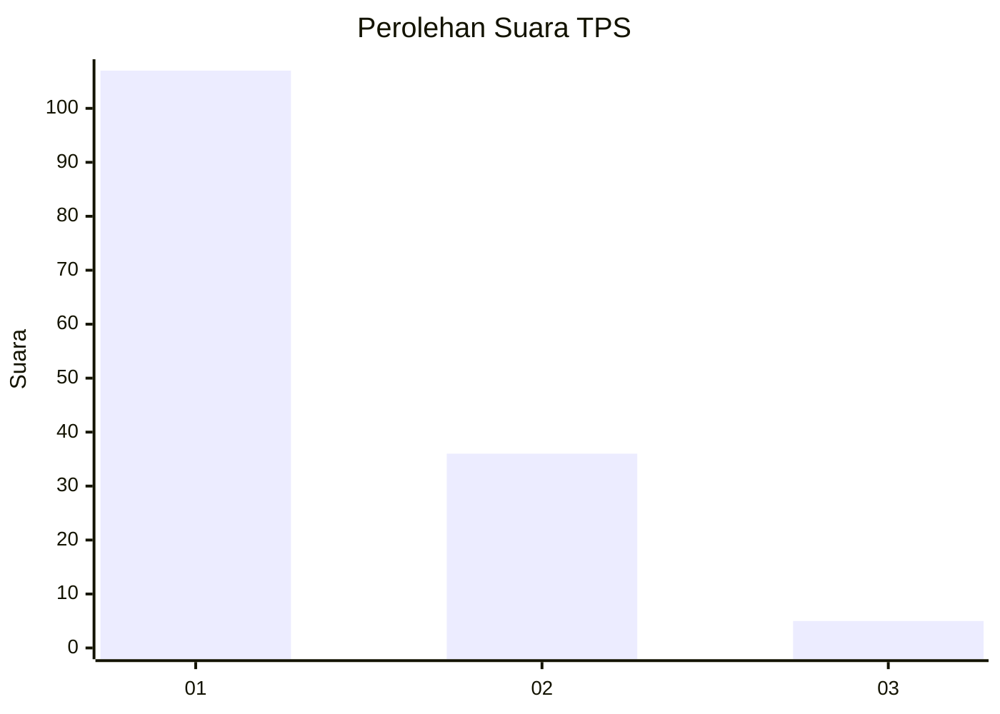
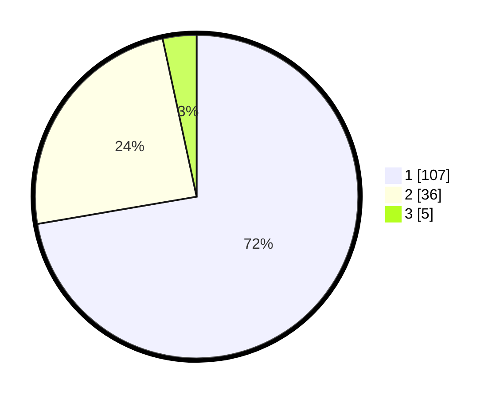

# Hasil

## Grafik

## Tabel

| No. | Nama Paslon    | Suara | Suara (raw) | Persentase |
|:--- |:-------------- | -----:| -----------:| ----------:|
| 1   | ANIES MUHAIMIN | 107   | [107][p-1]  | 72,30      |
| 2   | PRABOWO GIBRAN | 36    | [36][p-2]   | 24,32      |
| 3   | GANJAR MAHFUD  | 5     | [5][p-3]    | 3,38       |

[p-1]: https://github.com/gigit-pemilu/pemilu-2024-11-aceh/blob/main/pilpres/hitung-suara/sub/11-aceh/sub/13-gayo-lues/sub/05-pining/sub/2005-gajah/sub/001-tps/sub/paslon-1.txt
[p-2]: https://github.com/gigit-pemilu/pemilu-2024-11-aceh/blob/main/pilpres/hitung-suara/sub/11-aceh/sub/13-gayo-lues/sub/05-pining/sub/2005-gajah/sub/001-tps/sub/paslon-2.txt
[p-3]: https://github.com/gigit-pemilu/pemilu-2024-11-aceh/blob/main/pilpres/hitung-suara/sub/11-aceh/sub/13-gayo-lues/sub/05-pining/sub/2005-gajah/sub/001-tps/sub/paslon-3.txt

## Foto C Plano

https://sirekap-obj-formc.kpu.go.id/3d64/pemilu/ppwp/11/13/05/20/05/1113052005001-20240215-105628--e6e50063-6817-4736-baab-4ce02788e3a6.jpg

https://sirekap-obj-formc.kpu.go.id/3d64/pemilu/ppwp/11/13/05/20/05/1113052005001-20240215-105942--294cff9f-05f7-447b-ba0a-64caf817463d.jpg

https://sirekap-obj-formc.kpu.go.id/3d64/pemilu/ppwp/11/13/05/20/05/1113052005001-20240215-110421--39d645fb-eeee-4617-9b13-1815eb7db137.jpg

## Metadata

| Key        | Value               |
| ---------- | ------------------- |
| Time Stamp | 2024-02-24 22:31:28 |

